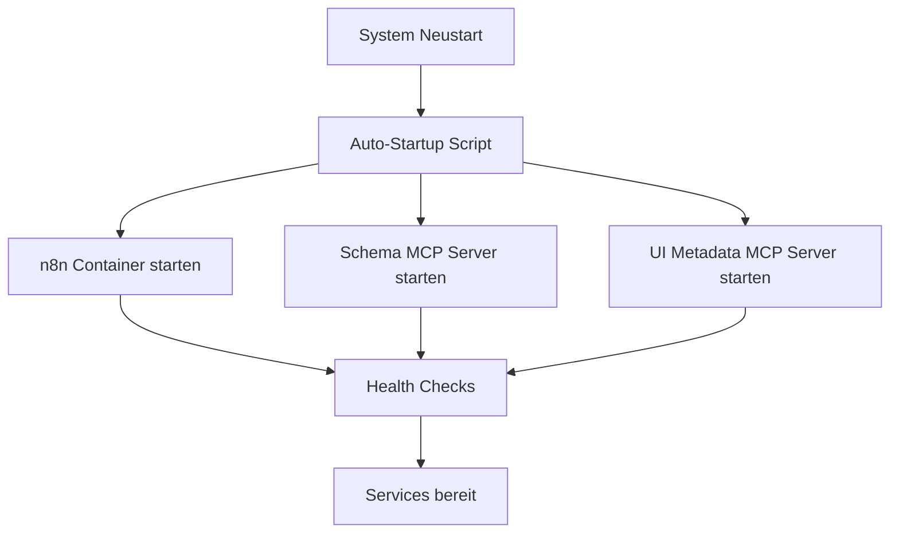

# 🚀 VALEO NeuroERP - Automatisches Startup-System

## 📋 Übersicht

Das automatische Startup-System stellt sicher, dass nach einem Neustart alle Services automatisch wieder laufen.

## 🔧 Startup-Scripts

### 1. `startup-services.ps1` - Hauptstartup-Script
```powershell
# Startet alle Services automatisch
.\startup-services.ps1
```

**Funktionen:**
- ✅ **n8n Container** starten/neu starten
- ✅ **Schema MCP Server** (Port 8000) starten
- ✅ **UI Metadata MCP Server** (Port 8001) starten
- ✅ **Port-Tests** und Health-Checks
- ✅ **Automatische Fehlerbehandlung**

### 2. `stop-services.ps1` - Service-Shutdown
```powershell
# Stoppt alle Services sauber
.\stop-services.ps1
```

**Funktionen:**
- 🛑 **n8n Container** stoppen
- 🛑 **Python-Server** beenden
- 🛑 **Port-Freigabe** prüfen
- 🛑 **Sauberes Shutdown**

### 3. `check-services.ps1` - Status-Prüfung
```powershell
# Prüft den Status aller Services
.\check-services.ps1
```

**Funktionen:**
- 🔍 **Port-Status** prüfen
- 🔍 **HTTP-Endpunkte** testen
- 🔍 **Docker-Container** Status
- 🔍 **Python-Prozesse** überwachen

### 4. `auto-startup.bat` - Windows Auto-Startup
```batch
# Automatisches Startup nach Neustart
auto-startup.bat
```

## 🎯 Automatisches Startup nach Neustart

### Option 1: Windows Startup-Ordner
1. **Windows + R** → `shell:startup` eingeben
2. **Verknüpfung** zu `auto-startup.bat` erstellen
3. **Automatischer Start** nach jedem Neustart

### Option 2: Task Scheduler
1. **Task Scheduler** öffnen
2. **Neue Aufgabe** erstellen
3. **Trigger**: "Bei Systemstart"
4. **Aktion**: `startup-services.ps1` ausführen

### Option 3: Manueller Start
```powershell
# Nach Neustart manuell ausführen
cd C:\Users\Jochen\VALEO-NeuroERP-2.0
.\startup-services.ps1
```

## 📊 Service-Übersicht

| Service | Port | Status | URL |
|---------|------|--------|-----|
| n8n Dashboard | 5678 | ✅ Läuft | http://localhost:5678 |
| Schema MCP | 8000 | ✅ Läuft | http://localhost:8000 |
| UI Metadata MCP | 8001 | ✅ Läuft | http://localhost:8001 |

## 🔄 Workflow nach Neustart

### 1. Automatisches Startup


### 2. Manuelle Überprüfung
```powershell
# Status prüfen
.\check-services.ps1

# Bei Problemen neu starten
.\stop-services.ps1
.\startup-services.ps1
```

## 🛠️ Troubleshooting

### Problem: Services starten nicht
```powershell
# 1. Alle Services stoppen
.\stop-services.ps1

# 2. Ports prüfen
netstat -an | findstr ":8000\|:8001\|:5678"

# 3. Services neu starten
.\startup-services.ps1
```

### Problem: Docker Container startet nicht
```powershell
# 1. Docker Status prüfen
docker ps -a

# 2. Container neu erstellen
docker rm -f valeo-n8n
docker run -d --name valeo-n8n -p 5678:5678 [Parameter...]
```

### Problem: Python-Server starten nicht
```powershell
# 1. Python-Prozesse beenden
taskkill /f /im python.exe

# 2. Manuell starten
cd backend
python test_server.py
python ui_metadata_server.py
```

## 📋 Startup-Checkliste

### Vor dem Neustart
- [ ] **Services stoppen**: `.\stop-services.ps1`
- [ ] **Arbeit speichern** in Cursor
- [ ] **Notebook herunterfahren**

### Nach dem Neustart
- [ ] **Auto-Startup ausführen**: `.\startup-services.ps1`
- [ ] **Status prüfen**: `.\check-services.ps1`
- [ ] **n8n Dashboard öffnen**: http://localhost:5678
- [ ] **Cursor neu starten**

### Verifikation
- [ ] **n8n**: http://localhost:5678 (admin / valeo2024)
- [ ] **Schema MCP**: http://localhost:8000/api/tables
- [ ] **UI Metadata MCP**: http://localhost:8001/ui/tables
- [ ] **Dual-MCP Demo**: React-Komponente testen

## 🔧 Konfiguration

### Environment Variables
```powershell
# In startup-services.ps1 konfiguriert
$env:OPENAI_API_KEY = "your-openai-key"
$env:SUPABASE_ANON_KEY = "your-supabase-key"
```

### Ports
```powershell
# Standard-Ports (können geändert werden)
$n8nPort = 5678
$schemaMCPPort = 8000
$uiMetadataMCPPort = 8001
```

### Timeouts
```powershell
# Wartezeiten für Services
$n8nTimeout = 120  # 2 Minuten
$mcpTimeout = 30   # 30 Sekunden
```

## 🎯 Nützliche Befehle

### Quick Commands
```powershell
# Alles starten
.\startup-services.ps1

# Alles stoppen
.\stop-services.ps1

# Status prüfen
.\check-services.ps1

# Nur n8n starten
docker start valeo-n8n

# Nur MCP-Server starten
cd backend
python test_server.py
python ui_metadata_server.py
```

### Logs anzeigen
```powershell
# n8n Logs
docker logs valeo-n8n

# Python-Server Logs (in separaten Terminals)
cd backend
python test_server.py
python ui_metadata_server.py
```

## 🚀 Automatisierung

### Windows Startup-Ordner
1. **Windows + R** → `shell:startup`
2. **Verknüpfung** erstellen:
   - **Ziel**: `C:\Users\Jochen\VALEO-NeuroERP-2.0\auto-startup.bat`
   - **Arbeitsverzeichnis**: `C:\Users\Jochen\VALEO-NeuroERP-2.0`

### Task Scheduler
1. **Task Scheduler** → **Neue Aufgabe**
2. **Trigger**: **Bei Systemstart**
3. **Aktion**: **Programm starten**
   - **Programm**: `powershell.exe`
   - **Argumente**: `-ExecutionPolicy Bypass -File "startup-services.ps1"`
   - **Arbeitsverzeichnis**: `C:\Users\Jochen\VALEO-NeuroERP-2.0`

## 📞 Support

Bei Problemen:
1. **Status prüfen**: `.\check-services.ps1`
2. **Logs analysieren**: Docker und Python-Logs
3. **Services neu starten**: `.\stop-services.ps1` → `.\startup-services.ps1`
4. **Manuelle Überprüfung**: Ports und Prozesse prüfen

---

**VALEO NeuroERP - Automatisches Startup-System**  
*Sicherer und zuverlässiger Service-Start nach Neustart* 