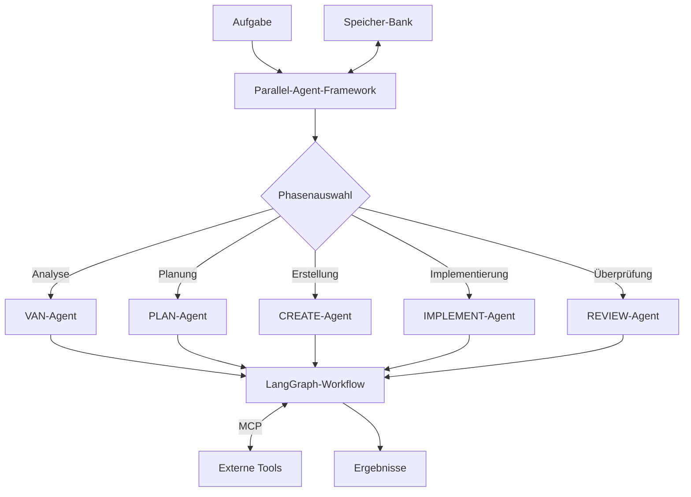

# VALEO-NeuroERP Multi-Agent-Framework

## Übersicht

Das VALEO-NeuroERP Multi-Agent-Framework ist eine fortschrittliche Lösung zur Automatisierung komplexer ERP-bezogener Aufgaben durch die Zusammenarbeit spezialisierter KI-Agenten. Das Framework nutzt LangGraph für die Workflow-Steuerung und das Model Context Protocol (MCP) für die Integration externer Tools.

## Hauptmerkmale

- **Multi-Agent-Architektur**: Spezialisierte Agenten für verschiedene Phasen des Entwicklungs- und Optimierungsprozesses
- **LangGraph-Integration**: Zustandsbasierte Workflows für strukturierte Agentenkoordination
- **MCP-Integration**: Nahtlose Einbindung externer Tools und Dienste
- **Phasenbasierter Ansatz**: Klare Abgrenzung von Verantwortlichkeiten und Übergabepunkten
- **Speicher-Bank**: Persistenter Speicher für Kontext und Zwischenergebnisse

## Agentenrollen

Das Framework definiert fünf Hauptagentenrollen:

1. **VAN (Validator-Analyzer)**: Analysiert Anforderungen und validiert deren Machbarkeit
2. **PLAN (Planner)**: Entwickelt strategische Pläne und Roadmaps
3. **CREATE (Creator)**: Entwickelt kreative Lösungen und Designs
4. **IMPLEMENT (Implementer)**: Setzt Lösungen um und integriert sie
5. **REVIEW (Reviewer)**: Führt Qualitätssicherung und Bewertung durch

## Architekturdiagramm



## Schnellstart

### Installation

```bash
# Virtuelle Umgebung erstellen
python -m venv venv
source venv/bin/activate  # Für Linux/macOS
venv\Scripts\activate     # Für Windows

# Abhängigkeiten installieren
pip install -U "langgraph>=0.4.10" "langchain>=0.3.0" "langchain-openai>=0.3.0" "mcp>=0.0.7"
pip install -e .
```

### Beispiel: Aufgabe ausführen

```python
from linkup_mcp.run_parallel_agents import run_task

# Aufgabe definieren
task_name = "ERP-Modul-Optimierung"
task_description = "Optimierung des Finanzmoduls für bessere Leistung"

# Kontext bereitstellen
context = {
    "modul": "Finanzmodul",
    "priorität": "hoch",
    "aktuelle_probleme": [
        "Langsame Datenbankabfragen",
        "Hohe CPU-Auslastung"
    ]
}

# Aufgabe ausführen
results = run_task(
    task_name=task_name,
    task_description=task_description,
    context=context,
    use_mcp=True  # MCP-Integration aktivieren
)

# Ergebnisse verarbeiten
print(results)
```

## Dokumentation

Detaillierte Dokumentation ist in folgenden Dateien verfügbar:

- [Multi-Agent-Framework-Integration](./docs/multi_agent_framework_integration.md): Hauptdokumentation
- [Phasenendpunkte](./docs/phase_endpoints.md): Detaillierte Endpunktdefinitionen
- [LangGraph-MCP-Integration](./docs/langgraph_mcp_integration.md): Details zur LangGraph-MCP-Integration
- [Installationsanleitung](./docs/setup_guide.md): Vollständige Installationsanleitung

## Beispiele

Im Verzeichnis `examples/` finden Sie Beispielskripte für verschiedene Anwendungsfälle:

- `examples/erp_module_optimization.py`: Optimierung eines ERP-Moduls
- `examples/requirement_analysis.py`: Analyse von Anforderungen
- `examples/code_generation.py`: Generierung von Code

## Anforderungen

- Python 3.11 oder höher (Python 3.13 wird für die neuesten LangGraph-Funktionen empfohlen)
- OpenAI API-Schlüssel oder kompatibles LLM
- MCP-Server (für Tool-Integration)

## Mitwirkende

- VALEO-NeuroERP-Entwicklungsteam
- Externe Beitragende

## Lizenz

Copyright © 2025 VALEO-NeuroERP. Alle Rechte vorbehalten. 