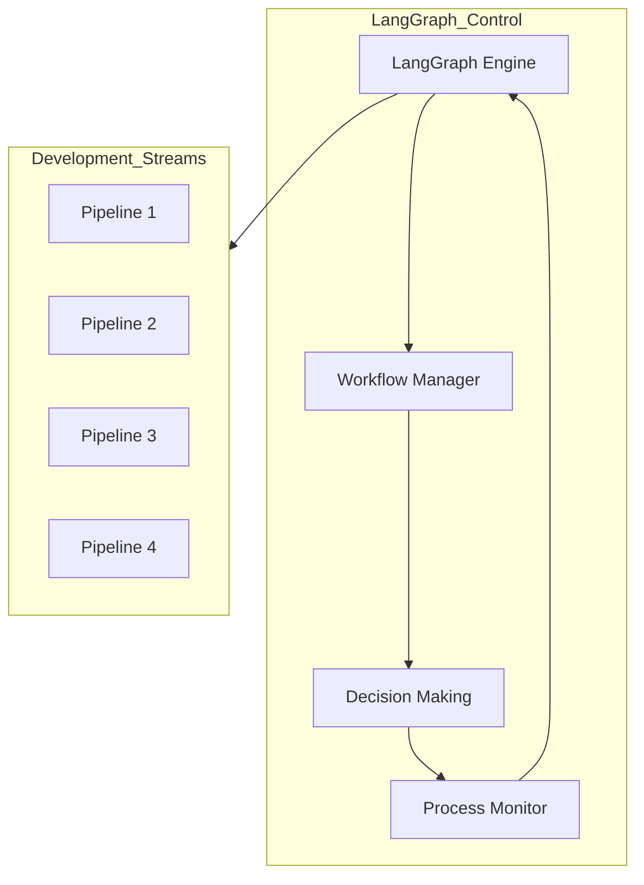
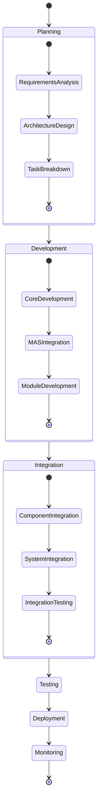
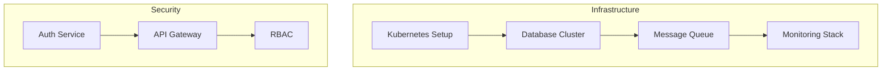
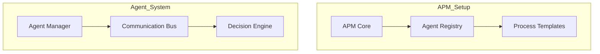
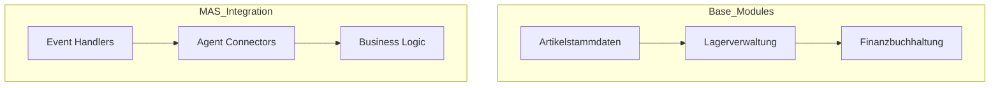
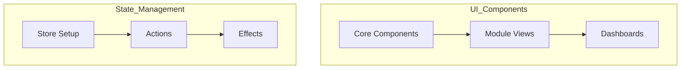
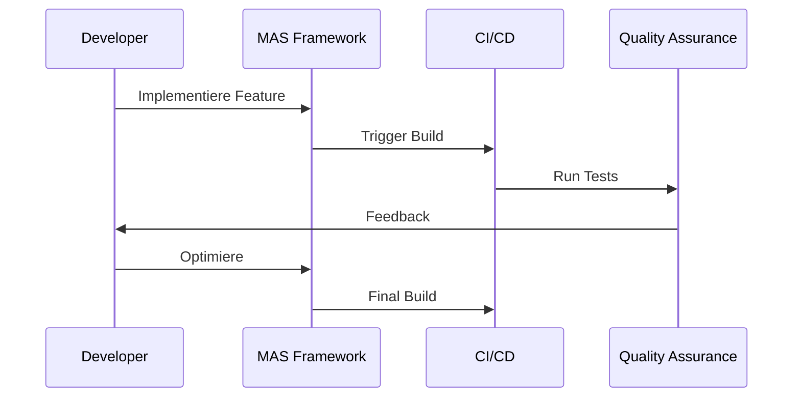
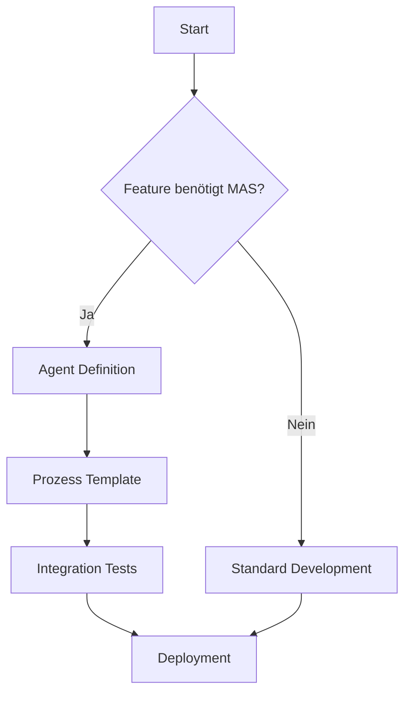
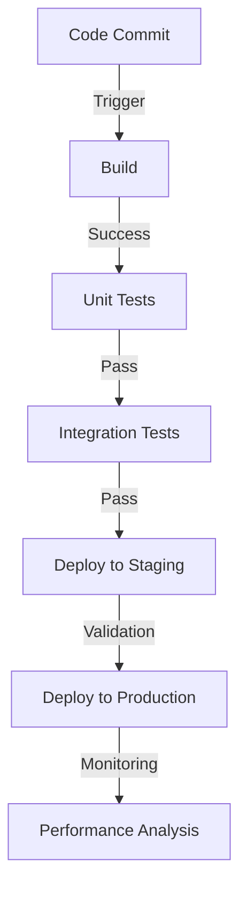

# VALEO-NeuroERP Detaillierter Entwicklungsablaufplan

## LangGraph Workflow-Orchestrierung



## Pipeline-übergreifende Prozesssteuerung



## Detaillierte Phasenplanung

### Phase 1: Foundation

#### Pipeline 1: Core-System


#### Pipeline 2: MAS-Framework


### Phase 2: Core Integration

#### Pipeline 3: Module Integration


#### Pipeline 4: Frontend Development


## Detaillierte Prozessabläufe

### 1. Entwicklungsprozess pro Modul



### 2. MAS-Integration Workflow



## Implementierungsdetails

### 1. Core-System (Pipeline 1)

#### 1.1 Infrastruktur
- **Kubernetes-Cluster**
  ```yaml
  apiVersion: v1
  kind: Cluster
  metadata:
    name: valeo-erp
  spec:
    nodes: 3
    region: eu-central
  ```

- **Datenbank-Setup**
  ```sql
  CREATE DATABASE valeo_erp;
  CREATE SCHEMA core;
  CREATE SCHEMA mas;
  CREATE SCHEMA modules;
  ```

#### 1.2 Sicherheit
- OAuth2/JWT Implementation
- RBAC-Konfiguration
- API-Gateway Routing

### 2. MAS-Framework (Pipeline 2)

#### 2.1 Agent-Definitionen
```python
class BaseAgent:
    def __init__(self):
        self.context = {}
        self.capabilities = []
        
    async def process(self, event):
        pass
        
    async def decide(self, options):
        pass
```

#### 2.2 Prozess-Templates
```python
class ProcessTemplate:
    def __init__(self):
        self.steps = []
        self.validation_rules = []
        self.error_handlers = {}
        
    def add_step(self, step):
        self.steps.append(step)
```

### 3. Modulentwicklung (Pipeline 3)

#### 3.1 Artikelstammdaten
```python
@agent_managed
class ArticleService:
    def __init__(self):
        self.validator = ArticleValidator()
        self.repository = ArticleRepository()
        
    @transaction
    async def create_article(self, data):
        pass
```

#### 3.2 Lagerverwaltung
```python
@agent_managed
class InventoryService:
    def __init__(self):
        self.stock_manager = StockManager()
        self.movement_tracker = MovementTracker()
        
    @transaction
    async def update_stock(self, movement):
        pass
```

### 4. Frontend (Pipeline 4)

#### 4.1 Komponenten-Struktur
```typescript
interface ModuleComponent {
    state: ModuleState;
    agents: AgentConnection[];
    actions: ActionMap;
}

class BaseModuleComponent implements ModuleComponent {
    constructor() {
        this.initializeAgents();
        this.setupState();
    }
}
```

## Qualitätssicherung

### 1. Automatisierte Tests
```python
@pytest.mark.integration
async def test_agent_module_interaction():
    agent = TestAgent()
    module = TestModule()
    
    result = await agent.process_module_request(module)
    assert result.status == "success"
```

### 2. Performance-Monitoring
```python
@performance_tracked
async def monitor_system_metrics():
    metrics = {
        'response_times': [],
        'agent_processing_times': [],
        'module_execution_times': []
    }
    return metrics
```

## Deployment-Workflow



## Monitoring und Feedback

### 1. System-Metriken
```python
@metrics_collector
class SystemMetrics:
    def collect_performance_metrics(self):
        pass
        
    def analyze_agent_behavior(self):
        pass
        
    def generate_health_report(self):
        pass
```

### 2. Business-Metriken
```python
@business_metrics
class BusinessAnalytics:
    def calculate_process_efficiency(self):
        pass
        
    def measure_automation_impact(self):
        pass
        
    def generate_roi_report(self):
        pass
```

## Nächste Schritte

1. **Initiale Setup-Phase**
   - Kubernetes-Cluster einrichten
   - CI/CD-Pipeline aufsetzen
   - Monitoring-Stack implementieren

2. **MAS-Framework Entwicklung**
   - Agent-Definitionen erstellen
   - Prozess-Templates entwickeln
   - Integration-Tests aufsetzen

3. **Modul-Integration**
   - Bestehende Module anpassen
   - MAS-Anbindung implementieren
   - Performance-Tests durchführen

4. **Frontend-Entwicklung**
   - Komponenten-Bibliothek aufbauen
   - State-Management implementieren
   - UI/UX-Tests durchführen 