# GENXAIS Framework Development Flow

## Overview

The GENXAIS Framework development flow is a structured approach to AI-enhanced software development. It consists of several phases that guide the development process from initial requirements to deployment and maintenance.

## Development Phases

### 1. VAN Phase (Vision, Analysis, Navigation)

The VAN phase is the initial phase of the development process. It focuses on understanding the requirements, analyzing the problem domain, and navigating potential solutions.

**Key Activities:**
- Requirement gathering and analysis
- Problem domain exploration
- Initial solution concepts
- Clarification questions and answers
- Technical feasibility assessment

**Outputs:**
- Requirements document
- Domain model
- Solution approach
- Technical constraints

### 2. PLAN Phase

The PLAN phase focuses on detailed planning of the solution based on the insights gained during the VAN phase.

**Key Activities:**
- Architecture design
- Component identification
- Task breakdown
- Resource planning
- Timeline estimation

**Outputs:**
- Architecture document
- Component specifications
- Task list with dependencies
- Resource allocation plan
- Project timeline

### 3. CREATE Phase

The CREATE phase is where the actual implementation begins. It focuses on creating the solution components according to the plan.

**Key Activities:**
- Code development
- Component integration
- Unit testing
- Documentation creation
- Code review

**Outputs:**
- Code artifacts
- Unit tests
- Component documentation
- Review reports

### 4. IMPLEMENT Phase

The IMPLEMENT phase focuses on integrating the created components into a cohesive system and ensuring its proper functioning.

**Key Activities:**
- System integration
- Integration testing
- Performance optimization
- Bug fixing
- Deployment preparation

**Outputs:**
- Integrated system
- Test results
- Performance metrics
- Deployment package

### 5. REFLECT Phase

The REFLECT phase is the final phase of the development process. It focuses on evaluating the developed solution, gathering feedback, and planning for future improvements.

**Key Activities:**
- Solution evaluation
- Feedback gathering
- Lessons learned documentation
- Future improvement planning
- Knowledge archiving

**Outputs:**
- Evaluation report
- Feedback summary
- Lessons learned document
- Improvement plan
- Knowledge archive

## Development Flow Diagram

```mermaid
graph TD
    VAN[VAN Phase] --> PLAN[PLAN Phase]
    PLAN --> CREATE[CREATE Phase]
    CREATE --> IMPLEMENT[IMPLEMENT Phase]
    IMPLEMENT --> REFLECT[REFLECT Phase]
    REFLECT -->|New Cycle| VAN
    
    subgraph "VAN Phase"
        VAN1[Requirement Analysis]
        VAN2[Domain Exploration]
        VAN3[Solution Concepts]
        VAN4[Clarification]
        VAN1 --> VAN2 --> VAN3 --> VAN4
    end
    
    subgraph "PLAN Phase"
        PLAN1[Architecture Design]
        PLAN2[Component Identification]
        PLAN3[Task Breakdown]
        PLAN4[Resource Planning]
        PLAN1 --> PLAN2 --> PLAN3 --> PLAN4
    end
    
    subgraph "CREATE Phase"
        CREATE1[Code Development]
        CREATE2[Component Integration]
        CREATE3[Unit Testing]
        CREATE4[Documentation]
        CREATE1 --> CREATE2 --> CREATE3 --> CREATE4
    end
    
    subgraph "IMPLEMENT Phase"
        IMPL1[System Integration]
        IMPL2[Integration Testing]
        IMPL3[Performance Optimization]
        IMPL4[Deployment Preparation]
        IMPL1 --> IMPL2 --> IMPL3 --> IMPL4
    end
    
    subgraph "REFLECT Phase"
        REFL1[Solution Evaluation]
        REFL2[Feedback Gathering]
        REFL3[Lessons Learned]
        REFL4[Improvement Planning]
        REFL1 --> REFL2 --> REFL3 --> REFL4
    end
```

## Handover Points

Handover points are critical junctures in the development flow where information is transferred between phases. The GENXAIS Framework provides a structured handover system to ensure smooth transitions.

### VAN to PLAN Handover
- Requirements document
- Domain model
- Solution approach
- Technical constraints

### PLAN to CREATE Handover
- Architecture document
- Component specifications
- Task list with dependencies
- Resource allocation plan

### CREATE to IMPLEMENT Handover
- Code artifacts
- Unit tests
- Component documentation
- Review reports

### IMPLEMENT to REFLECT Handover
- Integrated system
- Test results
- Performance metrics
- Deployment package

### REFLECT to VAN Handover (Next Cycle)
- Evaluation report
- Feedback summary
- Lessons learned document
- Improvement plan

## Benefits of the Development Flow

The GENXAIS Framework development flow provides several benefits:

1. **Structured Approach**: Clear phases with defined activities and outputs
2. **Traceability**: Each phase builds on the outputs of the previous phase
3. **Quality Assurance**: Multiple checkpoints and reviews throughout the process
4. **Knowledge Management**: Structured handovers ensure knowledge transfer
5. **Continuous Improvement**: Reflection phase feeds into the next development cycle

## Integration with AI Components

The GENXAIS Framework integrates AI components throughout the development flow:

- **VAN Phase**: AI-assisted requirement analysis and solution exploration
- **PLAN Phase**: AI-generated architecture suggestions and task breakdown
- **CREATE Phase**: AI-assisted code generation and review
- **IMPLEMENT Phase**: AI-assisted bug detection and performance optimization
- **REFLECT Phase**: AI-assisted evaluation and improvement suggestions

## Customization

The development flow can be customized to fit specific project needs:

- Phases can be combined or expanded
- Activities can be added or modified
- Outputs can be tailored to project requirements
- Handover points can be adjusted
- AI components can be configured or disabled 