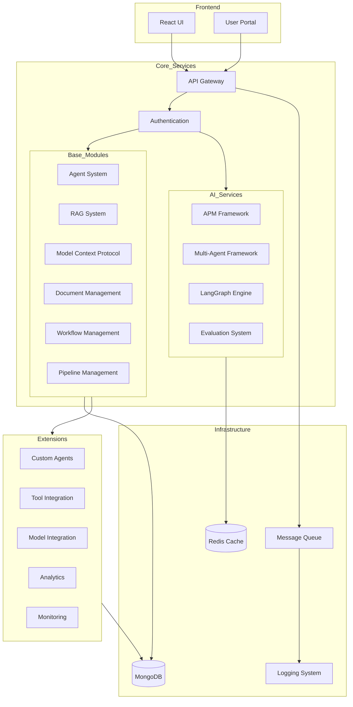

# GENXAIS Framework System Architecture

## Overview

GENXAIS Framework is a modular framework designed specifically for AI-driven application development. The architecture is based on a microservices approach with AI-supported functions.

## Architecture Diagram (LangGraph)

## Module Descriptions

### Core Modules

- **Agent System**: Management of AI agents
- **RAG System**: Retrieval Augmented Generation
- **Model Context Protocol**: Context management
- **Document Management**: Digital document management
- **Workflow Management**: Management of workflows
- **Pipeline Management**: Management of processing pipelines

### AI Services

- **APM Framework**: Adaptive Process Management
- **Multi-Agent Framework**: Coordination of AI agents
- **LangGraph Engine**: Workflow orchestration
- **Evaluation System**: Evaluation of AI outputs

### Extensions

- **Custom Agents**: Integration of custom agents
- **Tool Integration**: Integration of external tools
- **Model Integration**: Integration of AI models
- **Analytics**: Data analysis
- **Monitoring**: System monitoring

## Technology Stack

- **Frontend**: React, TypeScript
- **Backend**: Python, FastAPI
- **Database**: MongoDB
- **Cache**: Redis
- **Message Queue**: RabbitMQ
- **Monitoring**: Prometheus, Grafana

## Security Architecture

- OAuth2/JWT for authentication
- Role-based access control (RBAC)
- Encrypted communication (TLS)
- Audit logging
- Regular security audits

## Deployment Strategy

- Docker containers
- Kubernetes orchestration
- CI/CD pipeline
- Blue-Green deployments
- Automated tests

## Next Steps

1. Review and adaptation of existing modules
2. Implementation of extensions by priority
3. Integration of additional AI services
4. Performance optimization
5. Scalability tests 