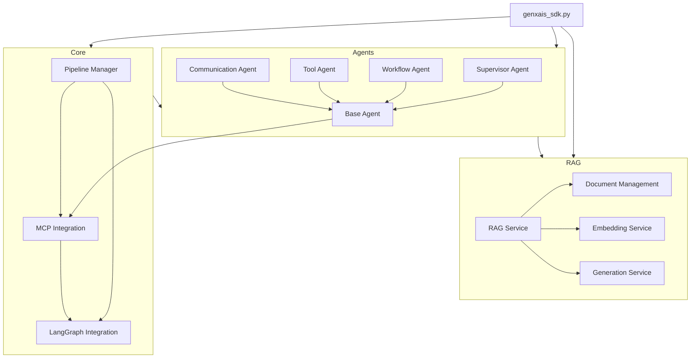

# GENXAIS Framework Module Dependencies

## Overview

This document describes the dependencies between the different modules of the GENXAIS Framework. Understanding these dependencies is crucial for maintaining and extending the framework.

## Core Module Dependencies

The GENXAIS Framework consists of several core modules that depend on each other. The following diagram shows the dependencies between these modules:

## Detailed Dependencies

### SDK Dependencies

The main SDK file (`genxais_sdk.py`) depends on:

- Core modules (Pipeline Manager, MCP Integration, LangGraph Integration)
- Agent modules (Base Agent, Communication Agent, Tool Agent, etc.)
- RAG modules (RAG Service, Document Management, etc.)

### Core Dependencies

The core modules have the following dependencies:

- **Pipeline Manager**: Depends on MCP Integration and LangGraph Integration
- **MCP Integration**: Depends on LangGraph Integration
- **LangGraph Integration**: No internal dependencies

### Agent Dependencies

The agent modules have the following dependencies:

- **Base Agent**: Depends on MCP Integration
- **Communication Agent**: Depends on Base Agent
- **Tool Agent**: Depends on Base Agent
- **Workflow Agent**: Depends on Base Agent
- **Supervisor Agent**: Depends on Base Agent

### RAG Dependencies

The RAG modules have the following dependencies:

- **RAG Service**: Depends on Document Management, Embedding Service, and Generation Service
- **Document Management**: No internal dependencies
- **Embedding Service**: No internal dependencies
- **Generation Service**: No internal dependencies

## External Dependencies

The GENXAIS Framework depends on several external libraries:

- **LangChain**: For building LLM applications
- **LangGraph**: For building agent workflows
- **OpenAI**: For accessing OpenAI models
- **ChromaDB**: For vector storage
- **FastAPI**: For API development
- **Pydantic**: For data validation
- **MongoDB**: For data storage

## Dependency Management

Dependencies in the GENXAIS Framework are managed using:

1. **Import Statements**: Python import statements define the dependencies between modules
2. **Requirements File**: The `requirements.txt` file defines the external dependencies
3. **Version Constraints**: Version constraints in the requirements file ensure compatibility

## Best Practices

When working with the GENXAIS Framework, follow these best practices for dependency management:

1. **Minimize Dependencies**: Modules should have as few dependencies as possible
2. **Avoid Circular Dependencies**: Circular dependencies should be avoided
3. **Use Dependency Injection**: Use dependency injection to make modules more testable
4. **Keep Dependencies Up-to-Date**: Regularly update dependencies to get the latest features and security fixes
5. **Document Dependencies**: Document all dependencies and their purposes

## Future Improvements

Future improvements to dependency management in the GENXAIS Framework include:

1. **Dependency Visualization Tool**: A tool to visualize dependencies between modules
2. **Dependency Checker**: A tool to check for circular dependencies and other issues
3. **Automated Dependency Updates**: Automated updates of dependencies with compatibility checks
4. **Dependency Metrics**: Metrics to track dependency complexity and health 