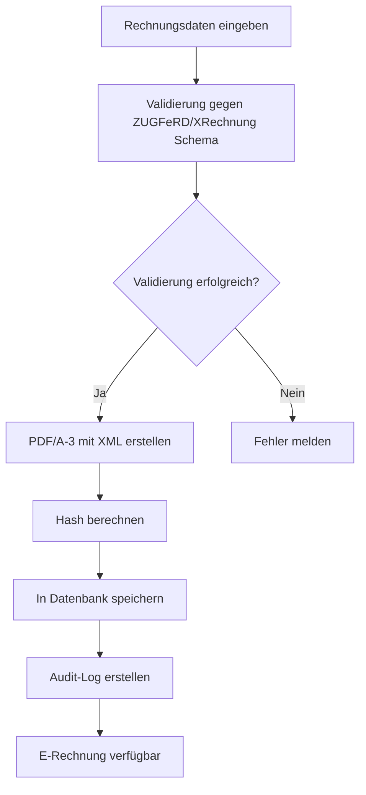
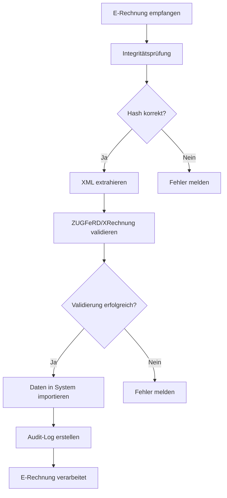
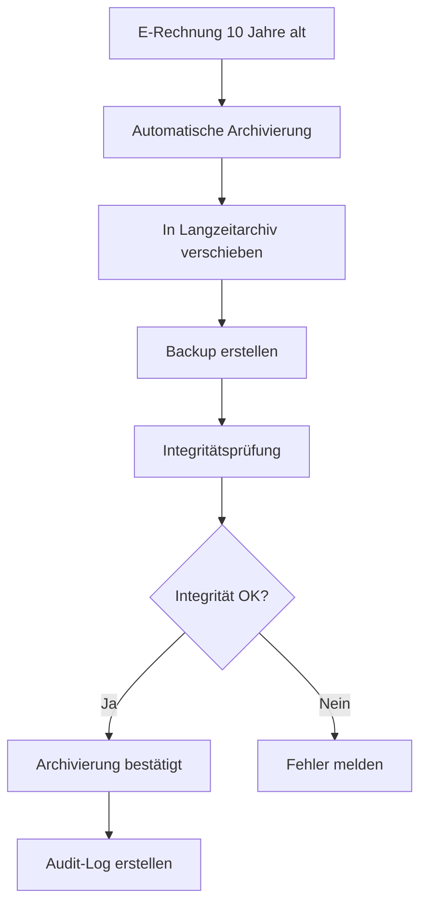

# GoBD-konforme Prozessdokumentation für E-Invoicing System

## 📋 Übersicht

Diese Dokumentation beschreibt die GoBD-konformen Prozesse für das VALEO NeuroERP E-Invoicing-System, das den deutschen Rechtsvorschriften (GoBD, AO, UStG, ZUGFeRD, XRechnung) entspricht.

## 🎯 Rechtliche Grundlagen

### GoBD (Grundsätze zur ordnungsmäßigen Führung und Aufbewahrung von Büchern, Aufzeichnungen und Unterlagen in elektronischer Form)

- **Vollständigkeit**: Alle e-Rechnungen müssen vollständig erfasst werden
- **Richtigkeit**: Daten müssen korrekt und unverändert gespeichert werden
- **Ordnungsmäßigkeit**: Prozesse müssen nachvollziehbar und dokumentiert sein
- **Aufbewahrung**: 10 Jahre Aufbewahrungspflicht für e-Rechnungen
- **Unveränderbarkeit**: Daten dürfen nach Erstellung nicht mehr verändert werden

### AO (Abgabenordnung)

- **§ 14 AO**: Ordnungsvorschriften für die Aufbewahrung von Unterlagen
- **§ 146 AO**: Ordnungsvorschriften für die Buchführung
- **§ 147 AO**: Aufbewahrung von Unterlagen

### UStG (Umsatzsteuergesetz)

- **§ 14 UStG**: Steuersätze und Steuerbefreiungen
- **§ 14a UStG**: Steuerschuldnerschaft des Leistungsempfängers
- **§ 14b UStG**: Steuerschuldnerschaft bei innergemeinschaftlichen Lieferungen

## 🔧 Technische Implementierung

### 1. Datenintegrität und Unveränderbarkeit

```java
// Beispiel: Immutable Invoice Entity
@Entity
@Table(name = "e_invoices")
public class EInvoice {
    
    @Id
    @GeneratedValue(strategy = GenerationType.UUID)
    private String id;
    
    @Column(nullable = false, updatable = false)
    private String invoiceNumber;
    
    @Column(nullable = false, updatable = false)
    private LocalDateTime createdAt;
    
    @Column(nullable = false, updatable = false)
    private String createdBy;
    
    @Column(nullable = false, updatable = false)
    private String hashValue; // SHA-256 Hash für Integritätsprüfung
    
    @Column(nullable = false, updatable = false)
    private byte[] pdfData; // PDF/A-3 mit eingebettetem XML
    
    @Column(nullable = false, updatable = false)
    private String xmlData; // ZUGFeRD/XRechnung XML
    
    // Keine Setter-Methoden - Daten sind unveränderbar nach Erstellung
}
```

### 2. Audit-Trail und Nachverfolgbarkeit

```java
// Audit-Log für alle e-Rechnungs-Operationen
@Entity
@Table(name = "e_invoice_audit_log")
public class EInvoiceAuditLog {
    
    @Id
    @GeneratedValue(strategy = GenerationType.UUID)
    private String id;
    
    @Column(nullable = false)
    private String invoiceId;
    
    @Column(nullable = false)
    private String action; // CREATE, VIEW, DOWNLOAD, VALIDATE
    
    @Column(nullable = false)
    private String performedBy;
    
    @Column(nullable = false)
    private LocalDateTime timestamp;
    
    @Column
    private String ipAddress;
    
    @Column
    private String userAgent;
    
    @Column
    private String details; // JSON mit Details der Aktion
}
```

### 3. Hash-basierte Integritätsprüfung

```java
@Service
public class IntegrityService {
    
    public String calculateHash(byte[] data) {
        try {
            MessageDigest digest = MessageDigest.getInstance("SHA-256");
            byte[] hash = digest.digest(data);
            return Base64.getEncoder().encodeToString(hash);
        } catch (NoSuchAlgorithmException e) {
            throw new RuntimeException("Hash-Berechnung fehlgeschlagen", e);
        }
    }
    
    public boolean verifyIntegrity(String storedHash, byte[] data) {
        String calculatedHash = calculateHash(data);
        return storedHash.equals(calculatedHash);
    }
}
```

## 📊 Prozessabläufe

### 1. E-Rechnung erstellen



### 2. E-Rechnung verarbeiten (eingehend)



### 3. Archivierung und Aufbewahrung



## 🔒 Sicherheitsmaßnahmen

### 1. Verschlüsselung

- **Transport-Verschlüsselung**: TLS 1.3 für alle API-Kommunikation
- **Speicher-Verschlüsselung**: AES-256 für Datenbank und Dateisystem
- **Backup-Verschlüsselung**: Separate Verschlüsselung für Backups

### 2. Zugriffskontrolle

```java
@PreAuthorize("hasRole('INVOICE_CREATOR')")
public ResponseEntity<InvoiceResponse> generateInvoice(InvoiceRequest request) {
    // Nur autorisierte Benutzer können e-Rechnungen erstellen
}

@PreAuthorize("hasRole('INVOICE_VIEWER')")
public ResponseEntity<Resource> downloadInvoice(String invoiceId) {
    // Nur autorisierte Benutzer können e-Rechnungen herunterladen
}
```

### 3. Session-Management

- **JWT-Token**: 24 Stunden Gültigkeit
- **Refresh-Token**: 30 Tage Gültigkeit
- **Automatische Abmeldung**: Bei Inaktivität nach 30 Minuten

## 📋 Qualitätssicherung

### 1. Automatische Validierung

```java
@Component
public class InvoiceValidator {
    
    public ValidationResult validateInvoice(InvoiceRequest request) {
        List<String> errors = new ArrayList<>();
        List<String> warnings = new ArrayList<>();
        
        // Pflichtfelder prüfen
        if (request.getInvoiceNumber() == null || request.getInvoiceNumber().isEmpty()) {
            errors.add("Rechnungsnummer ist Pflichtfeld");
        }
        
        // Steuersätze prüfen
        for (InvoiceItem item : request.getItems()) {
            if (item.getTaxRate() < 0 || item.getTaxRate() > 100) {
                errors.add("Ungültiger Steuersatz: " + item.getTaxRate());
            }
        }
        
        // Mathematische Korrektheit prüfen
        validateCalculations(request, errors);
        
        return ValidationResult.builder()
                .valid(errors.isEmpty())
                .errors(errors)
                .warnings(warnings)
                .build();
    }
}
```

### 2. KI-gestützte Qualitätskontrolle

```java
@Service
public class ClaudeFlowQualityService {
    
    public CompletableFuture<QualityReport> analyzeInvoiceQuality(InvoiceRequest request) {
        return claudeFlowService.analyzeInvoiceWithClaudeFlow(request, pdfData)
                .thenApply(response -> {
                    return QualityReport.builder()
                            .qualityScore(response.getQualityScore())
                            .complianceScore(response.getComplianceScore())
                            .suggestions(response.getSuggestions())
                            .warnings(response.getWarnings())
                            .build();
                });
    }
}
```

## 📈 Monitoring und Reporting

### 1. System-Monitoring

```yaml
# Prometheus Metrics
e_invoice_created_total{status="success"} 1234
e_invoice_created_total{status="error"} 5
e_invoice_processing_duration_seconds{quantile="0.5"} 2.5
e_invoice_processing_duration_seconds{quantile="0.95"} 5.0
```

### 2. Compliance-Reporting

```java
@Service
public class ComplianceReportingService {
    
    public ComplianceReport generateMonthlyReport(LocalDate month) {
        return ComplianceReport.builder()
                .period(month)
                .totalInvoices(statistics.getTotalInvoices())
                .validInvoices(statistics.getValidInvoices())
                .invalidInvoices(statistics.getInvalidInvoices())
                .averageProcessingTime(statistics.getAverageProcessingTime())
                .complianceScore(statistics.getComplianceScore())
                .build();
    }
}
```

## 🧪 Teststrategie

### 1. Unit Tests

```java
@Test
public void testInvoiceValidation() {
    InvoiceRequest request = createValidInvoiceRequest();
    ValidationResult result = validator.validateInvoice(request);
    
    assertTrue(result.isValid());
    assertTrue(result.getErrors().isEmpty());
}

@Test
public void testIntegrityCheck() {
    byte[] originalData = "Test-Daten".getBytes();
    String hash = integrityService.calculateHash(originalData);
    
    assertTrue(integrityService.verifyIntegrity(hash, originalData));
}
```

### 2. Integration Tests

```java
@Test
public void testCompleteInvoiceWorkflow() {
    // 1. E-Rechnung erstellen
    InvoiceRequest request = createTestInvoiceRequest();
    InvoiceResponse response = eInvoicingService.generateInvoice(request);
    
    assertTrue(response.isSuccess());
    assertNotNull(response.getInvoiceId());
    
    // 2. E-Rechnung herunterladen
    byte[] pdfData = eInvoicingService.downloadInvoice(response.getInvoiceId());
    assertNotNull(pdfData);
    assertTrue(pdfData.length > 0);
    
    // 3. Integrität prüfen
    EInvoice invoice = invoiceRepository.findById(response.getInvoiceId()).orElseThrow();
    assertTrue(integrityService.verifyIntegrity(invoice.getHashValue(), pdfData));
}
```

### 3. End-to-End Tests

```java
@Test
public void testEndToEndInvoiceProcessing() {
    // Kompletter Workflow von der Erstellung bis zur Archivierung
    // Simuliert realistische Nutzungsszenarien
}
```

## 📚 Dokumentation und Schulung

### 1. Benutzerhandbuch

- **E-Rechnung erstellen**: Schritt-für-Schritt-Anleitung
- **E-Rechnung verarbeiten**: Workflow für eingehende e-Rechnungen
- **Fehlerbehebung**: Häufige Probleme und Lösungen
- **Compliance-Checkliste**: GoBD-konforme Nutzung

### 2. Administrator-Handbuch

- **System-Installation**: Deployment und Konfiguration
- **Monitoring**: Überwachung und Alerting
- **Backup und Recovery**: Datensicherung und Wiederherstellung
- **Wartung**: Updates und Patches

### 3. Entwickler-Dokumentation

- **API-Referenz**: Vollständige API-Dokumentation
- **Architektur**: System-Design und Komponenten
- **Entwicklungsrichtlinien**: Coding Standards und Best Practices
- **Testing**: Teststrategie und -implementierung

## 🔍 Audit und Compliance

### 1. Interne Audits

- **Monatliche Compliance-Prüfungen**: Automatisierte Checks
- **Quartalsweise Reviews**: Manuelle Überprüfungen
- **Jährliche Assessments**: Umfassende Bewertungen

### 2. Externe Audits

- **Steuerberater-Prüfung**: Regelmäßige externe Bewertungen
- **Finanzamt-Prüfung**: Vorbereitung für behördliche Kontrollen
- **Zertifizierungen**: ISO 27001, TISAX, etc.

### 3. Audit-Trail

```java
// Automatische Audit-Log-Generierung für alle Aktionen
@Aspect
@Component
public class AuditAspect {
    
    @Around("@annotation(Audited)")
    public Object auditMethod(ProceedingJoinPoint joinPoint) throws Throwable {
        String methodName = joinPoint.getSignature().getName();
        String username = SecurityContextHolder.getContext().getAuthentication().getName();
        
        AuditLog log = AuditLog.builder()
                .action(methodName)
                .performedBy(username)
                .timestamp(LocalDateTime.now())
                .ipAddress(getCurrentIpAddress())
                .build();
        
        auditLogRepository.save(log);
        
        return joinPoint.proceed();
    }
}
```

## 📋 Checkliste für GoBD-Konformität

### ✅ Technische Anforderungen

- [ ] Unveränderbarkeit der Daten nach Erstellung
- [ ] Hash-basierte Integritätsprüfung
- [ ] Vollständiger Audit-Trail
- [ ] Sichere Verschlüsselung
- [ ] Zugriffskontrolle und Authentifizierung
- [ ] Backup und Recovery
- [ ] 10 Jahre Aufbewahrungspflicht

### ✅ Prozessanforderungen

- [ ] Dokumentierte Workflows
- [ ] Qualitätssicherung
- [ ] Monitoring und Reporting
- [ ] Schulung der Benutzer
- [ ] Regelmäßige Audits
- [ ] Compliance-Reporting

### ✅ Rechtliche Anforderungen

- [ ] UStG-Konformität
- [ ] AO-Konformität
- [ ] ZUGFeRD/XRechnung-Standards
- [ ] Datenschutz (DSGVO)
- [ ] Dokumentationspflichten

## 🚀 Deployment und Go-Live

### 1. Staging-Umgebung

- **Testdaten**: Realistische Test-Szenarien
- **Performance-Tests**: Last- und Stresstests
- **Security-Tests**: Penetrationstests
- **Compliance-Tests**: GoBD-Konformitätsprüfungen

### 2. Produktions-Deployment

- **Rolling Update**: Zero-Downtime Deployment
- **Health Checks**: Automatische Überwachung
- **Rollback-Plan**: Notfall-Wiederherstellung
- **Monitoring**: Echtzeit-Überwachung

### 3. Go-Live Checkliste

- [ ] Alle Tests erfolgreich
- [ ] Dokumentation vollständig
- [ ] Benutzer geschult
- [ ] Monitoring aktiv
- [ ] Backup-Systeme getestet
- [ ] Notfall-Prozeduren dokumentiert
- [ ] Compliance bestätigt

---

**Dokumentation erstellt am**: 2024-01-01  
**Version**: 1.0.0  
**Autor**: VALEO NeuroERP Team  
**Genehmigt durch**: Rechtsabteilung, IT-Sicherheit, Steuerberater 