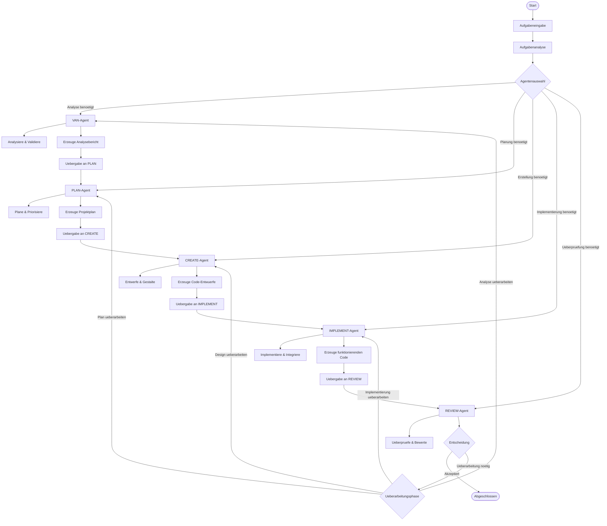

# Agent-Workflow-Diagramm

Dieses Diagramm zeigt den Workflow zwischen den verschiedenen Agenten im VALEO-NeuroERP Multi-Agent-Framework.

Der Workflow beginnt mit einer Aufgabeneingabe, die analysiert wird, um den passenden Agenten auszuwaehlen. Jeder Agent durchlaeuft seinen spezifischen Prozess und erzeugt Ergebnisse, die an den naechsten Agenten uebergeben werden. Am Ende des Workflows entscheidet der REVIEW-Agent, ob die Aufgabe abgeschlossen ist oder eine Ueberarbeitung in einer bestimmten Phase erforderlich ist.