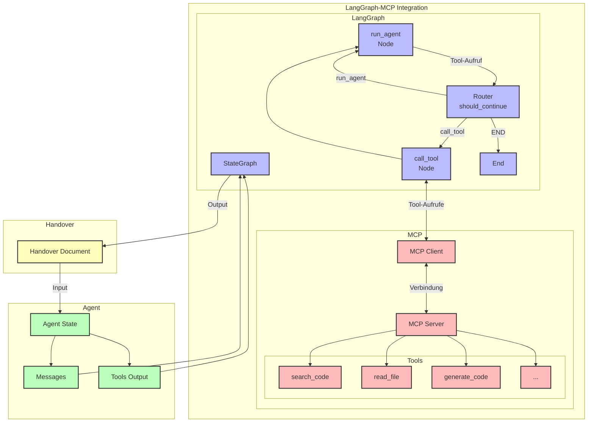

```mermaid
flowchart TD
    subgraph "LangGraph-MCP Integration"
        subgraph "LangGraph"
            SG["StateGraph"]
            NA["run_agent<br>Node"]
            NT["call_tool<br>Node"]
            Router["Router<br>should_continue"]
            
            NA -->|"Tool-Aufruf"| Router
            Router -->|"call_tool"| NT
            Router -->|"run_agent"| NA
            Router -->|"END"| End
            NT --> NA
        end
        
        subgraph "MCP"
            Client["MCP Client"]
            Server["MCP Server"]
            
            subgraph "Tools"
                T1["search_code"]
                T2["read_file"]
                T3["generate_code"]
                T4["..."]
            end
            
            Client <-->|"Verbindung"| Server
            Server --> T1
            Server --> T2
            Server --> T3
            Server --> T4
        end
        
        NT <-->|"Tool-Aufrufe"| Client
    end
    
    subgraph "Agent"
        AgentState["Agent State"]
        Messages["Messages"]
        ToolsOutput["Tools Output"]
        
        AgentState --> Messages
        AgentState --> ToolsOutput
        Messages --> SG
        ToolsOutput --> SG
    end
    
    subgraph "Handover"
        HD["Handover Document"]
        
        HD -->|"Input"| AgentState
        SG -->|"Output"| HD
    end
    
    %% Styling
    classDef langgraph fill:#bbf,stroke:#333,stroke-width:2px
    classDef mcp fill:#fbb,stroke:#333,stroke-width:2px
    classDef agent fill:#bfb,stroke:#333,stroke-width:2px
    classDef handover fill:#ffb,stroke:#333,stroke-width:2px
    
    class SG,NA,NT,Router,End langgraph
    class Client,Server,T1,T2,T3,T4 mcp
    class AgentState,Messages,ToolsOutput agent
    class HD handover
``` 