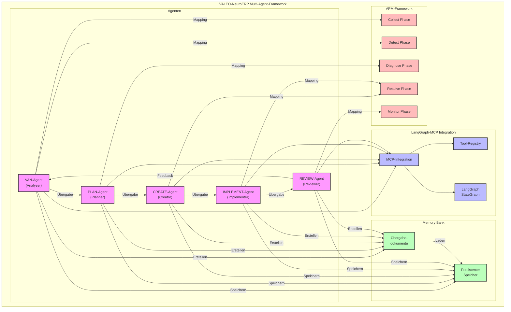

```mermaid
graph TD
    subgraph "VALEO-NeuroERP Multi-Agent-Framework"
        subgraph "Agenten"
            VAN["VAN-Agent<br>(Analyzer)"]
            PLAN["PLAN-Agent<br>(Planner)"]
            CREATE["CREATE-Agent<br>(Creator)"]
            IMPLEMENT["IMPLEMENT-Agent<br>(Implementer)"]
            REVIEW["REVIEW-Agent<br>(Reviewer)"]
        end
        
        subgraph "LangGraph-MCP Integration"
            MCP["MCP-Integration"]
            TOOLS["Tool-Registry"]
            GRAPH["LangGraph<br>StateGraph"]
        end
        
        subgraph "Memory Bank"
            MEMORY["Persistenter<br>Speicher"]
            HANDOVER["Übergabe-<br>dokumente"]
        end
        
        subgraph "APM-Framework"
            COLLECT["Collect Phase"]
            DETECT["Detect Phase"]
            DIAGNOSE["Diagnose Phase"]
            RESOLVE["Resolve Phase"]
            MONITOR["Monitor Phase"]
        end
    end
    
    %% Verbindungen zwischen Agenten (Handover)
    VAN -->|"Übergabe"| PLAN
    PLAN -->|"Übergabe"| CREATE
    CREATE -->|"Übergabe"| IMPLEMENT
    IMPLEMENT -->|"Übergabe"| REVIEW
    REVIEW -->|"Feedback"| VAN
    
    %% Integration mit LangGraph-MCP
    VAN --> MCP
    PLAN --> MCP
    CREATE --> MCP
    IMPLEMENT --> MCP
    REVIEW --> MCP
    
    MCP --> TOOLS
    MCP --> GRAPH
    
    %% Memory Bank Verbindungen
    VAN -->|"Speichern"| MEMORY
    PLAN -->|"Speichern"| MEMORY
    CREATE -->|"Speichern"| MEMORY
    IMPLEMENT -->|"Speichern"| MEMORY
    REVIEW -->|"Speichern"| MEMORY
    
    VAN -->|"Erstellen"| HANDOVER
    PLAN -->|"Erstellen"| HANDOVER
    CREATE -->|"Erstellen"| HANDOVER
    IMPLEMENT -->|"Erstellen"| HANDOVER
    REVIEW -->|"Erstellen"| HANDOVER
    
    HANDOVER -->|"Laden"| MEMORY
    
    %% APM-Framework Mapping
    VAN -->|"Mapping"| COLLECT
    VAN -->|"Mapping"| DETECT
    PLAN -->|"Mapping"| DIAGNOSE
    CREATE -->|"Mapping"| RESOLVE
    IMPLEMENT -->|"Mapping"| RESOLVE
    REVIEW -->|"Mapping"| MONITOR
    
    %% Styling
    classDef agent fill:#f9f,stroke:#333,stroke-width:2px
    classDef integration fill:#bbf,stroke:#333,stroke-width:2px
    classDef memory fill:#bfb,stroke:#333,stroke-width:2px
    classDef apm fill:#fbb,stroke:#333,stroke-width:2px
    
    class VAN,PLAN,CREATE,IMPLEMENT,REVIEW agent
    class MCP,TOOLS,GRAPH integration
    class MEMORY,HANDOVER memory
    class COLLECT,DETECT,DIAGNOSE,RESOLVE,MONITOR apm
``` 