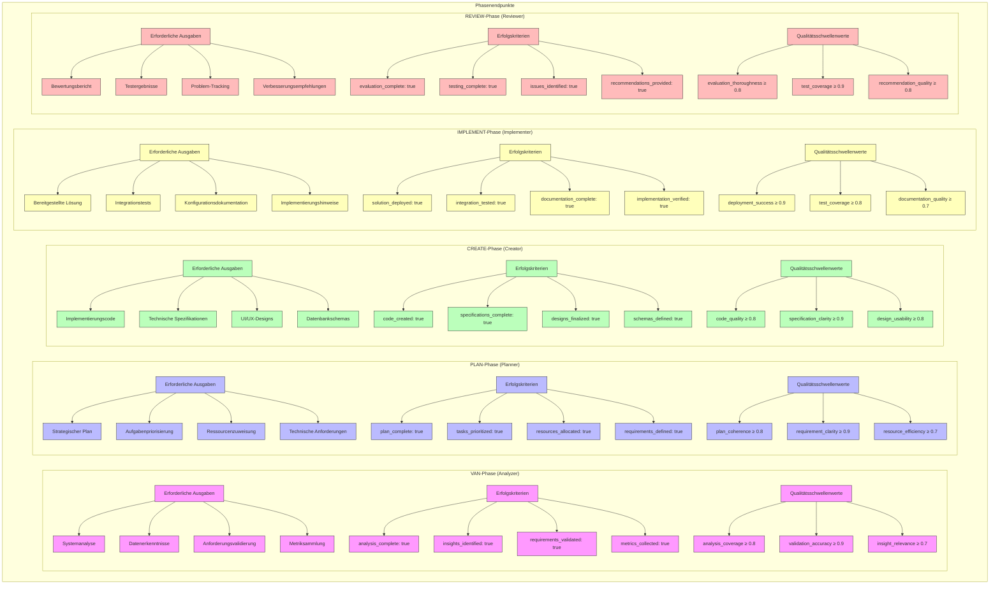

```mermaid
graph TD
    subgraph "Phasenendpunkte"
        subgraph "VAN-Phase (Analyzer)"
            VAN_OUT["Erforderliche Ausgaben"]
            VAN_CRIT["Erfolgskriterien"]
            VAN_QUAL["Qualitätsschwellenwerte"]
            
            VAN_OUT1["Systemanalyse"]
            VAN_OUT2["Datenerkenntnisse"]
            VAN_OUT3["Anforderungsvalidierung"]
            VAN_OUT4["Metriksammlung"]
            
            VAN_CRIT1["analysis_complete: true"]
            VAN_CRIT2["insights_identified: true"]
            VAN_CRIT3["requirements_validated: true"]
            VAN_CRIT4["metrics_collected: true"]
            
            VAN_QUAL1["analysis_coverage ≥ 0.8"]
            VAN_QUAL2["validation_accuracy ≥ 0.9"]
            VAN_QUAL3["insight_relevance ≥ 0.7"]
            
            VAN_OUT --> VAN_OUT1
            VAN_OUT --> VAN_OUT2
            VAN_OUT --> VAN_OUT3
            VAN_OUT --> VAN_OUT4
            
            VAN_CRIT --> VAN_CRIT1
            VAN_CRIT --> VAN_CRIT2
            VAN_CRIT --> VAN_CRIT3
            VAN_CRIT --> VAN_CRIT4
            
            VAN_QUAL --> VAN_QUAL1
            VAN_QUAL --> VAN_QUAL2
            VAN_QUAL --> VAN_QUAL3
        end
        
        subgraph "PLAN-Phase (Planner)"
            PLAN_OUT["Erforderliche Ausgaben"]
            PLAN_CRIT["Erfolgskriterien"]
            PLAN_QUAL["Qualitätsschwellenwerte"]
            
            PLAN_OUT1["Strategischer Plan"]
            PLAN_OUT2["Aufgabenpriorisierung"]
            PLAN_OUT3["Ressourcenzuweisung"]
            PLAN_OUT4["Technische Anforderungen"]
            
            PLAN_CRIT1["plan_complete: true"]
            PLAN_CRIT2["tasks_prioritized: true"]
            PLAN_CRIT3["resources_allocated: true"]
            PLAN_CRIT4["requirements_defined: true"]
            
            PLAN_QUAL1["plan_coherence ≥ 0.8"]
            PLAN_QUAL2["requirement_clarity ≥ 0.9"]
            PLAN_QUAL3["resource_efficiency ≥ 0.7"]
            
            PLAN_OUT --> PLAN_OUT1
            PLAN_OUT --> PLAN_OUT2
            PLAN_OUT --> PLAN_OUT3
            PLAN_OUT --> PLAN_OUT4
            
            PLAN_CRIT --> PLAN_CRIT1
            PLAN_CRIT --> PLAN_CRIT2
            PLAN_CRIT --> PLAN_CRIT3
            PLAN_CRIT --> PLAN_CRIT4
            
            PLAN_QUAL --> PLAN_QUAL1
            PLAN_QUAL --> PLAN_QUAL2
            PLAN_QUAL --> PLAN_QUAL3
        end
        
        subgraph "CREATE-Phase (Creator)"
            CREATE_OUT["Erforderliche Ausgaben"]
            CREATE_CRIT["Erfolgskriterien"]
            CREATE_QUAL["Qualitätsschwellenwerte"]
            
            CREATE_OUT1["Implementierungscode"]
            CREATE_OUT2["Technische Spezifikationen"]
            CREATE_OUT3["UI/UX-Designs"]
            CREATE_OUT4["Datenbankschemas"]
            
            CREATE_CRIT1["code_created: true"]
            CREATE_CRIT2["specifications_complete: true"]
            CREATE_CRIT3["designs_finalized: true"]
            CREATE_CRIT4["schemas_defined: true"]
            
            CREATE_QUAL1["code_quality ≥ 0.8"]
            CREATE_QUAL2["specification_clarity ≥ 0.9"]
            CREATE_QUAL3["design_usability ≥ 0.8"]
            
            CREATE_OUT --> CREATE_OUT1
            CREATE_OUT --> CREATE_OUT2
            CREATE_OUT --> CREATE_OUT3
            CREATE_OUT --> CREATE_OUT4
            
            CREATE_CRIT --> CREATE_CRIT1
            CREATE_CRIT --> CREATE_CRIT2
            CREATE_CRIT --> CREATE_CRIT3
            CREATE_CRIT --> CREATE_CRIT4
            
            CREATE_QUAL --> CREATE_QUAL1
            CREATE_QUAL --> CREATE_QUAL2
            CREATE_QUAL --> CREATE_QUAL3
        end
        
        subgraph "IMPLEMENT-Phase (Implementer)"
            IMPL_OUT["Erforderliche Ausgaben"]
            IMPL_CRIT["Erfolgskriterien"]
            IMPL_QUAL["Qualitätsschwellenwerte"]
            
            IMPL_OUT1["Bereitgestellte Lösung"]
            IMPL_OUT2["Integrationstests"]
            IMPL_OUT3["Konfigurationsdokumentation"]
            IMPL_OUT4["Implementierungshinweise"]
            
            IMPL_CRIT1["solution_deployed: true"]
            IMPL_CRIT2["integration_tested: true"]
            IMPL_CRIT3["documentation_complete: true"]
            IMPL_CRIT4["implementation_verified: true"]
            
            IMPL_QUAL1["deployment_success ≥ 0.9"]
            IMPL_QUAL2["test_coverage ≥ 0.8"]
            IMPL_QUAL3["documentation_quality ≥ 0.7"]
            
            IMPL_OUT --> IMPL_OUT1
            IMPL_OUT --> IMPL_OUT2
            IMPL_OUT --> IMPL_OUT3
            IMPL_OUT --> IMPL_OUT4
            
            IMPL_CRIT --> IMPL_CRIT1
            IMPL_CRIT --> IMPL_CRIT2
            IMPL_CRIT --> IMPL_CRIT3
            IMPL_CRIT --> IMPL_CRIT4
            
            IMPL_QUAL --> IMPL_QUAL1
            IMPL_QUAL --> IMPL_QUAL2
            IMPL_QUAL --> IMPL_QUAL3
        end
        
        subgraph "REVIEW-Phase (Reviewer)"
            REV_OUT["Erforderliche Ausgaben"]
            REV_CRIT["Erfolgskriterien"]
            REV_QUAL["Qualitätsschwellenwerte"]
            
            REV_OUT1["Bewertungsbericht"]
            REV_OUT2["Testergebnisse"]
            REV_OUT3["Problem-Tracking"]
            REV_OUT4["Verbesserungsempfehlungen"]
            
            REV_CRIT1["evaluation_complete: true"]
            REV_CRIT2["testing_complete: true"]
            REV_CRIT3["issues_identified: true"]
            REV_CRIT4["recommendations_provided: true"]
            
            REV_QUAL1["evaluation_thoroughness ≥ 0.8"]
            REV_QUAL2["test_coverage ≥ 0.9"]
            REV_QUAL3["recommendation_quality ≥ 0.8"]
            
            REV_OUT --> REV_OUT1
            REV_OUT --> REV_OUT2
            REV_OUT --> REV_OUT3
            REV_OUT --> REV_OUT4
            
            REV_CRIT --> REV_CRIT1
            REV_CRIT --> REV_CRIT2
            REV_CRIT --> REV_CRIT3
            REV_CRIT --> REV_CRIT4
            
            REV_QUAL --> REV_QUAL1
            REV_QUAL --> REV_QUAL2
            REV_QUAL --> REV_QUAL3
        end
    end
    
    %% Styling
    classDef van fill:#f9f,stroke:#333,stroke-width:1px
    classDef plan fill:#bbf,stroke:#333,stroke-width:1px
    classDef create fill:#bfb,stroke:#333,stroke-width:1px
    classDef implement fill:#ffb,stroke:#333,stroke-width:1px
    classDef review fill:#fbb,stroke:#333,stroke-width:1px
    
    class VAN_OUT,VAN_CRIT,VAN_QUAL,VAN_OUT1,VAN_OUT2,VAN_OUT3,VAN_OUT4,VAN_CRIT1,VAN_CRIT2,VAN_CRIT3,VAN_CRIT4,VAN_QUAL1,VAN_QUAL2,VAN_QUAL3 van
    class PLAN_OUT,PLAN_CRIT,PLAN_QUAL,PLAN_OUT1,PLAN_OUT2,PLAN_OUT3,PLAN_OUT4,PLAN_CRIT1,PLAN_CRIT2,PLAN_CRIT3,PLAN_CRIT4,PLAN_QUAL1,PLAN_QUAL2,PLAN_QUAL3 plan
    class CREATE_OUT,CREATE_CRIT,CREATE_QUAL,CREATE_OUT1,CREATE_OUT2,CREATE_OUT3,CREATE_OUT4,CREATE_CRIT1,CREATE_CRIT2,CREATE_CRIT3,CREATE_CRIT4,CREATE_QUAL1,CREATE_QUAL2,CREATE_QUAL3 create
    class IMPL_OUT,IMPL_CRIT,IMPL_QUAL,IMPL_OUT1,IMPL_OUT2,IMPL_OUT3,IMPL_OUT4,IMPL_CRIT1,IMPL_CRIT2,IMPL_CRIT3,IMPL_CRIT4,IMPL_QUAL1,IMPL_QUAL2,IMPL_QUAL3 implement
    class REV_OUT,REV_CRIT,REV_QUAL,REV_OUT1,REV_OUT2,REV_OUT3,REV_OUT4,REV_CRIT1,REV_CRIT2,REV_CRIT3,REV_CRIT4,REV_QUAL1,REV_QUAL2,REV_QUAL3 review
``` 