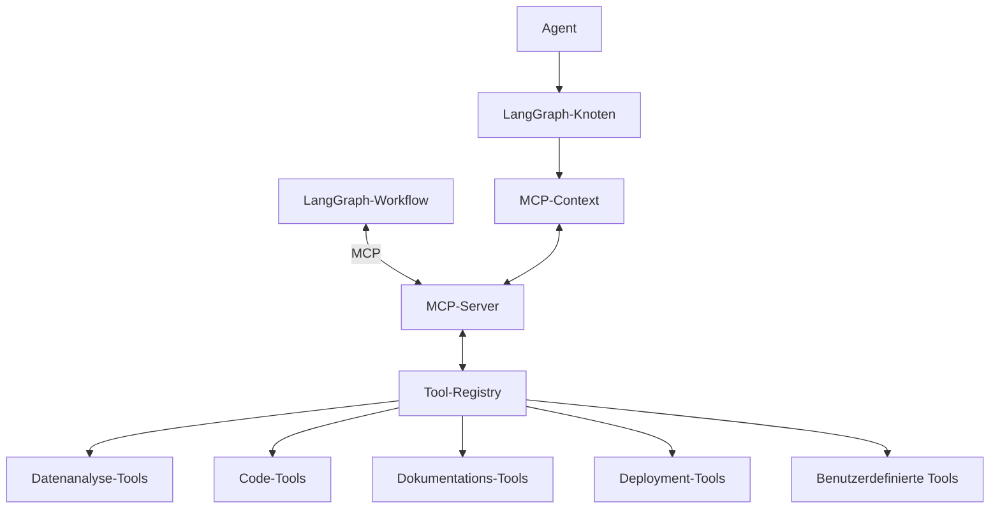

# LangGraph-MCP Integration

Diese Dokumentation beschreibt die Integration von LangGraph mit dem Model Context Protocol (MCP) im VALEO-NeuroERP Multi-Agent-Framework.

## Übersicht

Die Integration von LangGraph mit dem Model Context Protocol (MCP) ermöglicht eine nahtlose Kommunikation zwischen den Agenten des Frameworks und externen Tools und Diensten. Diese Integration bildet das Rückgrat für die Werkzeugnutzung und Interoperabilität im Multi-Agent-Framework.

## Architekturdiagramm



## Komponenten

### 1. LangGraph

LangGraph ist eine Bibliothek zur Definition von zustandsbasierten Workflows für KI-Agenten. Im VALEO-NeuroERP-Framework wird LangGraph verwendet, um:

- Den Workflow zwischen verschiedenen Agentenrollen zu definieren
- Zustandsübergänge und Entscheidungspunkte zu verwalten
- Parallele Ausführung von Agentenaufgaben zu ermöglichen
- Persistente Zustände zwischen Agentenaufrufen zu speichern

### 2. Model Context Protocol (MCP)

MCP ist ein Protokoll, das es LLM-basierten Agenten ermöglicht, mit externen Tools und Diensten zu interagieren. Im Framework wird MCP verwendet, um:

- Agentenspezifische Tools zu definieren und bereitzustellen
- Werkzeugaufrufe zu standardisieren und zu validieren
- Ergebnisse von Werkzeugaufrufen zu verarbeiten und in den Agentenkontext zu integrieren
- Die Sicherheit und Zuverlässigkeit von Werkzeugaufrufen zu gewährleisten

### 3. MCP-Integration

Die MCP-Integration im VALEO-NeuroERP-Framework besteht aus mehreren Komponenten:

#### 3.1. MCP-Server

Der MCP-Server ist ein separater Dienst, der als Vermittler zwischen den Agenten und den Tools fungiert. Er:

- Empfängt Anfragen von Agenten
- Validiert Anfragen und Berechtigungen
- Leitet Anfragen an die entsprechenden Tools weiter
- Gibt Ergebnisse an die Agenten zurück

#### 3.2. MCPIntegration-Klasse

Die `MCPIntegration`-Klasse ist die Hauptschnittstelle zwischen dem Framework und dem MCP-Server:

```python
class MCPIntegration:
    def __init__(self, mcp_server_url, config=None):
        self.mcp_server_url = mcp_server_url
        self.config = config or {}
        
    def create_mcp_context(self, agent_type):
        """Erstellt einen MCP-Kontext für einen bestimmten Agententyp."""
        tools = self._get_tools_for_agent(agent_type)
        return MCPContext(
            server_url=self.mcp_server_url,
            tools=tools,
            metadata={"agent_type": agent_type}
        )
    
    def _get_tools_for_agent(self, agent_type):
        """Gibt die für einen Agententyp verfügbaren Tools zurück."""
        base_tools = ["file_read", "file_write", "search"]
        
        agent_specific_tools = {
            "van": ["data_analysis", "requirement_validation", "schema_validation"],
            "plan": ["task_planning", "resource_allocation", "timeline_generation"],
            "create": ["code_generation", "design_tools", "prototype_creation"],
            "implement": ["code_implementation", "testing", "deployment"],
            "review": ["code_review", "performance_analysis", "security_audit"]
        }
        
        return base_tools + agent_specific_tools.get(agent_type, [])
```

#### 3.3. Tool-Registry

Die Tool-Registry verwaltet die verfügbaren Tools und deren Konfigurationen:

```python
class ToolRegistry:
    def __init__(self):
        self.tools = {}
        
    def register_tool(self, tool_name, tool_config):
        """Registriert ein Tool in der Registry."""
        self.tools[tool_name] = tool_config
        
    def get_tool(self, tool_name):
        """Gibt die Konfiguration eines Tools zurück."""
        return self.tools.get(tool_name)
        
    def list_tools(self, agent_type=None):
        """Listet alle verfügbaren Tools für einen Agententyp auf."""
        if agent_type is None:
            return list(self.tools.keys())
            
        return [
            tool_name for tool_name, config in self.tools.items()
            if agent_type in config.get("allowed_agents", [])
        ]
```

## Integration mit LangGraph

Die Integration von MCP mit LangGraph erfolgt über die Definition von Knoten im LangGraph-Workflow:

```python
from langgraph.graph import StateGraph
from mcp import MCPContext

def create_agent_with_mcp(agent_type, mcp_integration):
    """Erstellt einen Agenten mit MCP-Integration."""
    
    async def agent_node(state):
        # MCP-Kontext für den Agenten erstellen
        mcp_context = mcp_integration.create_mcp_context(agent_type)
        
        # Agenten mit MCP-Kontext initialisieren
        agent = get_agent_for_type(agent_type, mcp_context)
        
        # Aufgabe ausführen
        result = await agent.process(state["task"], state["context"])
        
        # Ergebnis in den Zustand integrieren
        new_state = state.copy()
        new_state["results"][agent_type] = result
        
        return new_state
    
    return agent_node

def create_workflow(mcp_integration):
    """Erstellt einen LangGraph-Workflow mit MCP-Integration."""
    workflow = StateGraph()
    
    # Agenten mit MCP-Integration definieren
    van_agent = create_agent_with_mcp("van", mcp_integration)
    plan_agent = create_agent_with_mcp("plan", mcp_integration)
    create_agent = create_agent_with_mcp("create", mcp_integration)
    implement_agent = create_agent_with_mcp("implement", mcp_integration)
    review_agent = create_agent_with_mcp("review", mcp_integration)
    
    # Knoten zum Workflow hinzufügen
    workflow.add_node("van", van_agent)
    workflow.add_node("plan", plan_agent)
    workflow.add_node("create", create_agent)
    workflow.add_node("implement", implement_agent)
    workflow.add_node("review", review_agent)
    
    # Übergänge definieren
    # ...
    
    return workflow.compile()
```

## Agentenspezifische Tools

Jeder Agententyp hat Zugriff auf spezifische Tools, die für seine Aufgaben relevant sind:

### VAN (Validator-Analyzer) Tools

- `data_analysis`: Analyse von Daten und Metriken
- `requirement_validation`: Validierung von Anforderungen
- `schema_validation`: Validierung von Datenschemas

### PLAN (Planner) Tools

- `task_planning`: Erstellung von Aufgabenplänen
- `resource_allocation`: Zuweisung von Ressourcen
- `timeline_generation`: Generierung von Zeitplänen und Gantt-Diagrammen

### CREATE (Creator) Tools

- `code_generation`: Generierung von Code
- `design_tools`: UI/UX-Design-Tools
- `prototype_creation`: Erstellung von Prototypen

### IMPLEMENT (Implementer) Tools

- `code_implementation`: Implementierung von Code
- `testing`: Durchführung von Tests
- `deployment`: Deployment von Anwendungen

### REVIEW (Reviewer) Tools

- `code_review`: Code-Review-Tools
- `performance_analysis`: Leistungsanalyse
- `security_audit`: Sicherheitsaudit

## Tool-Definitionen

Tools werden im MCP-Format definiert:

```python
{
    "name": "data_analysis",
    "description": "Analysiert Daten und generiert Metriken und Erkenntnisse.",
    "parameters": {
        "type": "object",
        "properties": {
            "data_source": {
                "type": "string",
                "description": "Die Quelle der zu analysierenden Daten."
            },
            "metrics": {
                "type": "array",
                "items": {
                    "type": "string"
                },
                "description": "Die zu berechnenden Metriken."
            },
            "output_format": {
                "type": "string",
                "enum": ["json", "csv", "markdown"],
                "description": "Das Format der Ausgabe."
            }
        },
        "required": ["data_source"]
    }
}
```

## Konfiguration und Setup

### 1. MCP-Server-Setup

Der MCP-Server muss separat installiert und konfiguriert werden:

```bash
# Installation des MCP-Servers
pip install mcp-server

# Konfigurationsdatei erstellen
cat > mcp-config.json << EOF
{
    "server": {
        "host": "localhost",
        "port": 8000
    },
    "tools": {
        "directory": "./tools"
    },
    "security": {
        "api_key_required": true
    }
}
EOF

# MCP-Server starten
mcp-server --config mcp-config.json
```

### 2. Framework-Konfiguration

Die MCP-Integration wird im Framework konfiguriert:

```python
# config/mcp_config.py
MCP_CONFIG = {
    "server_url": "http://localhost:8000",
    "api_key": "your-api-key",
    "timeout": 30,  # Sekunden
    "retry_attempts": 3
}
```

### 3. Tool-Registrierung

Tools werden in der Tool-Registry registriert:

```python
# Beispiel für die Registrierung von Tools
registry = ToolRegistry()

registry.register_tool("data_analysis", {
    "path": "tools.data_analysis.analyze_data",
    "allowed_agents": ["van", "review"],
    "requires_authentication": True
})

registry.register_tool("task_planning", {
    "path": "tools.planning.create_task_plan",
    "allowed_agents": ["plan"],
    "requires_authentication": True
})

# Weitere Tools registrieren...
```

## Fehlerbehandlung

Die MCP-Integration enthält robuste Fehlerbehandlung:

```python
async def execute_tool_with_retry(mcp_context, tool_name, parameters):
    """Führt ein Tool mit Wiederholungsversuchen aus."""
    max_retries = 3
    retry_count = 0
    
    while retry_count < max_retries:
        try:
            result = await mcp_context.execute_tool(tool_name, parameters)
            return result
        except ConnectionError:
            retry_count += 1
            if retry_count >= max_retries:
                raise
            await asyncio.sleep(1)  # Kurze Pause vor dem nächsten Versuch
        except Exception as e:
            # Andere Fehler nicht wiederholen
            raise
```

## Sicherheitsaspekte

Die MCP-Integration implementiert mehrere Sicherheitsmaßnahmen:

1. **API-Schlüssel-Authentifizierung**: Jeder Aufruf an den MCP-Server erfordert einen API-Schlüssel.
2. **Berechtigungsprüfung**: Tools sind nur für bestimmte Agententypen verfügbar.
3. **Eingabevalidierung**: Alle Toolparameter werden validiert, bevor sie an das Tool übergeben werden.
4. **Rate Limiting**: Die Anzahl der Toolaufrufe pro Zeiteinheit ist begrenzt.
5. **Audit-Logging**: Alle Toolaufrufe werden protokolliert.

## Best Practices

### 1. Tool-Design

- Definieren Sie klare Eingabe- und Ausgabeparameter für jedes Tool
- Stellen Sie ausführliche Beschreibungen für jedes Tool bereit
- Implementieren Sie Validierung für alle Eingabeparameter

### 2. Fehlerbehandlung

- Implementieren Sie Wiederholungsversuche für netzwerkbezogene Fehler
- Liefern Sie aussagekräftige Fehlermeldungen zurück
- Protokollieren Sie Fehler für spätere Analyse

### 3. Sicherheit

- Beschränken Sie den Zugriff auf Tools nach Agententyp
- Validieren Sie alle Eingaben gründlich
- Implementieren Sie Rate Limiting für Toolaufrufe

## Fazit

Die Integration von LangGraph mit MCP bietet eine leistungsstarke und flexible Grundlage für das Multi-Agent-Framework. Sie ermöglicht es den Agenten, mit einer Vielzahl von Tools zu interagieren und komplexe Aufgaben zu lösen, während sie gleichzeitig eine klare Struktur und Sicherheitsmaßnahmen bietet.

## Weiterführende Dokumentation

- [Multi-Agent-Framework-Integration](./multi_agent_framework_integration.md)
- [Phasenendpunkte](./phase_endpoints.md)
- [Installationsanleitung](./setup_guide.md)
- [Offizielle LangGraph-Dokumentation](https://github.com/langchain-ai/langgraph)
- [Offizielle MCP-Dokumentation](https://github.com/microsoft/mcp)
