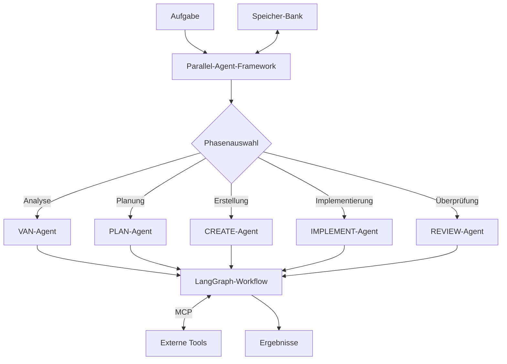

# Multi-Agent-Framework Integration mit LangGraph-MCP

Diese Dokumentation beschreibt die Integration des VALEO-NeuroERP Multi-Agent-Frameworks mit LangGraph und dem Model Context Protocol (MCP).

## Übersicht

Das VALEO-NeuroERP Multi-Agent-Framework ermöglicht die Zusammenarbeit verschiedener spezialisierter KI-Agenten zur Lösung komplexer ERP-bezogener Aufgaben. Die Integration mit LangGraph und MCP bietet folgende Vorteile:

- **Strukturierte Agentenkoordination**: Klare Definition von Agentenrollen und Verantwortlichkeiten
- **Zustandsverwaltung**: Konsistente Übergabe zwischen Agenten mit gemeinsamen Kontext
- **Werkzeugintegration**: Nahtlose Einbindung externer Tools über das Model Context Protocol
- **Skalierbarkeit**: Einfache Erweiterung um neue Agentenrollen und Fähigkeiten

## Architektur

Das Framework besteht aus folgenden Hauptkomponenten:

1. **Parallel-Agent-Framework**: Koordiniert die verschiedenen Agenten und deren Phasen
2. **LangGraph-Integration**: Definiert den Workflow und die Übergänge zwischen Agenten
3. **MCP-Integration**: Verbindet das Framework mit externen Tools und Diensten
4. **Speicher-Bank**: Speichert Zwischenergebnisse und Kontext zwischen Agentenphasen

### Diagramm der Architektur



## Agenten und ihre Rollen

Das Framework definiert fünf Hauptagentenrollen mit spezifischen Verantwortlichkeiten:

### 1. VAN (Validator-Analyzer)

- **Primäre Aufgabe**: Analyse und Validierung von Anforderungen
- **Fähigkeiten**: Datenanalyse, Anforderungsvalidierung, Problemidentifikation
- **Endpunkte**: Validierungsberichte, Problemdefinitionen, Analyseergebnisse

### 2. PLAN (Planner)

- **Primäre Aufgabe**: Strategische Planung und Roadmap-Entwicklung
- **Fähigkeiten**: Aufgabenplanung, Ressourcenzuweisung, Zeitplanung
- **Endpunkte**: Projektpläne, Aufgabenlisten, Ressourcenzuweisungen

### 3. CREATE (Creator)

- **Primäre Aufgabe**: Kreative Lösungsentwicklung und Design
- **Fähigkeiten**: Code-Generierung, UI/UX-Design, Architekturentwurf
- **Endpunkte**: Code-Entwürfe, Designspezifikationen, Prototypen

### 4. IMPLEMENT (Implementer)

- **Primäre Aufgabe**: Umsetzung von Lösungen und Integration
- **Fähigkeiten**: Codeimplementierung, Systemintegration, Deployment
- **Endpunkte**: Implementierte Funktionen, Integrationstests, Deployments

### 5. REVIEW (Reviewer)

- **Primäre Aufgabe**: Qualitätssicherung und Bewertung
- **Fähigkeiten**: Code-Review, Leistungsbewertung, Sicherheitsanalyse
- **Endpunkte**: Review-Berichte, Verbesserungsvorschläge, Qualitätsmetriken

## LangGraph-Integration

Die LangGraph-Integration definiert den Workflow zwischen den Agenten und ermöglicht eine zustandsbasierte Koordination:

```python
from langgraph.graph import StateGraph

def create_agent_workflow():
    workflow = StateGraph(AgentState)
    
    # Definiere Übergänge zwischen Agenten
    workflow.add_node("van", van_agent)
    workflow.add_node("plan", plan_agent)
    workflow.add_node("create", create_agent)
    workflow.add_node("implement", implement_agent)
    workflow.add_node("review", review_agent)
    
    # Definiere Übergänge
    workflow.add_edge("van", "plan")
    workflow.add_edge("plan", "create")
    workflow.add_edge("create", "implement")
    workflow.add_edge("implement", "review")
    
    # Definiere bedingte Übergänge für Feedback-Schleifen
    workflow.add_conditional_edges(
        "review",
        review_router,
        {
            "complete": END,
            "revise_implementation": "implement",
            "revise_design": "create",
            "revise_plan": "plan",
            "revise_analysis": "van"
        }
    )
    
    return workflow.compile()
```

## MCP-Integration

Die MCP-Integration ermöglicht die Kommunikation mit externen Tools und Diensten:

```python
from mcp import MCPContext

class MCPIntegration:
    def __init__(self, mcp_server_url):
        self.mcp_server_url = mcp_server_url
        
    def create_mcp_context(self, agent_type):
        tools = self._get_tools_for_agent(agent_type)
        return MCPContext(
            server_url=self.mcp_server_url,
            tools=tools
        )
    
    def _get_tools_for_agent(self, agent_type):
        # Definiere agentenspezifische Tools
        if agent_type == "van":
            return ["data_analysis", "requirement_validation"]
        elif agent_type == "plan":
            return ["task_planning", "resource_allocation"]
        # ...weitere Agententypen
```

## Phasenendpunkte

Jede Agentenphase definiert klare Endpunkte, die die Ergebnisse ihrer Arbeit darstellen. Diese Endpunkte dienen als Übergabepunkte zwischen den Agenten:

| Phase | Endpunkte | Format |
|-------|-----------|--------|
| VAN | Analysebericht, Validierungsergebnisse | JSON, Markdown |
| PLAN | Projektplan, Aufgabenliste | JSON, Markdown, Gantt |
| CREATE | Code-Entwürfe, Designs | Python/JS-Dateien, Figma-Links |
| IMPLEMENT | Implementierte Funktionen | Git-Commits, Docker-Images |
| REVIEW | Review-Berichte, Qualitätsmetriken | JSON, Markdown, CSV |

Weitere Details zu den Phasenendpunkten finden Sie in der [Dokumentation der Phasenendpunkte](./phase_endpoints.md).

## Speicher-Bank

Die Speicher-Bank dient als zentraler Speicher für Kontext und Zwischenergebnisse zwischen den Agentenphasen:

```
memory-bank/
  ├── handover/                # Übergabedateien zwischen Agenten
  │   ├── van_to_plan.json     # VAN zu PLAN Übergabe
  │   ├── plan_to_create.json  # PLAN zu CREATE Übergabe
  │   └── ...
  ├── archive/                 # Archivierte Ergebnisse
  ├── reflection/              # Reflexionen und Lernpunkte
  └── validation/              # Validierungsergebnisse
```

## Verwendung des Frameworks

### Aufgabe ausführen

```python
from linkup_mcp.run_parallel_agents import run_task

# Aufgabe definieren
task_name = "ERP-Modul-Optimierung"
task_description = "Optimierung des Finanzmoduls für bessere Leistung"

# Kontext bereitstellen
context = {
    "modul": "Finanzmodul",
    "priorität": "hoch",
    "aktuelle_probleme": [
        "Langsame Datenbankabfragen",
        "Hohe CPU-Auslastung"
    ]
}

# Aufgabe ausführen
results = run_task(
    task_name=task_name,
    task_description=task_description,
    context=context,
    use_mcp=True  # MCP-Integration aktivieren
)

# Ergebnisse verarbeiten
print(results)
```

### Benutzerdefinierte Agenten erstellen

Um einen benutzerdefinierten Agenten zu erstellen, erweitern Sie die Basisagentenklasse:

```python
from linkup_mcp.agents.base_agent import BaseAgent

class CustomAnalysisAgent(BaseAgent):
    def __init__(self, config):
        super().__init__(config)
        self.agent_type = "analysis"
    
    async def process(self, task, context):
        # Implementieren Sie die Verarbeitungslogik
        results = await self._analyze_data(task, context)
        return {
            "summary": "Analyseergebnisse",
            "details": results,
            "recommendations": ["Empfehlung 1", "Empfehlung 2"]
        }
    
    async def _analyze_data(self, task, context):
        # Implementieren Sie die Analyselogik
        pass
```

## Fehlerbehebung

### Häufige Probleme

1. **MCP-Verbindungsfehler**
   - Überprüfen Sie, ob der MCP-Server läuft
   - Überprüfen Sie die MCP-Server-URL in der Konfiguration

2. **Agentenübergabefehler**
   - Stellen Sie sicher, dass alle erforderlichen Felder in der Übergabedatei vorhanden sind
   - Überprüfen Sie das Format der Übergabedaten

3. **Tool-Zugriffsfehler**
   - Stellen Sie sicher, dass die erforderlichen Tools für den Agenten konfiguriert sind
   - Überprüfen Sie die Tool-Berechtigungen

## Weiterführende Dokumentation

- [LangGraph-MCP-Integration](./langgraph_mcp_integration.md)
- [Phasenendpunkte](./phase_endpoints.md)
- [Agent-Workflow](./images/agent_workflow.md)
- [Installationsanleitung](./setup_guide.md)

## Mitwirkende

- VALEO-NeuroERP-Entwicklungsteam
- Externe Beitragende

## Lizenz

Copyright © 2025 VALEO-NeuroERP. Alle Rechte vorbehalten.
