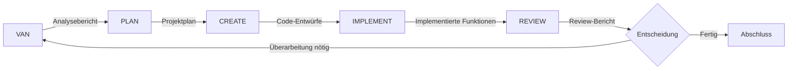

# Phasenendpunkte im Multi-Agent-Framework

Diese Dokumentation beschreibt die definierten Endpunkte für jede Phase im VALEO-NeuroERP Multi-Agent-Framework.

## Was sind Phasenendpunkte?

Phasenendpunkte sind klar definierte Ergebnisse und Übergabepunkte zwischen den verschiedenen Agentenrollen im Multi-Agent-Framework. Sie stellen sicher, dass jeder Agent genau weiß, welche Artefakte er produzieren muss und welche Informationen er vom vorherigen Agenten erhält.

## Diagramm der Phasenendpunkte



## Endpunkte nach Agentenphasen

### 1. VAN (Validator-Analyzer) Endpunkte

Der VAN-Agent analysiert Anforderungen und validiert deren Machbarkeit. Seine Endpunkte sind:

| Endpunkt | Beschreibung | Format | Speicherort |
|----------|--------------|--------|-------------|
| `analysis_report.md` | Detaillierte Analyse der Anforderungen | Markdown | `memory-bank/handover/van_analysis_report.md` |
| `validation_results.json` | Ergebnisse der Validierung mit Machbarkeitsmetriken | JSON | `memory-bank/handover/van_validation_results.json` |
| `problem_definition.md` | Klare Definition des zu lösenden Problems | Markdown | `memory-bank/handover/van_problem_definition.md` |
| `data_analysis.json` | Ergebnisse der Datenanalyse (falls relevant) | JSON | `memory-bank/handover/van_data_analysis.json` |

#### Beispiel für `validation_results.json`:

```json
{
  "anforderung_id": "REQ-2025-06-01",
  "validierung_status": "bestanden",
  "machbarkeit_score": 0.85,
  "risiken": [
    {
      "beschreibung": "Hohe Datenbankbelastung während der Spitzenzeiten",
      "schweregrad": "mittel",
      "minderungsstrategien": ["Caching implementieren", "Abfragen optimieren"]
    }
  ],
  "abhängigkeiten": [
    "Finanzmodul-API v2.3",
    "Berechtigungssystem-Update"
  ],
  "technische_einschränkungen": [
    "Muss mit PostgreSQL 14.5 kompatibel sein",
    "Maximale Antwortzeit: 500ms"
  ]
}
```

### 2. PLAN (Planner) Endpunkte

Der PLAN-Agent entwickelt strategische Pläne und Roadmaps. Seine Endpunkte sind:

| Endpunkt | Beschreibung | Format | Speicherort |
|----------|--------------|--------|-------------|
| `project_plan.md` | Detaillierter Projektplan mit Meilensteinen | Markdown | `memory-bank/handover/plan_project_plan.md` |
| `task_list.json` | Liste der Aufgaben mit Prioritäten und Abhängigkeiten | JSON | `memory-bank/handover/plan_task_list.json` |
| `resource_allocation.json` | Zuweisung von Ressourcen zu Aufgaben | JSON | `memory-bank/handover/plan_resource_allocation.json` |
| `timeline.md` | Zeitplan mit Meilensteinen und Deadlines | Markdown | `memory-bank/handover/plan_timeline.md` |
| `gantt_chart.mmd` | Gantt-Diagramm zur Visualisierung des Zeitplans | Mermaid | `memory-bank/handover/plan_gantt_chart.mmd` |

#### Beispiel für `task_list.json`:

```json
{
  "tasks": [
    {
      "id": "T-001",
      "titel": "Datenbankindizes optimieren",
      "beschreibung": "Identifizieren und Optimieren ineffizienter Datenbankindizes",
      "priorität": "hoch",
      "geschätzter_aufwand": "8 Stunden",
      "abhängigkeiten": [],
      "verantwortlich": "DB-Team",
      "status": "geplant"
    },
    {
      "id": "T-002",
      "titel": "Caching-Schicht implementieren",
      "beschreibung": "Redis-Caching für häufig abgerufene Daten einrichten",
      "priorität": "mittel",
      "geschätzter_aufwand": "16 Stunden",
      "abhängigkeiten": ["T-001"],
      "verantwortlich": "Backend-Team",
      "status": "geplant"
    }
  ]
}
```

### 3. CREATE (Creator) Endpunkte

Der CREATE-Agent entwickelt kreative Lösungen und Designs. Seine Endpunkte sind:

| Endpunkt | Beschreibung | Format | Speicherort |
|----------|--------------|--------|-------------|
| `code_design.md` | Architektur- und Codedesign-Dokument | Markdown | `memory-bank/handover/create_code_design.md` |
| `prototype_code/` | Verzeichnis mit Prototyp-Code | Python/JS/etc. | `memory-bank/handover/create_prototype_code/` |
| `ui_design.json` | UI/UX-Design-Spezifikationen | JSON | `memory-bank/handover/create_ui_design.json` |
| `architecture_diagram.mmd` | Architekturdiagramm | Mermaid | `memory-bank/handover/create_architecture_diagram.mmd` |
| `api_specifications.json` | API-Spezifikationen | JSON | `memory-bank/handover/create_api_specifications.json` |

#### Beispiel für `code_design.md`:

```markdown
# Code-Design: Finanzmodul-Optimierung

## Architektur

Wir implementieren ein dreistufiges Caching-System:
1. In-Memory-Cache für häufig abgerufene Daten
2. Redis-Cache für gemeinsam genutzte Daten
3. CDN für statische Ressourcen

## Datenbankoptimierungen

- Einführung von materialisierten Ansichten für Berichtsabfragen
- Partitionierung der Transaktionsdaten nach Datum
- Optimierung der Indizes für häufige Abfragen

## Codebeispiel

```python
class OptimizedFinanceRepository:
    def __init__(self, cache_manager, db_connection):
        self.cache = cache_manager
        self.db = db_connection
        
    async def get_transaction(self, transaction_id):
        # Versuche zuerst aus dem Cache zu lesen
        cached_result = await self.cache.get(f"transaction:{transaction_id}")
        if cached_result:
            return cached_result
            
        # Wenn nicht im Cache, aus der Datenbank lesen
        result = await self.db.fetch_one(
            "SELECT * FROM transactions WHERE id = :id",
            {"id": transaction_id}
        )
        
        # Im Cache speichern für zukünftige Anfragen
        if result:
            await self.cache.set(f"transaction:{transaction_id}", result, expire=3600)
            
        return result
```
```

### 4. IMPLEMENT (Implementer) Endpunkte

Der IMPLEMENT-Agent setzt Lösungen um und integriert sie. Seine Endpunkte sind:

| Endpunkt | Beschreibung | Format | Speicherort |
|----------|--------------|--------|-------------|
| `implementation_report.md` | Bericht über die Implementierung | Markdown | `memory-bank/handover/implement_report.md` |
| `implemented_code/` | Verzeichnis mit implementiertem Code | Python/JS/etc. | `memory-bank/handover/implement_code/` |
| `test_results.json` | Ergebnisse der Tests | JSON | `memory-bank/handover/implement_test_results.json` |
| `deployment_config.yaml` | Konfiguration für das Deployment | YAML | `memory-bank/handover/implement_deployment_config.yaml` |
| `integration_tests.json` | Ergebnisse der Integrationstests | JSON | `memory-bank/handover/implement_integration_tests.json` |

#### Beispiel für `test_results.json`:

```json
{
  "test_suite": "Finanzmodul-Optimierung",
  "ausführungsdatum": "2025-06-15T14:30:00Z",
  "gesamtergebnis": "bestanden",
  "tests": [
    {
      "name": "test_transaction_caching",
      "status": "bestanden",
      "dauer_ms": 156,
      "assertions": 5,
      "fehler": null
    },
    {
      "name": "test_report_generation_performance",
      "status": "bestanden",
      "dauer_ms": 1250,
      "assertions": 3,
      "fehler": null
    },
    {
      "name": "test_concurrent_transactions",
      "status": "bestanden",
      "dauer_ms": 890,
      "assertions": 8,
      "fehler": null
    }
  ],
  "leistungsmetriken": {
    "durchschnittliche_antwortzeit": 0.95,
    "transaktionen_pro_sekunde": 28.5,
    "speichernutzung": 0.75,
    "cpu_auslastung": 48.2
  }
}
```

### 5. REVIEW (Reviewer) Endpunkte

Der REVIEW-Agent führt Qualitätssicherung und Bewertung durch. Seine Endpunkte sind:

| Endpunkt | Beschreibung | Format | Speicherort |
|----------|--------------|--------|-------------|
| `review_report.md` | Detaillierter Review-Bericht | Markdown | `memory-bank/handover/review_report.md` |
| `code_quality_metrics.json` | Metriken zur Codequalität | JSON | `memory-bank/handover/review_code_quality_metrics.json` |
| `performance_analysis.json` | Leistungsanalyse | JSON | `memory-bank/handover/review_performance_analysis.json` |
| `security_audit.md` | Sicherheitsaudit | Markdown | `memory-bank/handover/review_security_audit.md` |
| `improvement_suggestions.md` | Vorschläge zur Verbesserung | Markdown | `memory-bank/handover/review_improvement_suggestions.md` |

#### Beispiel für `code_quality_metrics.json`:

```json
{
  "code_quality": {
    "komplexität": {
      "zyklomatische_komplexität": 12.5,
      "bewertung": "gut",
      "empfohlener_maximalwert": 15
    },
    "wartbarkeit": {
      "wartbarkeitsindex": 85,
      "bewertung": "sehr gut",
      "empfohlener_minimalwert": 70
    },
    "testabdeckung": {
      "prozent": 92.5,
      "bewertung": "ausgezeichnet",
      "empfohlener_minimalwert": 80
    },
    "codewiederholung": {
      "duplikate_prozent": 3.2,
      "bewertung": "gut",
      "empfohlener_maximalwert": 5
    }
  },
  "problembereiche": [
    {
      "datei": "finance_service.py",
      "zeile": 156,
      "problem": "Zu hohe Methodenkomplexität",
      "empfehlung": "Methode in kleinere Funktionen aufteilen"
    },
    {
      "datei": "transaction_processor.py",
      "zeile": 78,
      "problem": "Potenzielle Race Condition",
      "empfehlung": "Mutex oder Semaphore für kritischen Abschnitt verwenden"
    }
  ]
}
```

## Übergabeprozess zwischen Agenten

Der Übergabeprozess zwischen Agenten erfolgt über die definierten Endpunkte und folgt einem standardisierten Ablauf:

1. **Endpunkterstellung**: Der Agent erstellt alle erforderlichen Endpunkte gemäß den Spezifikationen.
2. **Validierung**: Der Agent überprüft, ob alle Endpunkte den Anforderungen entsprechen.
3. **Speicherung**: Die Endpunkte werden in der Speicher-Bank im entsprechenden Verzeichnis gespeichert.
4. **Benachrichtigung**: Das Framework wird über den Abschluss der Phase informiert.
5. **Übergabe**: Der nächste Agent erhält Zugriff auf die Endpunkte und beginnt seine Arbeit.

## Best Practices für Phasenendpunkte

1. **Vollständigkeit**: Stellen Sie sicher, dass alle erforderlichen Endpunkte erstellt werden.
2. **Konsistenz**: Verwenden Sie konsistente Namenskonventionen und Formate.
3. **Dokumentation**: Dokumentieren Sie alle Endpunkte ausführlich.
4. **Validierung**: Validieren Sie die Endpunkte vor der Übergabe.
5. **Versionierung**: Verwenden Sie Versionsnummern für Endpunkte, wenn sie sich ändern können.

## Anpassung der Endpunkte

Die Endpunkte können je nach Aufgabe und Kontext angepasst werden. Das Framework erlaubt die Definition benutzerdefinierter Endpunkte für spezifische Anwendungsfälle.

Um benutzerdefinierte Endpunkte zu definieren, bearbeiten Sie die Konfigurationsdatei `linkup_mcp/config/endpoint_config.py`:

```python
CUSTOM_ENDPOINTS = {
    "van": [
        {
            "name": "domain_specific_analysis",
            "description": "Domänenspezifische Analyse für das Finanzmodul",
            "format": "JSON",
            "required": False
        }
    ],
    "plan": [
        # Benutzerdefinierte Endpunkte für den PLAN-Agenten
    ]
}
```

## Fazit

Phasenendpunkte sind ein zentrales Element des Multi-Agent-Frameworks und ermöglichen eine strukturierte Zusammenarbeit zwischen den verschiedenen Agentenrollen. Durch die klare Definition von Endpunkten wird sichergestellt, dass jeder Agent genau weiß, welche Artefakte er produzieren muss und welche Informationen er vom vorherigen Agenten erhält.
