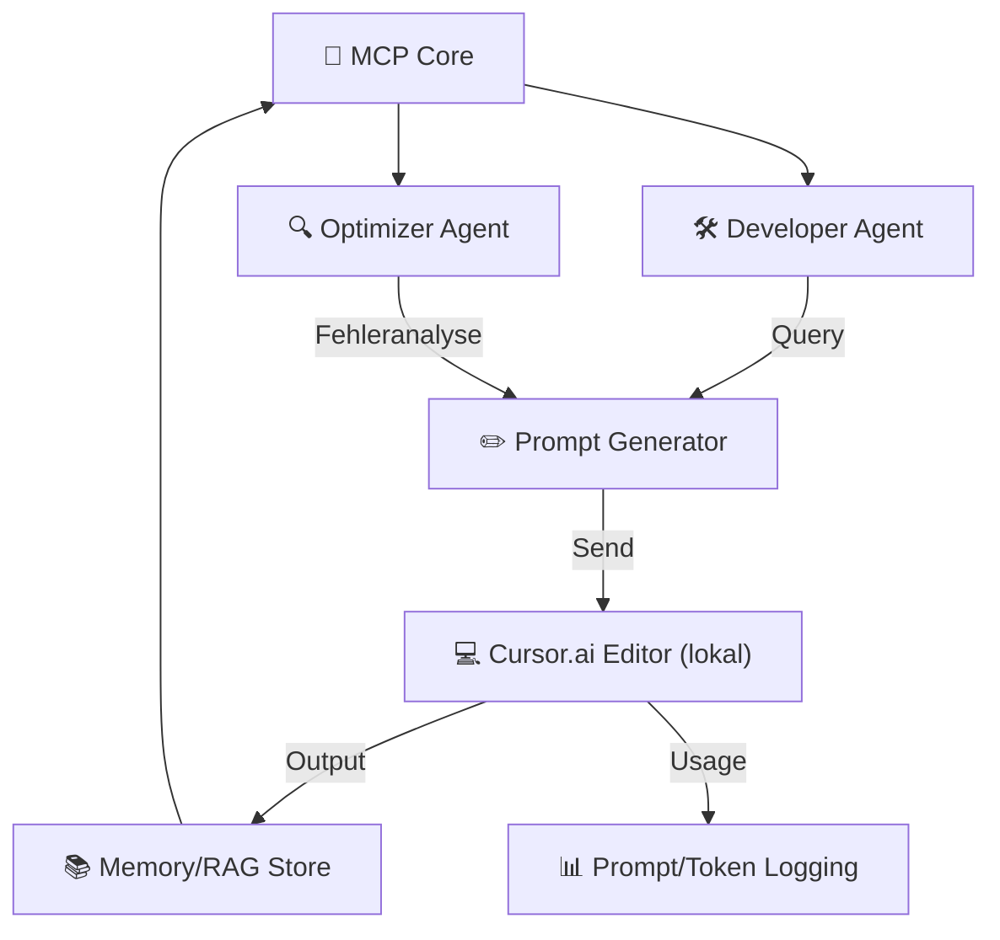

# Streamlit-App mit MCP-Integration und Cursor.ai-Anbindung

## Übersicht

Die Streamlit-App bietet eine grafische Benutzeroberfläche für das VALEO-NeuroERP v1.8.1 System mit Fokus auf Pipeline-Integration, Edge-Komponenten und Cursor.ai-Anbindung. Die App ermöglicht die Überwachung des Pipeline-Fortschritts, die Verwaltung von Handover-Dokumenten und die Generierung von Prompts für Cursor.ai.

## Architektur



## Komponenten

### 1. MCP-Server

Der MCP-Server (Model Context Protocol) dient als zentraler Hub für die Kommunikation zwischen den verschiedenen Komponenten. Er bietet folgende Tools:

- `get_pipeline_status`: Gibt den aktuellen Status der Pipeline zurück
- `update_pipeline_status`: Aktualisiert den Status der Pipeline
- `get_handover_content`: Gibt den Inhalt des Handovers für eine Phase zurück
- `save_handover_content`: Speichert den Handover-Inhalt für eine Phase
- `generate_prompt`: Generiert einen Prompt basierend auf Handover und Review-Änderungen
- `cursor_integration`: Integriert einen Prompt mit Cursor.ai über MCP
- `get_version`: Gibt die aktuelle Version zurück

### 2. Server-Sent Events (SSE)

Die App verwendet Server-Sent Events für Echtzeit-Updates. Folgende Event-Typen werden unterstützt:

- `pipeline_status`: Updates zum Pipeline-Status
- `handover`: Updates zu Handover-Dokumenten
- `cursor_prompt`: Neue generierte Prompts
- `heartbeat`: Regelmäßige Heartbeats zur Aufrechterhaltung der Verbindung

### 3. Cursor.ai-Integration

Die Integration mit Cursor.ai erfolgt über:

1. **MCP-Schnittstelle**: Standardisierte Prompt-Übergabe über MCP
2. **Dateiüberwachung**: Überwachung von Prompt-Dateien für automatische Übergabe
3. **Langgraph-Workflow**: Steuerung des Workflows über Langgraph

#### Standardisierte Prompt-Schnittstelle (PromptSpec)

Die Prompts werden in einem standardisierten Format erstellt:

```markdown
## 🎯 Ziel
[Beschreibung des Ziels]

## 📎 Kontext
[Relevanter Kontext]

## ✅ Anforderungen
[Liste der Anforderungen]

## 🧠 Hinweise
[Zusätzliche Hinweise]
```

## API-Endpunkte

### MCP-API

- `GET /api/status`: Status des MCP-Servers
- `POST /api/execute`: Ausführung von MCP-Tools

### SSE-API

- `GET /sse`: Server-Sent Events für Echtzeit-Updates

### Cursor-API

- `POST /cursor`: Übertragung von Prompts an Cursor.ai

## Datenstruktur

### Pipeline-Status

```json
{
  "phase": "IMPLEMENT",
  "progress": 75,
  "status": "running",
  "completed": ["VAN", "PLAN"],
  "active_pipelines": [
    "Edge-Validation-Pipeline",
    "Conflict-Analysis-Pipeline",
    "Edge-Refactoring-Pipeline"
  ],
  "last_update": "2024-07-01T15:30:00",
  "next_phase": "VERIFY",
  "estimated_completion": "2024-07-01T18:00:00"
}
```

### Prompt-Format

```json
{
  "prompt": "...",
  "generated_at": "2024-07-01T16:45:00",
  "phase": "IMPLEMENT",
  "source": {
    "handover": "data/handover/plan_handover.md",
    "review_changes": "..."
  },
  "target": "cursor.ai",
  "version": "1.8.1"
}
```

## Verwendung

1. **Start der App**: Führen Sie `start_app.sh` (Linux/Mac) oder `start_app.bat` (Windows) aus
2. **Pipeline-Überwachung**: Sehen Sie den aktuellen Status der Pipeline
3. **Handover-Verwaltung**: Verwalten Sie Handover-Dokumente für Phasenübergänge
4. **Prompt-Generierung**: Generieren Sie Prompts für Cursor.ai basierend auf Handover und Review-Änderungen

## Integration mit Cursor.ai

Die Integration mit Cursor.ai erfolgt über:

1. **Prompt-Streaming**: Direkte Übergabe generierter Prompts an Cursor.ai
2. **Kontextmanagement**: Automatische Hinzufügung relevanter Kontextinformationen aus dem RAG/Memory-Store
3. **Fehleranalyse**: Automatische Analyse und Korrektur von Fehlern durch APM-Agenten
4. **Workflow-Anpassung**: Reaktive Anpassung des Workflows basierend auf Feedback ("Reflect & Reinject")
5. **Task-Generierung**: Automatische Erstellung von Cursor-Tasks durch MCP-Scripting

## Ordnerstruktur

```
📦 mcp-agent/
 ┣ 📁 prompts/
 ┃ ┣ cursor-task-gen.md
 ┃ ┗ reflect-failure.md
 ┣ 📁 context/
 ┃ ┣ memory.json
 ┃ ┗ code_snippets/
 ┣ 📁 agents/
 ┃ ┣ generator.py
 ┃ ┗ optimizer.py
 ┗ mcp_config.yaml
``` 