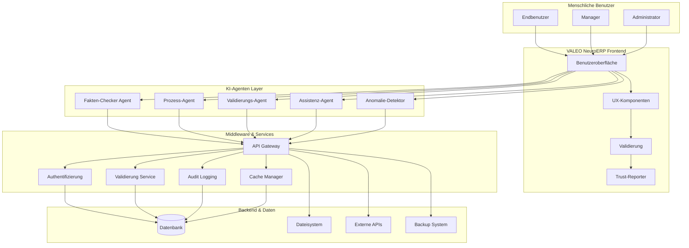
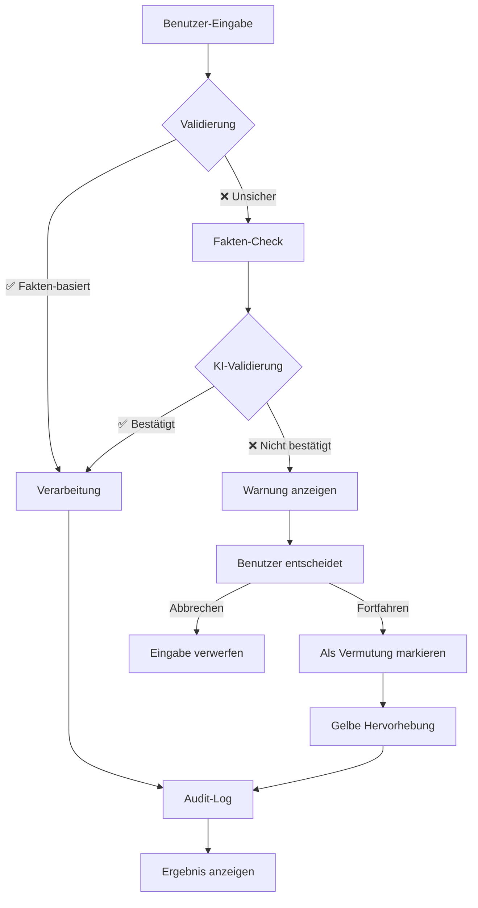
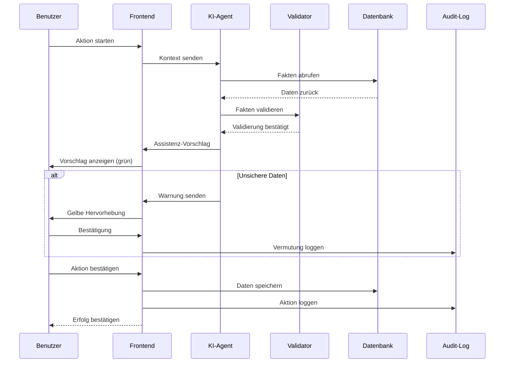
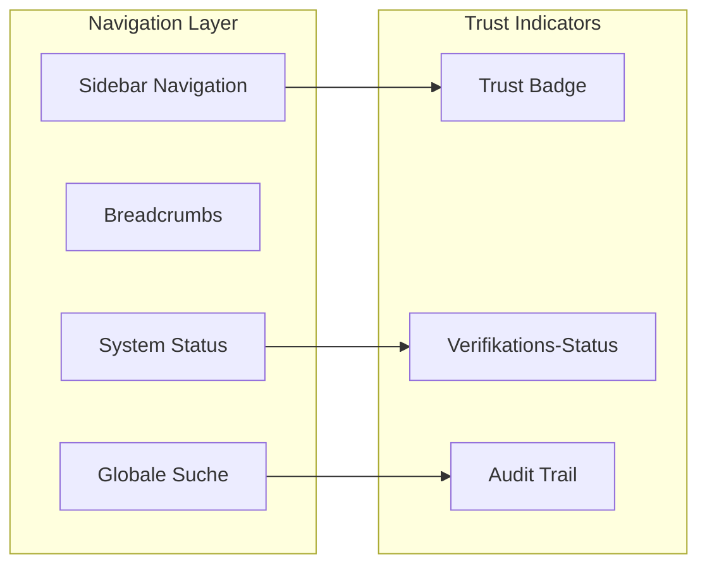
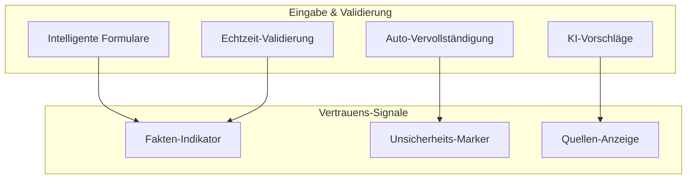
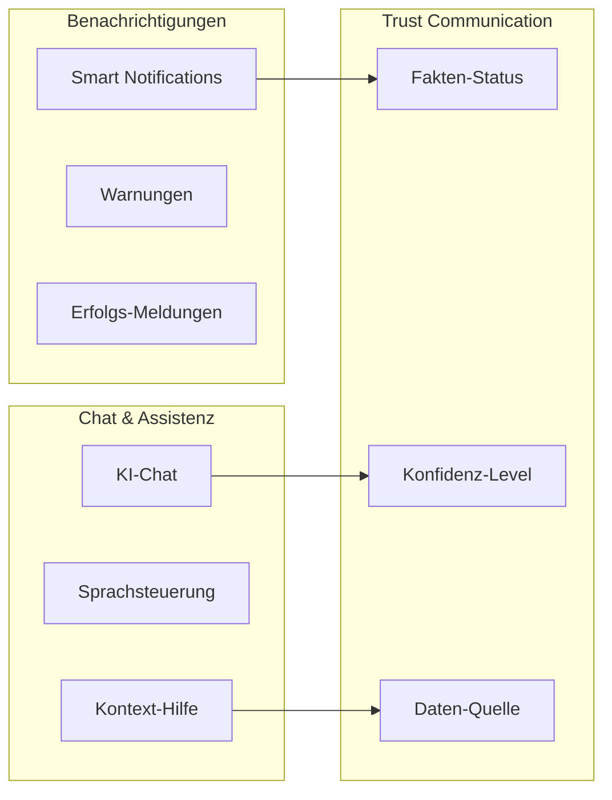

# VALEO NeuroERP - Workflow & Prozess UML-Diagrammübersicht
## Form Follows Function: KI-Mensch-Symbiose mit 100% Vertrauenswürdigkeit

### 1. Systemarchitektur-Übersicht



### 2. Vertrauenswürdigkeits-Workflow



### 3. KI-Assistenz-Workflow



### 4. Modulare UI-Komponenten nach Workflow

#### 4.1 Navigation & Orientierung


#### 4.2 Benutzer-Interaktion


#### 4.3 Kommunikation & Feedback


### 5. Vertrauenswürdigkeits-Design-Prinzipien

#### 5.1 Farbkodierung für Vertrauenswürdigkeit
- **🟢 Grün**: Fakten-basiert, validiert, sicher
- **🟡 Gelb**: Vermutung, unsicher, Benutzer-Entscheidung erforderlich
- **🔴 Rot**: Fehler, nicht validiert, abgelehnt
- **🔵 Blau**: Informativ, neutral, verarbeitend

#### 5.2 Icon-System für Vertrauenswürdigkeit
- **✅ Fakten-Check**: Häkchen mit Schild
- **❓ Unsicher**: Fragezeichen mit gelbem Hintergrund
- **⚠️ Warnung**: Ausrufezeichen mit gelbem Dreieck
- **🚫 Abgelehnt**: X mit rotem Kreis
- **🔄 Verarbeitung**: Spinner mit blauem Kreis
- **📊 Daten-Quelle**: Diagramm-Icon
- **🔍 Audit**: Lupe mit Schild

#### 5.3 Sprachliche Vertrauenssignale
- **Fakten-basiert**: "Basierend auf validierten Daten..."
- **Vermutung**: "Möglicherweise... (nicht validiert)"
- **Unsicher**: "Benötigt weitere Validierung..."
- **Fehler**: "Daten konnten nicht bestätigt werden..."

### 6. UI-Komponenten-Architektur

#### 6.1 Trust-Aware Components
```typescript
interface TrustAwareComponent {
  confidenceLevel: 'fact' | 'assumption' | 'uncertain' | 'error';
  dataSource?: string;
  lastValidated?: Date;
  requiresUserDecision?: boolean;
  auditTrail?: AuditEntry[];
}
```

#### 6.2 Vertrauenswürdigkeits-Indikatoren
```typescript
interface TrustIndicator {
  type: 'fact' | 'assumption' | 'uncertain' | 'error';
  confidence: number; // 0-100
  source: string;
  validationDate: Date;
  userAcknowledged: boolean;
}
```

### 7. Implementierungs-Prioritäten

#### Phase 1: Grundlegende Vertrauenswürdigkeit
1. **TrustIndicator-Komponente** - Farbkodierung und Icons
2. **Fakten-Validator** - KI-basierte Validierung
3. **Audit-Logging** - Vollständige Nachverfolgung
4. **Warnungs-System** - Gelbe Hervorhebungen

#### Phase 2: Erweiterte Assistenz
1. **KI-Chat mit Vertrauenssignalen**
2. **Auto-Vervollständigung mit Validierung**
3. **Intelligente Formulare**
4. **Sprachsteuerung mit Fakten-Check**

#### Phase 3: Vollständige Integration
1. **Modulare UI-Komponenten**
2. **Responsive Design**
3. **Performance-Optimierung**
4. **Benutzer-Training**

### 8. Kritische Erfolgsfaktoren

#### 8.1 Vertrauenswürdigkeit
- **Keine Halluzinationen**: Nur validierte Daten anzeigen
- **Transparenz**: Immer Daten-Quelle und Validierungsstatus zeigen
- **Benutzer-Kontrolle**: Mensch entscheidet bei Unsicherheiten
- **Audit-Trail**: Vollständige Nachverfolgung aller Aktionen

#### 8.2 Benutzerfreundlichkeit
- **Selbstsprechende Icons**: Intuitive Symbolik
- **Sprachunterstützung**: Deutsche Texte und Kontext
- **Assistierende Popups**: Proaktive Hilfe
- **Automatische Vorbefüllung**: KI-gestützte Eingabehilfen

#### 8.3 System-Integration
- **Nahtlose Middleware**: API-Gateway und Services
- **Backend-Synchronisation**: Echtzeit-Datenabgleich
- **Fehlerbehandlung**: Graceful Degradation
- **Performance**: Schnelle Reaktionszeiten

### 9. Risiko-Mitigation

#### 9.1 Vertrauensverlust verhindern
- **Strikte Validierung**: Keine unbestätigten Daten
- **Klare Kennzeichnung**: Vermutungen deutlich markieren
- **Benutzer-Schulung**: Verständnis für KI-Limitationen
- **Fallback-Mechanismen**: Manuelle Eingabe bei Unsicherheit

#### 9.2 System-Stabilität
- **Redundanz**: Backup-Systeme
- **Monitoring**: Echtzeit-Überwachung
- **Rollback**: Schnelle Wiederherstellung
- **Dokumentation**: Vollständige Prozess-Dokumentation

Diese Workflow-Übersicht bildet die Grundlage für die modulare UI-Entwicklung mit Fokus auf Vertrauenswürdigkeit und Benutzerfreundlichkeit. 