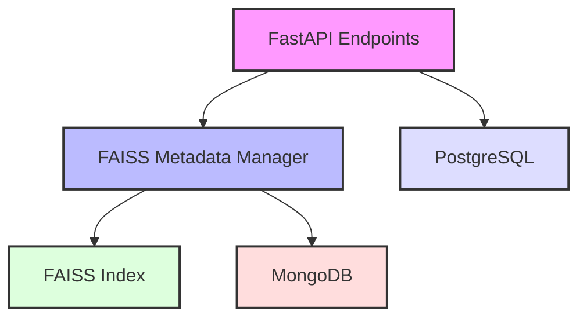

# VALEO-NeuroERP Vektorsuche-Integration

## Übersicht

Die Vektorsuche-Integration in VALEO-NeuroERP kombiniert drei Datenbanktechnologien für optimale Performance und Funktionalität:

1. **FAISS**: Hochperformante Vektorsuche für Embeddings
2. **MongoDB**: Metadaten-Verwaltung und Dokumentenspeicherung
3. **PostgreSQL**: Hauptdatenbank für strukturierte Anwendungsdaten

## Architektur

### Komponenten



### Datenfluss

1. **Dokument-Erstellung**:
   - Embedding-Generierung
   - Speicherung in FAISS
   - Metadaten in MongoDB
   - Index-Aktualisierung

2. **Suche**:
   - Query-Embedding
   - FAISS Ähnlichkeitssuche
   - Metadaten-Anreicherung aus MongoDB
   - Ergebnisfilterung und -sortierung

## Komponenten im Detail

### FAISS Metadata Manager

Der `FaissWithMetadataManager` ist die zentrale Komponente für die Vektorsuche:

- **Persistenz**: Automatische Speicherung und Wiederherstellung von Indizes
- **Metadaten-Verwaltung**: Integration mit MongoDB
- **Fehlerbehandlung**: Umfangreiches Logging und Exception-Handling
- **Performance-Optimierung**: Effiziente Batch-Verarbeitung

### API-Endpunkte

Die FastAPI-Integration bietet folgende Endpunkte:

1. `POST /documents/`
   - Erstellt neue Dokumente mit Embeddings
   - Validiert Eingabedaten
   - Generiert eindeutige IDs

2. `POST /documents/search/`
   - Sucht ähnliche Dokumente
   - Unterstützt Filterkriterien
   - Liefert sortierte Ergebnisse

3. `POST /documents/rebuild-index/`
   - Baut den FAISS-Index neu auf
   - Synchronisiert mit MongoDB

## Konfiguration

### Umgebungsvariablen

```env
MONGODB_URI=mongodb://localhost:27017
MONGODB_DB=valeo_neuroerp
```

### Feature Flags

```json
{
  "vector_search": true,
  "async_processing": true
}
```

## Verwendung

### Dokument hinzufügen

```python
import requests

doc = {
    "title": "Beispieldokument",
    "content": "Inhalt...",
    "doc_type": "technical",
    "embedding": [...],  # 1536-dimensionaler Vektor
    "metadata": {
        "author": "Max Mustermann",
        "department": "Engineering"
    }
}

response = requests.post("/api/v1/documents/", json=doc)
```

### Ähnliche Dokumente suchen

```python
query = {
    "query_embedding": [...],  # 1536-dimensionaler Vektor
    "filter_criteria": {
        "doc_type": "technical"
    },
    "limit": 5
}

response = requests.post("/api/v1/documents/search/", json=query)
```

## Performance-Optimierung

1. **MongoDB-Indizes**:
   - Timestamp-basiert
   - Dokumententyp
   - Volltextsuche

2. **FAISS-Optimierungen**:
   - L2-Normalisierung
   - Kosinus-Ähnlichkeit
   - Batch-Verarbeitung

## Sicherheit

1. **Datenvalidierung**:
   - Pydantic-Modelle
   - Embedding-Dimensionsprüfung
   - Metadaten-Validierung

2. **Fehlerbehandlung**:
   - Graceful Degradation
   - Ausführliches Logging
   - Transaktionssicherheit

## Wartung und Monitoring

### Backup

```python
# MongoDB Backup
manager = FaissWithMetadataManager(dim=1536)
backup = manager.create_backup()

# FAISS Index Backup
# Automatisch bei jedem Update
```

### Monitoring

- Logging in `./logs/app.log`
- MongoDB Statistiken
- FAISS Index-Größe
- API-Performance-Metriken

## Integration in bestehende Systeme

### PostgreSQL-Synchronisation

Die Integration behält die bestehende PostgreSQL-Datenbank als primäre Datenquelle bei:

```python
# Beispiel für Synchronisation
def sync_with_postgres():
    # PostgreSQL-Daten abrufen
    docs = db.query(Documents).all()
    
    # In Vektorsuche integrieren
    for doc in docs:
        embedding = generate_embedding(doc.content)
        manager.add_document(doc.id, embedding, doc.metadata)
```

### Monitoring-Integration

Die Vektorsuche ist in das bestehende Monitoring-System integriert:

```python
# Prometheus Metriken
vector_search_requests = Counter('vector_search_requests_total', 'Total vector search requests')
vector_search_latency = Histogram('vector_search_latency_seconds', 'Vector search latency')
```

## Fehlerbehebung

### Häufige Probleme

1. **Index-Inkonsistenz**:
   ```bash
   # Index neu aufbauen
   curl -X POST "/api/v1/documents/rebuild-index/"
   ```

2. **MongoDB-Verbindungsprobleme**:
   ```python
   # Verbindung prüfen
   from pymongo import MongoClient
   client = MongoClient('mongodb://localhost:27017/')
   client.admin.command('ping')
   ```

### Logging

Alle Komponenten nutzen das zentrale Logging-System:

```python
# Log-Beispiel
2024-03-15 10:30:45 - faiss_manager - INFO - Index mit 1000 Vektoren erfolgreich erstellt
```

## Roadmap

### Geplante Erweiterungen

1. **Phase 1** (Q2 2024):
   - GPU-Unterstützung für FAISS
   - Automatische Index-Optimierung
   - Erweiterte Filteroptionen

2. **Phase 2** (Q3 2024):
   - Multi-Index-Unterstützung
   - Echtzeit-Updates
   - Verteilte Suche

## Technische Spezifikationen

### Hardware-Anforderungen

- **RAM**: Min. 8GB (16GB empfohlen)
- **CPU**: 4+ Kerne
- **Speicher**: 100GB+ für Indizes

### Software-Abhängigkeiten

```requirements.txt
faiss-cpu==1.7.4
pymongo==4.5.0
fastapi==0.95.0
numpy==1.24.3
``` 