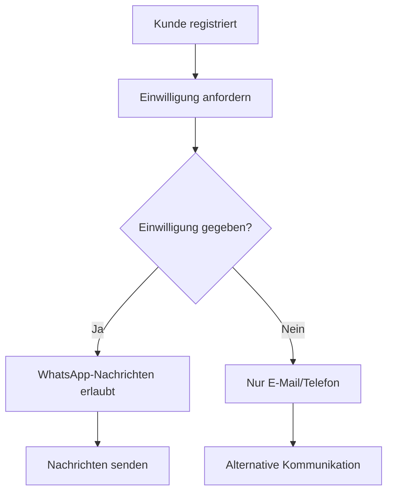
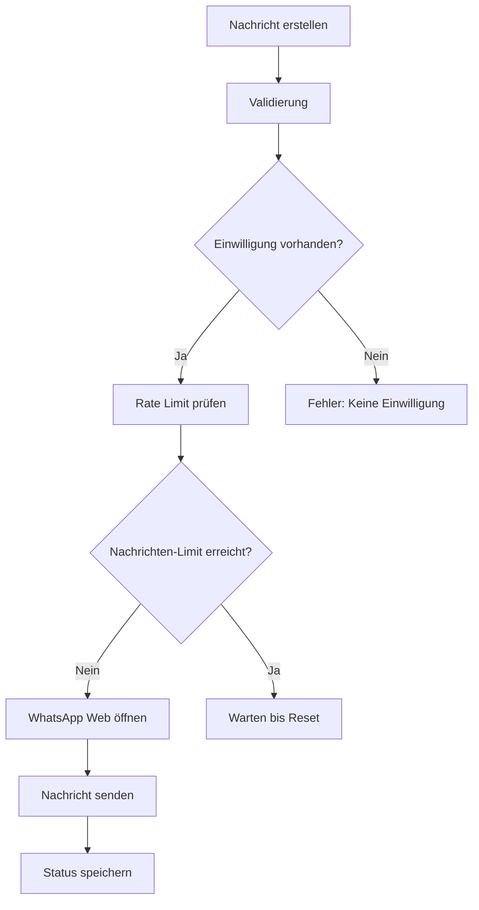

# 📱 WhatsApp Web Integration - VALEO NeuroERP

## 🎯 Übersicht

Die **WhatsApp Web Integration** ist eine **rechtssichere, kostenfreie Lösung** für die Integration von WhatsApp in das VALEO NeuroERP System. Sie nutzt Browser-Automation über WhatsApp Web und bietet vollständige DSGVO-Konformität.

## ✨ Features

### 🔐 **Rechtssicherheit**
- **DSGVO-konforme Datenspeicherung** (90 Tage Aufbewahrung)
- **Einwilligungsmanagement** für Kunden
- **Opt-Out-Funktionalität**
- **Audit-Logging** aller Aktivitäten
- **Verschlüsselte Datenübertragung**

### 💬 **Kommunikation**
- **Schnell-Nachrichten** mit Templates
- **Nachrichtenverlauf** pro Kunde
- **Status-Tracking** (gesendet, zugestellt, gelesen)
- **Bulk-Messaging** mit Rate-Limiting
- **Automatische Antworten**

### 🎨 **UI/UX**
- **WhatsApp Web Tab** im CRM
- **QR-Code-Management** für Verbindung
- **Template-Verwaltung**
- **Echtzeit-Status-Anzeige**
- **Responsive Design**

## 🏗️ Architektur

### **Frontend (React/TypeScript)**
```
frontend/src/components/crm/tabs/CustomerWhatsAppWebTab.tsx
├── WhatsApp Web Tab
├── Schnell-Nachrichten
├── Template-Verwaltung
├── QR-Code-Management
└── Nachrichtenverlauf
```

### **Backend (Python/FastAPI)**
```
backend/services/whatsapp_service.py
├── WhatsAppWebService
├── WhatsAppDatabase
├── Browser-Automation
└── Rechtssichere APIs

backend/api/whatsapp_routes.py
├── REST API Endpunkte
├── DSGVO-konforme Validierung
└── Security Headers
```

## 🚀 Installation

### **1. Python-Abhängigkeiten**
```bash
pip install playwright==1.40.0
playwright install chromium
```

### **2. Frontend-Integration**
```bash
cd frontend
npm install
```

### **3. Backend-Service starten**
```bash
cd backend
python -m uvicorn main:app --reload
```

## 📋 Verwendung

### **1. WhatsApp Web verbinden**
1. Öffnen Sie den **WhatsApp Web Tab** im CRM
2. Klicken Sie auf **"QR-Code scannen"**
3. Scannen Sie den QR-Code mit Ihrer WhatsApp-App
4. Bestätigen Sie die Verbindung

### **2. Nachricht senden**
```typescript
// Frontend
const sendMessage = async (phoneNumber: string, message: string) => {
  const response = await fetch('/api/whatsapp/send', {
    method: 'POST',
    headers: { 'Content-Type': 'application/json' },
    body: JSON.stringify({ phone_number: phoneNumber, message: message })
  });
  return response.json();
};
```

### **3. Einwilligung speichern**
```typescript
// Kunden-Einwilligung für WhatsApp
const saveConsent = async (customerId: string, phoneNumber: string) => {
  const response = await fetch('/api/whatsapp/consent', {
    method: 'POST',
    headers: { 'Content-Type': 'application/json' },
    body: JSON.stringify({ 
      customer_id: customerId, 
      phone_number: phoneNumber 
    })
  });
  return response.json();
};
```

## 🔧 API-Endpunkte

### **Verbindung**
```http
GET /api/whatsapp/status
POST /api/whatsapp/connect
```

### **Nachrichten**
```http
POST /api/whatsapp/send
GET /api/whatsapp/history/{customer_id}
```

### **Einwilligung**
```http
POST /api/whatsapp/consent
GET /api/whatsapp/consent/{customer_id}
```

### **Templates**
```http
POST /api/whatsapp/templates
GET /api/whatsapp/templates
DELETE /api/whatsapp/templates/{template_id}
```

### **Verwaltung**
```http
POST /api/whatsapp/cleanup
GET /api/whatsapp/stats
```

## 🛡️ Rechtssicherheit

### **DSGVO-Konformität**
- **Datenminimierung**: Nur notwendige Daten werden gespeichert
- **Aufbewahrungsfrist**: 90 Tage automatische Löschung
- **Einwilligung**: Explizite Zustimmung erforderlich
- **Opt-Out**: Jederzeitige Abmeldung möglich
- **Transparenz**: Vollständige Audit-Trails

### **Datenschutz**
```python
# Automatische Datenlöschung
async def cleanup_old_messages(self):
    cutoff_date = datetime.now().timestamp() - (90 * 24 * 3600)
    # Löscht Nachrichten älter als 90 Tage
```

### **Sicherheit**
- **Rate-Limiting**: Max. 50 Nachrichten pro Stunde
- **Validierung**: Alle Eingaben werden geprüft
- **Verschlüsselung**: Sichere Datenübertragung
- **Logging**: Vollständige Aktivitätsprotokolle

## 📊 Monitoring & Analytics

### **Statistiken**
```http
GET /api/whatsapp/stats
```
```json
{
  "success": true,
  "stats": {
    "total_messages": 1250,
    "today_messages": 45,
    "successful_messages": 1200,
    "success_rate": 96.0,
    "customers_with_consent": 89,
    "total_templates": 12,
    "rate_limit_remaining": 35
  }
}
```

### **Audit-Log**
```python
# Automatisches Logging aller Aktivitäten
self.logger.info(f"Nachricht an {phone_number} gesendet")
self.logger.warning(f"Keine Einwilligung von Kunde {customer_id}")
```

## 🔄 Workflow

### **1. Kunden-Einwilligung**


### **2. Nachrichtenversand**


## 🎨 UI-Komponenten

### **WhatsApp Web Tab**
- **Verbindungsstatus** mit QR-Code-Management
- **Nachrichten-Editor** mit Template-Unterstützung
- **Nachrichtenverlauf** mit Status-Anzeige
- **Schnell-Nachrichten** mit Kategorien

### **Template-System**
```typescript
const templates = [
  {
    name: 'Begrüßung',
    message: 'Hallo! Vielen Dank für Ihr Interesse.',
    category: 'greeting'
  },
  {
    name: 'Bestellbestätigung',
    message: 'Ihre Bestellung {orderNumber} wurde bestätigt.',
    category: 'order'
  }
];
```

## 🚨 Fehlerbehandlung

### **Häufige Fehler**
1. **Keine Einwilligung**: Kunde muss zuerst zustimmen
2. **Rate Limit**: Zu viele Nachrichten in kurzer Zeit
3. **Verbindung verloren**: QR-Code neu scannen
4. **Ungültige Nummer**: Telefonnummer-Format prüfen

### **Fehlerbehebung**
```python
# Automatische Wiederherstellung
async def reconnect_if_needed(self):
    if not self.is_connected:
        await self.connect_whatsapp_web()
```

## 🔮 Erweiterungen

### **Geplante Features**
- **Automatische Antworten** basierend auf Keywords
- **Broadcasting** für Marketing-Kampagnen
- **Analytics Dashboard** mit Detaillierten Reports
- **Mobile App Integration**
- **Webhook-Support** für externe Systeme

### **API-Erweiterungen**
```python
# Webhook für eingehende Nachrichten
@router.post("/webhook")
async def webhook_handler(message: IncomingMessage):
    # Verarbeite eingehende Nachrichten
    pass

# Broadcast-Funktionalität
@router.post("/broadcast")
async def send_broadcast(request: BroadcastRequest):
    # Sende Nachrichten an mehrere Empfänger
    pass
```

## 📝 Rechtliche Hinweise

### **Wichtige Hinweise**
1. **Einwilligung erforderlich**: Kunden müssen explizit zustimmen
2. **Opt-Out möglich**: Abmeldung muss jederzeit möglich sein
3. **Datenlöschung**: Automatische Löschung nach 90 Tagen
4. **Transparenz**: Kunden müssen über Datennutzung informiert werden

### **Compliance-Checkliste**
- [ ] Einwilligungsformular implementiert
- [ ] Opt-Out-Funktionalität vorhanden
- [ ] Automatische Datenlöschung aktiviert
- [ ] Audit-Logging konfiguriert
- [ ] Datenschutzerklärung aktualisiert
- [ ] Mitarbeiter geschult

## 🆘 Support

### **Troubleshooting**
1. **QR-Code funktioniert nicht**: Browser-Cache leeren
2. **Nachrichten werden nicht gesendet**: Rate Limit prüfen
3. **Verbindung instabil**: Internetverbindung prüfen
4. **Fehler beim Speichern**: Datenbankberechtigungen prüfen

### **Logs prüfen**
```bash
# WhatsApp Audit-Log
tail -f whatsapp_audit.log

# Backend-Logs
tail -f backend/logs/app.log
```

## 📚 Weitere Ressourcen

- [WhatsApp Business API Dokumentation](https://developers.facebook.com/docs/whatsapp)
- [DSGVO-Compliance Guide](https://gdpr.eu/)
- [Playwright Dokumentation](https://playwright.dev/)
- [FastAPI Dokumentation](https://fastapi.tiangolo.com/)

---

**⚠️ Wichtig**: Diese Integration ist für **legitime Geschäftszwecke** gedacht. Missbrauch kann zu rechtlichen Konsequenzen führen. 