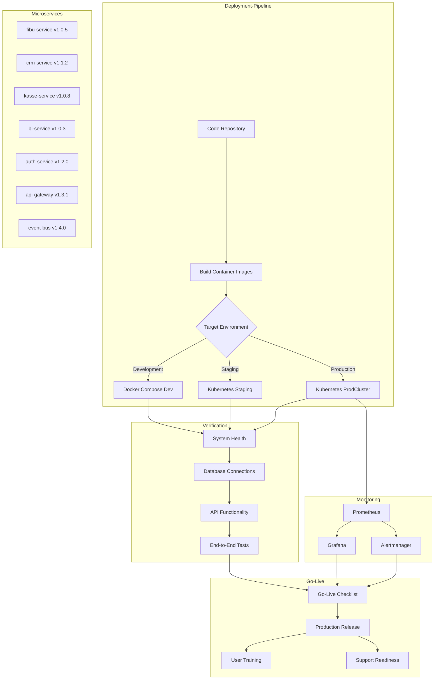

# Deployment-Prozess: VALERO-NeuroERP v1.0.0

Das folgende Diagramm visualisiert den Deployment-Prozess für das VALERO-NeuroERP-System von der Entwicklung bis zum Go-Live.

## Erläuterung

### Deployment-Pipeline

1. **Code Repository**: Ausgangspunkt ist das zentrale Code-Repository mit allen Microservices
2. **Build Container Images**: Erstellung der Docker-Images für jeden Microservice
3. **Target Environment**: Je nach Zielumgebung wird ein anderer Deployment-Pfad gewählt:
   - **Docker Compose Dev**: Lokale Entwicklungsumgebung für Entwickler
   - **Kubernetes Staging**: Vorabproduktionsumgebung für Tests und Validierung
   - **Kubernetes ProdCluster**: Finale Produktivumgebung für Endbenutzer

### Microservices

Die folgenden Microservices werden im Rahmen des Deployments bereitgestellt:
- **fibu-service v1.0.5**: Finanzbuchhaltungsmodul
- **crm-service v1.1.2**: Customer Relationship Management
- **kasse-service v1.0.8**: Kassensystem
- **bi-service v1.0.3**: Business Intelligence
- **auth-service v1.2.0**: Authentifizierung und Autorisierung
- **api-gateway v1.3.1**: API-Gateway für einheitlichen Zugriff
- **event-bus v1.4.0**: Nachrichtenvermittlung zwischen Services

### Verification

Nach dem Deployment werden folgende Überprüfungen durchgeführt:
1. **System Health**: Überprüfung der Systemgesundheit aller Services
2. **Database Connections**: Validierung der Datenbankverbindungen
3. **API Functionality**: Test der API-Funktionalität aller Services
4. **End-to-End Tests**: Durchführung von End-to-End-Tests für kritische Geschäftsprozesse

### Monitoring

In der Produktivumgebung wird ein umfassendes Monitoring eingerichtet:
1. **Prometheus**: Sammlung von Metriken aller Services
2. **Grafana**: Visualisierung der Metriken in Dashboards
3. **Alertmanager**: Benachrichtigung bei kritischen Ereignissen

### Go-Live

Der finale Go-Live-Prozess umfasst:
1. **Go-Live Checklist**: Überprüfung aller kritischen Aspekte vor dem produktiven Start
2. **Production Release**: Freigabe des Systems für Endbenutzer
3. **User Training**: Schulung der Benutzer
4. **Support Readiness**: Bereitstellung von Support für Endbenutzer 