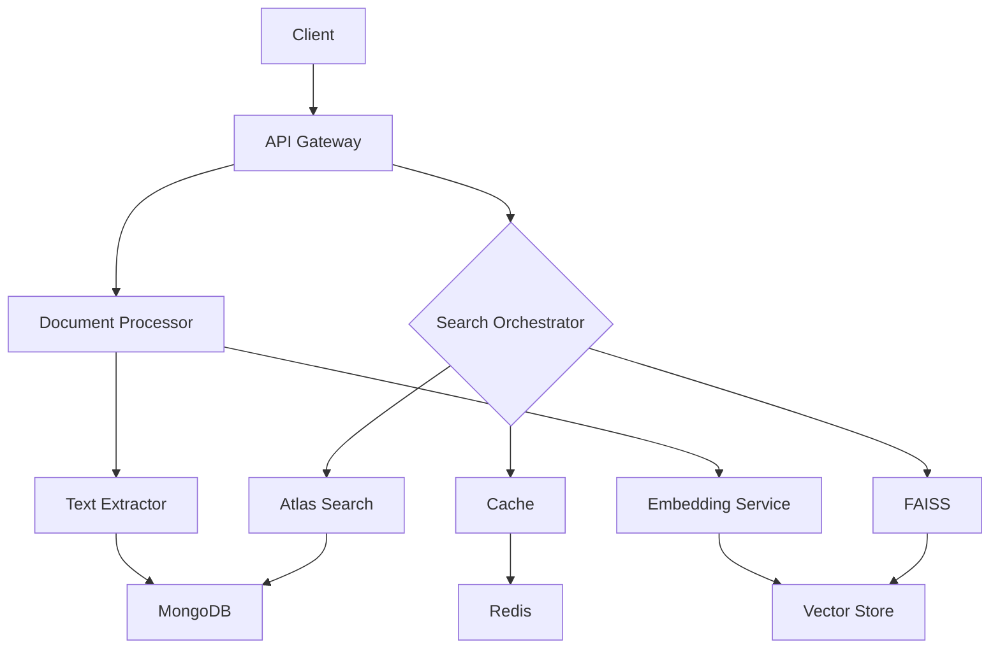

# VALEO-NeuroERP: Erweiterte Suchfunktionalität - Teil 1: Architektur

## 🎯 Projektvision & Architektur

### Gesamtziel
Integration einer skalierbaren, hybriden Suchlösung im VALEO-NeuroERP-System, die moderne Suchtechnologien kombiniert und optimale Nutzererfahrung bietet.

### Systemarchitektur

```python
class SearchSystemArchitecture:
    """
    Kernarchitektur des erweiterten Suchsystems
    """
    components = {
        "frontend_layer": {
            "components": {
                "search_interface": {
                    "type": "React Component",
                    "features": [
                        "Autosuggest",
                        "Faceted Search",
                        "Results Preview",
                        "Advanced Search Options"
                    ]
                },
                "results_viewer": {
                    "type": "React Component",
                    "features": [
                        "Dynamic Loading",
                        "Filtering",
                        "Sorting",
                        "Export"
                    ]
                },
                "analytics_dashboard": {
                    "type": "React Component",
                    "features": [
                        "Search Metrics",
                        "User Behavior",
                        "Performance Stats"
                    ]
                }
            },
            "technologies": [
                "React 18",
                "TypeScript 5",
                "Material-UI v5",
                "Redux Toolkit"
            ]
        },
        "api_layer": {
            "components": {
                "search_api": {
                    "type": "FastAPI Service",
                    "endpoints": [
                        "/api/v1/search",
                        "/api/v1/suggest",
                        "/api/v1/document",
                        "/api/v1/analytics"
                    ],
                    "features": [
                        "Rate Limiting",
                        "Authentication",
                        "Caching",
                        "Logging"
                    ]
                },
                "orchestrator": {
                    "type": "Search Service",
                    "features": [
                        "Query Processing",
                        "Result Merging",
                        "Score Normalization",
                        "Relevance Tuning"
                    ]
                }
            },
            "technologies": [
                "FastAPI",
                "Pydantic v2",
                "asyncio",
                "Redis"
            ]
        },
        "search_layer": {
            "components": {
                "primary_search": {
                    "type": "Atlas Search",
                    "features": [
                        "Full-text Search",
                        "Fuzzy Matching",
                        "Faceting",
                        "Highlighting"
                    ],
                    "indices": [
                        "documents",
                        "products",
                        "transactions",
                        "metadata"
                    ]
                },
                "vector_search": {
                    "type": "FAISS",
                    "features": [
                        "Vector Search",
                        "KNN",
                        "Clustering",
                        "Dimension Reduction"
                    ],
                    "indices": [
                        "document_embeddings",
                        "semantic_vectors",
                        "image_features"
                    ]
                }
            },
            "technologies": [
                "MongoDB Atlas",
                "FAISS",
                "PyTorch",
                "NumPy"
            ]
        },
        "processing_layer": {
            "components": {
                "document_processor": {
                    "type": "Async Service",
                    "features": [
                        "Text Extraction",
                        "Metadata Analysis",
                        "Entity Recognition",
                        "Language Detection"
                    ]
                },
                "embedding_service": {
                    "type": "ML Service",
                    "features": [
                        "Text Embedding",
                        "Image Feature Extraction",
                        "Model Management",
                        "Batch Processing"
                    ]
                }
            },
            "technologies": [
                "spaCy",
                "Transformers",
                "TensorFlow",
                "scikit-learn"
            ]
        },
        "storage_layer": {
            "components": {
                "document_store": {
                    "type": "MongoDB",
                    "collections": [
                        "raw_documents",
                        "processed_documents",
                        "embeddings",
                        "metadata"
                    ]
                },
                "cache_store": {
                    "type": "Redis",
                    "features": [
                        "Query Cache",
                        "Result Cache",
                        "Session Store",
                        "Rate Limiting"
                    ]
                }
            },
            "technologies": [
                "MongoDB",
                "Redis",
                "S3",
                "MinIO"
            ]
        }
    }

    communication_patterns = {
        "synchronous": [
            "REST API calls",
            "GraphQL queries",
            "Direct database queries"
        ],
        "asynchronous": [
            "Message queues",
            "Event streaming",
            "Webhooks"
        ],
        "protocols": [
            "HTTP/2",
            "WebSocket",
            "gRPC",
            "AMQP"
        ]
    }

    scaling_strategy = {
        "horizontal": {
            "components": [
                "API servers",
                "Search nodes",
                "Processing workers"
            ],
            "mechanism": "Kubernetes HPA"
        },
        "vertical": {
            "components": [
                "Database instances",
                "Cache nodes",
                "Vector stores"
            ],
            "mechanism": "Resource allocation"
        }
    }

    security_framework = {
        "authentication": [
            "JWT",
            "OAuth2",
            "API keys"
        ],
        "authorization": [
            "RBAC",
            "Document-level permissions",
            "Field-level security"
        ],
        "encryption": [
            "TLS 1.3",
            "AES-256",
            "Key rotation"
        ]
    }
```

### Datenfluss-Architektur



### Microservices-Struktur

```yaml
services:
  search_api:
    type: "FastAPI Service"
    scaling:
      min_replicas: 2
      max_replicas: 10
      target_cpu_utilization: 70
    endpoints:
      - path: "/api/v1/search"
        methods: ["POST"]
        rate_limit: 1000/minute
      - path: "/api/v1/suggest"
        methods: ["GET"]
        rate_limit: 2000/minute
      - path: "/api/v1/document/{id}"
        methods: ["GET", "PUT", "DELETE"]
        rate_limit: 500/minute
      - path: "/api/v1/batch"
        methods: ["POST"]
        rate_limit: 100/minute

  document_processor:
    type: "Async Worker"
    scaling:
      min_replicas: 1
      max_replicas: 5
      target_cpu_utilization: 80
    queues:
      - name: "document_processing"
        priority: high
      - name: "embedding_generation"
        priority: medium
      - name: "index_updates"
        priority: low

  search_orchestrator:
    type: "Core Service"
    scaling:
      min_replicas: 2
      max_replicas: 8
      target_cpu_utilization: 75
    features:
      - query_analysis
      - result_merging
      - scoring_normalization
      - relevance_tuning

  cache_manager:
    type: "Redis Service"
    scaling:
      min_replicas: 2
      max_replicas: 4
      target_memory_utilization: 70
    features:
      - query_caching
      - result_caching
      - session_management
      - rate_limiting
```

### Datenbankschema

```typescript
interface SearchSchema {
  documents: {
    _id: ObjectId;
    title: string;
    content: string;
    metadata: {
      author: string;
      created_at: Date;
      updated_at: Date;
      version: number;
      status: 'draft' | 'published' | 'archived';
      tags: string[];
      category: string;
      permissions: string[];
    };
    embeddings: {
      text_vector: number[];
      model_version: string;
      updated_at: Date;
    };
    processing: {
      status: 'pending' | 'processing' | 'completed' | 'failed';
      error?: string;
      pipeline_version: string;
      processing_time: number;
    };
    search_metadata: {
      popularity_score: number;
      relevance_boost: number;
      last_accessed: Date;
      access_count: number;
    };
    audit: {
      created_by: string;
      modified_by: string[];
      version_history: {
        version: number;
        timestamp: Date;
        author: string;
        changes: string[];
      }[];
    };
  };

  search_logs: {
    _id: ObjectId;
    timestamp: Date;
    user_id: string;
    query: string;
    filters: Record<string, any>;
    results_count: number;
    execution_time: number;
    clicked_results: string[];
    session_id: string;
    client_info: {
      ip: string;
      user_agent: string;
      location: string;
    };
  };

  search_analytics: {
    _id: ObjectId;
    period: 'hour' | 'day' | 'week' | 'month';
    timestamp: Date;
    metrics: {
      total_searches: number;
      unique_users: number;
      avg_response_time: number;
      cache_hit_rate: number;
      error_rate: number;
      popular_queries: {
        query: string;
        count: number;
      }[];
    };
  };
}
```

### API-Spezifikation

```yaml
openapi: 3.0.0
info:
  title: VALEO-NeuroERP Search API
  version: 1.0.0
paths:
  /api/v1/search:
    post:
      summary: Durchführt eine Suche
      requestBody:
        required: true
        content:
          application/json:
            schema:
              type: object
              properties:
                query:
                  type: string
                filters:
                  type: object
                page:
                  type: integer
                  default: 1
                per_page:
                  type: integer
                  default: 20
                sort:
                  type: object
      responses:
        '200':
          description: Erfolgreiche Suche
          content:
            application/json:
              schema:
                type: object
                properties:
                  results:
                    type: array
                  total:
                    type: integer
                  page:
                    type: integer
                  pages:
                    type: integer

  /api/v1/suggest:
    get:
      summary: Liefert Suchvorschläge
      parameters:
        - name: q
          in: query
          required: true
          schema:
            type: string
        - name: limit
          in: query
          schema:
            type: integer
            default: 10
      responses:
        '200':
          description: Erfolgreiche Vorschläge
          content:
            application/json:
              schema:
                type: array
                items:
                  type: string

  /api/v1/document/{id}:
    get:
      summary: Ruft ein Dokument ab
      parameters:
        - name: id
          in: path
          required: true
          schema:
            type: string
      responses:
        '200':
          description: Dokument gefunden
        '404':
          description: Dokument nicht gefunden

    put:
      summary: Aktualisiert ein Dokument
      parameters:
        - name: id
          in: path
          required: true
          schema:
            type: string
      requestBody:
        required: true
        content:
          application/json:
            schema:
              type: object
      responses:
        '200':
          description: Dokument aktualisiert
        '404':
          description: Dokument nicht gefunden

    delete:
      summary: Löscht ein Dokument
      parameters:
        - name: id
          in: path
          required: true
          schema:
            type: string
      responses:
        '204':
          description: Dokument gelöscht
        '404':
          description: Dokument nicht gefunden
``` 