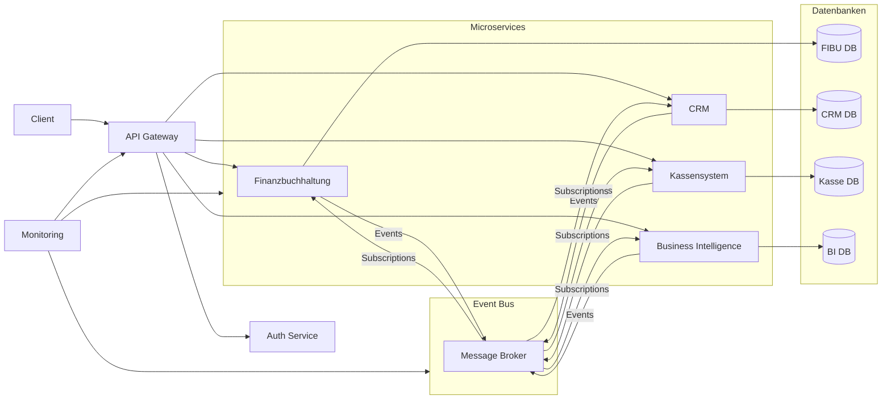

# Integrationsplan: VALERO-NeuroERP

## 1. Übersicht der Module und API-Schnittstellen

### Integrierte Module

| Modul | Microservice | Hauptfunktionen | API-Endpunkte | Event-Bus-Topics |
|-------|--------------|-----------------|---------------|------------------|
| **Finanzbuchhaltung** | fibu-service | Kontenplan, Buchungen, Berichte, Perioden, Anlagen, Kostenstellen, Steuern, Fremdwährungen, Offene Posten | `/api/v1/fibu/*` | `fibu.transactions`, `fibu.accounts`, `fibu.reports` |
| **CRM** | crm-service | Kundenstammdaten, Kontakte, Kommunikation, Leads, Verkaufschancen, Angebote, Berichte, Marketing, Kundenservice | `/api/v1/crm/*` | `crm.customers`, `crm.leads`, `crm.opportunities` |
| **Kassensystem** | kasse-service | Kassenoberfläche, Artikelerfassung, Rabatte, Zahlungen, Retouren, Kassenabschluss, TSE, Berichte, Konfiguration | `/api/v1/kasse/*` | `kasse.sales`, `kasse.returns`, `kasse.reports` |
| **Business Intelligence** | bi-service | Dashboard, Visualisierung, KPIs, Berichtsdesigner, Datenanalyse, Berichtsplanung, Mobile BI, Datenintegration | `/api/v1/bi/*` | `bi.dashboards`, `bi.reports`, `bi.analytics` |

### Zentrale Dienste

| Dienst | Microservice | Hauptfunktionen | API-Endpunkte |
|--------|--------------|-----------------|---------------|
| **API-Gateway** | api-gateway | Routing, Authentifizierung, Rate Limiting, Caching, Monitoring | `/api/*` |
| **Auth-Service** | auth-service | Benutzer- und Rechteverwaltung, SSO, 2FA | `/api/v1/auth/*` |
| **Event-Bus** | event-bus | Nachrichtenvermittlung, Event-Persistenz, Event-Replay | - |
| **Monitoring** | monitoring-service | Systemüberwachung, Alerting, Logging | `/api/v1/monitoring/*` |

## 2. Kommunikationsstruktur

### Kommunikationsdiagramm



### Event-Bus-Architektur

Der Event-Bus basiert auf RabbitMQ und implementiert das Publish-Subscribe-Muster mit folgenden Eigenschaften:

- **Topic-basierte Kommunikation**: Nachrichten werden nach Themen kategorisiert
- **Dead-Letter-Queue**: Fehlgeschlagene Nachrichten werden in eine spezielle Warteschlange verschoben
- **Event-Persistenz**: Ereignisse werden für Audit- und Replay-Zwecke gespeichert
- **Idempotente Verarbeitung**: Mehrfache Verarbeitung derselben Nachricht führt nicht zu Inkonsistenzen
- **Asynchrone Kommunikation**: Entkopplung der Dienste für bessere Skalierbarkeit und Ausfallsicherheit

## 3. Datenformate und Mapping zwischen Modulen

### Gemeinsame Datenmodelle

| Entität | Schema | Verwendende Module | Synchronisationsstrategie |
|---------|--------|-------------------|--------------------------|
| **Kunde** | `Customer` | CRM (primär), FIBU, Kasse, BI | CRM ist System of Record, andere Module synchronisieren |
| **Artikel** | `Product` | Kasse (primär), CRM, FIBU, BI | Kasse ist System of Record, andere Module synchronisieren |
| **Buchung** | `Transaction` | FIBU (primär), Kasse, BI | FIBU ist System of Record, andere Module synchronisieren |
| **Beleg** | `Document` | FIBU (primär), CRM, Kasse, BI | FIBU ist System of Record, andere Module synchronisieren |
| **Benutzer** | `User` | Auth-Service (primär), alle Module | Auth-Service ist System of Record, andere Module synchronisieren |

### JSON-Schema-Beispiel für Transaktionen

```json
{
  "$schema": "http://json-schema.org/draft-07/schema#",
  "title": "Transaction",
  "type": "object",
  "properties": {
    "transaction_id": {
      "type": "string",
      "format": "uuid",
      "description": "Eindeutige ID der Transaktion"
    },
    "transaction_type": {
      "type": "string",
      "enum": ["SALE", "PURCHASE", "TRANSFER", "ADJUSTMENT", "RETURN"],
      "description": "Art der Transaktion"
    },
    "amount": {
      "type": "number",
      "description": "Betrag der Transaktion"
    },
    "currency": {
      "type": "string",
      "pattern": "^[A-Z]{3}$",
      "description": "Währungscode nach ISO 4217"
    },
    "date": {
      "type": "string",
      "format": "date-time",
      "description": "Datum und Uhrzeit der Transaktion"
    },
    "description": {
      "type": "string",
      "description": "Beschreibung der Transaktion"
    },
    "customer_id": {
      "type": ["string", "null"],
      "format": "uuid",
      "description": "ID des Kunden (falls vorhanden)"
    },
    "source_system": {
      "type": "string",
      "enum": ["FIBU", "CRM", "KASSE", "BI"],
      "description": "Quellsystem der Transaktion"
    },
    "entries": {
      "type": "array",
      "items": {
        "type": "object",
        "properties": {
          "account_code": {
            "type": "string",
            "description": "Kontonummer"
          },
          "debit": {
            "type": "number",
            "description": "Soll-Betrag"
          },
          "credit": {
            "type": "number",
            "description": "Haben-Betrag"
          },
          "cost_center": {
            "type": ["string", "null"],
            "description": "Kostenstelle (falls vorhanden)"
          }
        },
        "required": ["account_code", "debit", "credit"]
      },
      "minItems": 2,
      "description": "Buchungssätze (mindestens zwei für Soll und Haben)"
    },
    "metadata": {
      "type": "object",
      "description": "Zusätzliche Metadaten zur Transaktion"
    }
  },
  "required": ["transaction_id", "transaction_type", "amount", "currency", "date", "source_system", "entries"]
}
```

### Mapping-Strategien

1. **Event-basierte Synchronisation**: Änderungen werden als Ereignisse publiziert und von anderen Modulen konsumiert
2. **Batch-Synchronisation**: Regelmäßige Synchronisation von Daten zwischen Modulen (z.B. nachts)
3. **On-Demand-Synchronisation**: Daten werden bei Bedarf über API-Aufrufe abgerufen
4. **Hybride Strategie**: Kombination aus Event-basierter und On-Demand-Synchronisation je nach Anwendungsfall

## 4. Transaktionsverfolgung über Servicegrenzen hinweg

### Distributed Tracing

Die Implementierung von Distributed Tracing erfolgt mit OpenTelemetry und Jaeger:

- **Trace-ID**: Eindeutige ID für die gesamte Transaktionskette
- **Span-ID**: Eindeutige ID für jeden Verarbeitungsschritt
- **Baggage**: Kontextinformationen, die über Servicegrenzen hinweg weitergegeben werden
- **Sampling**: Konfigurierbare Stichprobenentnahme für Performance-Optimierung

### Transaktionskoordination

Für verteilte Transaktionen wird das Saga-Muster implementiert:

1. **Choreographie-basierte Sagas**: Services reagieren auf Events und führen Kompensationsaktionen durch
2. **Orchestrierungs-basierte Sagas**: Ein zentraler Koordinator steuert den Transaktionsablauf

### Beispiel: Verkaufsprozess über Servicegrenzen

1. **Kasse**: Erfassung eines Verkaufs → Event `kasse.sales.created`
2. **CRM**: Aktualisierung der Kundenhistorie → Event `crm.customer.updated`
3. **FIBU**: Erstellung der Buchung → Event `fibu.transactions.created`
4. **BI**: Aktualisierung der Dashboards → Event `bi.dashboards.updated`

## 5. Testmatrix für Integrationstestfälle

### Integrationstestfälle

| ID | Testfall | Beteiligte Module | Eingabe | Erwartetes Ergebnis | Priorität |
|----|----------|-------------------|---------|---------------------|-----------|
| INT-001 | Verkauf im Kassensystem mit Kundenreferenz | Kasse, CRM, FIBU | Verkaufstransaktion mit Kundenreferenz | Kundenhistorie aktualisiert, Buchung erstellt | Hoch |
| INT-002 | Erstellung einer Rechnung | FIBU, CRM | Neue Rechnung für Kunden | Offener Posten erstellt, Kunde benachrichtigt | Hoch |
| INT-003 | Zahlungseingang zuordnen | FIBU, CRM | Zahlungseingang mit Kundenreferenz | Offener Posten ausgeglichen, Kundenhistorie aktualisiert | Hoch |
| INT-004 | Kundenanlage im CRM | CRM, FIBU, Kasse | Neuer Kunde | Kunde in allen Systemen verfügbar | Mittel |
| INT-005 | Kassenabschluss | Kasse, FIBU | Tagesabschluss der Kasse | Buchungen in FIBU erstellt | Hoch |
| INT-006 | BI-Dashboard mit Echtzeit-Daten | BI, FIBU, Kasse, CRM | Aktualisierung der Quelldaten | Dashboard aktualisiert | Mittel |
| INT-007 | Benutzerauthentifizierung | Auth-Service, alle Module | Benutzeranmeldung | Zugriff auf berechtigte Ressourcen | Hoch |
| INT-008 | Retourenabwicklung | Kasse, FIBU, CRM | Retoure eines Verkaufs | Stornobuchung, Kundenhistorie aktualisiert | Mittel |
| INT-009 | Periodenabschluss in FIBU | FIBU, BI | Periodenabschluss | Berichte aktualisiert, neue Periode eröffnet | Hoch |
| INT-010 | Fehlerhafte Transaktion | Alle | Ungültige Daten | Rollback in allen Systemen | Hoch |

### Testumgebung

Die Integrationstests werden in einer dedizierten Testumgebung durchgeführt:

- **Containerisierte Services**: Jeder Microservice läuft in einem eigenen Container
- **Testdatenbank**: Separate Datenbanken für Testdaten
- **Mocks**: Externe Dienste werden bei Bedarf gemockt
- **CI/CD-Integration**: Automatisierte Ausführung der Tests bei jedem Commit

### Automatisierte Testausführung

Die Tests werden mit folgenden Tools automatisiert:

- **Testframework**: JUnit 5 für Unit-Tests, Cucumber für BDD-Tests
- **API-Tests**: REST-assured für API-Tests
- **UI-Tests**: Selenium für UI-Tests
- **Performance-Tests**: JMeter für Lasttest
- **Continuous Testing**: Integration in die CI/CD-Pipeline mit Jenkins

## 6. Integrationsziele und Erfolgskriterien

### Datenfluss zwischen Modulen

- **Ziel**: Nahtlose Datenübertragung zwischen allen Modulen
- **Erfolgskriterien**:
  - Maximale Latenz von 2 Sekunden für kritische Datenflüsse
  - 99,9% erfolgreiche Datenübertragungen
  - Automatische Wiederholung bei Übertragungsfehlern

### Synchronisation von Geschäftsvorfällen

- **Ziel**: Konsistente Darstellung von Geschäftsvorfällen in allen Modulen
- **Erfolgskriterien**:
  - Eventual Consistency innerhalb von 5 Sekunden
  - Korrekte Abbildung aller Geschäftsvorfälle in allen betroffenen Modulen
  - Fehlerfreie Kompensationsaktionen bei Teilausfällen

### Zentraler Auth-Service

- **Ziel**: Einheitliche Authentifizierung und Autorisierung für alle Module
- **Erfolgskriterien**:
  - Single Sign-On für alle Module
  - Rollenbasierte Zugriffssteuerung
  - Zwei-Faktor-Authentifizierung für kritische Operationen
  - Audit-Trail für alle Authentifizierungs- und Autorisierungsvorgänge

### Fehlertoleranz und Resilienz

- **Ziel**: Robuste Systemarchitektur, die Teilausfälle kompensieren kann
- **Erfolgskriterien**:
  - Kein Datenverlust bei Ausfällen
  - Automatische Wiederherstellung nach Ausfällen
  - Graceful Degradation bei Teilausfällen
  - 99,9% Systemverfügbarkeit

### Konsolidierte BI-Reports

- **Ziel**: Integrierte Berichterstattung über alle Module hinweg
- **Erfolgskriterien**:
  - Echtzeit-Dashboards mit Daten aus allen Modulen
  - Konsistente KPIs über alle Datenquellen
  - Drill-Down-Funktionalität bis zur Transaktionsebene
  - Export in verschiedene Formate (PDF, Excel, CSV)

## 7. Implementierungsplan

### Phase 1: Vorbereitung (2 Wochen)

- Einrichtung der Integrationsumgebung
- Implementierung des API-Gateways
- Einrichtung des Event-Bus
- Implementierung des Auth-Service

### Phase 2: Basisintegration (4 Wochen)

- Integration von FIBU und CRM
- Integration von FIBU und Kassensystem
- Implementierung der gemeinsamen Datenmodelle
- Einrichtung des Distributed Tracing

### Phase 3: Erweiterte Integration (3 Wochen)

- Integration des BI-Systems mit allen Modulen
- Implementierung der Transaktionsverfolgung
- Entwicklung der konsolidierten Dashboards
- Optimierung der Datenflüsse

### Phase 4: Testing und Optimierung (3 Wochen)

- Durchführung aller Integrationstests
- Performance-Optimierung
- Fehlerbehandlung und Resilienz-Tests
- Dokumentation und Schulung

### Phase 5: Abnahme und Deployment (2 Wochen)

- Abnahmetests mit Fachbereichen
- Fehlerbehebung und Feintuning
- Vorbereitung des Produktivdeployments
- Go-Live-Planung

## 8. Risiken und Maßnahmen

| Risiko | Wahrscheinlichkeit | Auswirkung | Maßnahmen |
|--------|-------------------|------------|-----------|
| Inkonsistente Daten zwischen Modulen | Mittel | Hoch | Implementierung von Konsistenzprüfungen, Event-Sourcing |
| Performance-Engpässe | Mittel | Hoch | Frühzeitige Lasttests, Caching-Strategien, Skalierungskonzept |
| Sicherheitslücken an Schnittstellen | Niedrig | Sehr hoch | Security-Audits, Penetrationstests, regelmäßige Updates |
| Ausfälle des Event-Bus | Niedrig | Hoch | Redundante Auslegung, Failover-Mechanismen, Circuit Breaker |
| Komplexität der verteilten Transaktionen | Hoch | Mittel | Saga-Muster, ausführliche Dokumentation, Schulungen |

## 9. Monitoring und Alerting

### Monitoring-Metriken

- **System-Metriken**: CPU, Speicher, Disk, Netzwerk
- **Anwendungs-Metriken**: Anfragen pro Sekunde, Antwortzeiten, Fehlerraten
- **Business-Metriken**: Transaktionsvolumen, Erfolgsraten, Durchsatzzeiten

### Alerting-Regeln

- **Kritische Alerts**: Sofortige Benachrichtigung bei Systemausfällen oder Datenverlust
- **Warnungen**: Benachrichtigung bei Performance-Problemen oder erhöhten Fehlerraten
- **Informationen**: Regelmäßige Reports über Systemzustand und Performance

### Dashboard

Ein zentrales Monitoring-Dashboard zeigt den Zustand aller integrierten Systeme und deren Schnittstellen in Echtzeit an, mit Fokus auf:

- Systemverfügbarkeit
- Schnittstellenperformance
- Fehlerraten und -typen
- Geschäftskennzahlen

## 10. Dokumentation

Die Integrationsdokumentation umfasst:

- **Architekturübersicht**: Gesamtarchitektur und Komponentenbeziehungen
- **API-Dokumentation**: OpenAPI-Spezifikationen aller Schnittstellen
- **Event-Katalog**: Beschreibung aller Events im System
- **Datenmodelle**: JSON-Schemas aller gemeinsamen Datenmodelle
- **Betriebshandbuch**: Anleitungen für Deployment, Monitoring und Troubleshooting
- **Entwicklerhandbuch**: Anleitungen für die Erweiterung und Wartung des Systems 