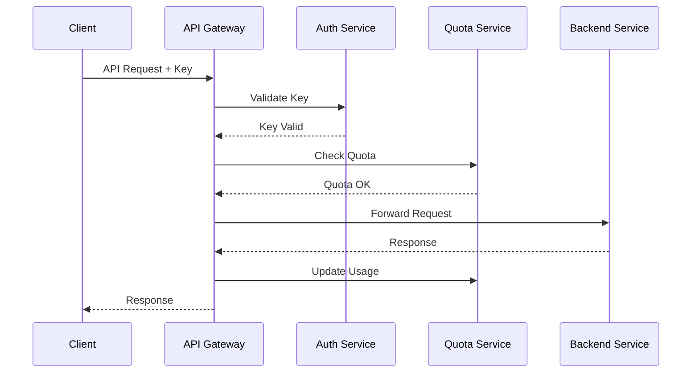

# Planungsdokument: Zugriffssteuerung im API-Gateway

## 1. Ziel & Nutzenbeschreibung

### User Story
Als Systemarchitekt möchte ich die Zugriffssteuerung im API-Gateway erweitern, um eine sichere und kontrollierte Anbindung von Drittanbietern zu ermöglichen und dabei die Systemressourcen zu schützen.

### Akzeptanzkriterien
- Sichere API-Schlüsselverwaltung für Drittanbieter
- Rate-Limiting und Quota-Management pro API-Schlüssel
- Granulare Zugriffssteuerung auf API-Endpunkte
- Monitoring und Alerting bei Auffälligkeiten
- Automatische Sperrung bei Missbrauch
- API-Nutzungsstatistiken und Reporting
- OAuth2-Integration für Benutzerauthentifizierung

## 2. Technische Anforderungen & Schnittstellen

### Gateway-Komponenten
- Erweiterung des Kong API Gateways
- Implementation von Custom Plugins
- Integration mit dem Auth-Service
- Rate-Limiting und Quota Service
- API-Key Management Service

### Monitoring & Analytics
- Integration mit Prometheus/Grafana
- Custom Dashboards für API-Nutzung
- Anomalie-Erkennung
- Real-time Alerting

### Security
- OAuth2-Provider Integration
- API-Key Rotation
- SSL/TLS Enforcement
- Request/Response Validation

## 3. Grobentwurf

### API-Key Management
```python
class APIKey(BaseModel):
    id: str
    name: str
    key: str
    secret: str
    client_id: str
    status: Literal['active', 'suspended', 'revoked']
    rate_limit: RateLimit
    quotas: List[Quota]
    permissions: List[str]
    created_at: datetime
    expires_at: Optional[datetime]
    
class RateLimit(BaseModel):
    requests_per_second: int
    burst_size: int
    
class Quota(BaseModel):
    resource: str
    limit: int
    period: str  # 'daily', 'monthly', 'yearly'
```

### Kong Plugin Configuration
```yaml
plugins:
  - name: key-auth
    config:
      key_names: ['x-api-key']
      hide_credentials: true
      
  - name: rate-limiting
    config:
      second: 10
      minute: 100
      hour: 1000
      policy: redis
      
  - name: oauth2
    config:
      scopes: ['read', 'write', 'admin']
      mandatory_scope: true
      token_expiration: 7200
      
  - name: custom-quota
    config:
      redis_host: localhost
      redis_port: 6379
      quota_sync_interval: 60
```

### Monitoring-Metriken
```yaml
metrics:
  - name: api_requests_total
    type: counter
    labels: [api_key, endpoint, status]
    
  - name: api_request_duration_seconds
    type: histogram
    labels: [api_key, endpoint]
    
  - name: api_quota_usage_percent
    type: gauge
    labels: [api_key, quota_type]
    
  - name: api_rate_limit_exceeded_total
    type: counter
    labels: [api_key, endpoint]
```

### Sequenzdiagramm


## 4. Aufwandsschätzung

### Entwicklungsaufwand
- Gateway-Konfiguration: 2 Personentage
- Custom Plugins: 4 Personentage
- Monitoring-Setup: 2 Personentage
- OAuth2-Integration: 3 Personentage
- Tests & Dokumentation: 2 Personentage
- Buffer: 1 Personentag
**Gesamt: 14 Personentage**

### Ressourcen
- 1 Senior Backend Developer
- 1 DevOps Engineer
- 1 Security Engineer
- Staging-Umgebung für Tests

### Performance-Anforderungen
- API Gateway Latenz: <20ms
- Rate-Limit-Check: <5ms
- Quota-Check: <10ms
- Auth-Check: <50ms
- 99.99% Verfügbarkeit

## 5. Empfehlungen für CREATE-Phase

### Vorgeschlagene Agentenrollen
1. **GatewayAgent**: Kong-Konfiguration und Plugin-Entwicklung
2. **SecurityAgent**: OAuth2 und API-Key-Management
3. **MonitoringAgent**: Metriken und Alerting
4. **TestAgent**: Last- und Sicherheitstests
5. **DocAgent**: API-Dokumentation und Entwicklerportal

### Implementierungsreihenfolge
1. Basis-Gateway-Konfiguration
2. API-Key-Management
3. Rate-Limiting und Quotas
4. Monitoring und Alerting
5. OAuth2-Integration
6. Custom Plugins
7. Entwicklerportal

### Sicherheitsaspekte
- Regelmäßige Security Audits
- Penetrationstests
- Key-Rotation-Strategie
- Incident Response Plan
- OWASP Top 10 Compliance 