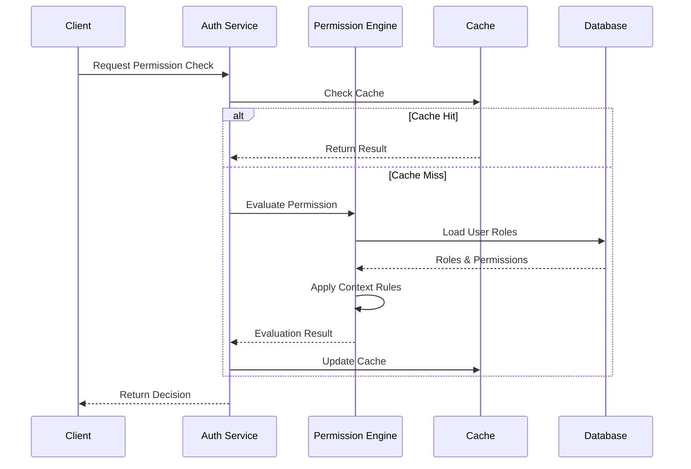

# Planungsdokument: Feingranulare Rollenverwaltung im Auth-Service

## 1. Ziel & Nutzenbeschreibung

### User Story
Als Administrator möchte ich ein feingranulares Berechtigungskonzept im Auth-Service implementieren, um Zugriffsrechte auf Funktions-, Daten- und Feldebene definieren und verwalten zu können.

### Akzeptanzkriterien
- Definition von Berechtigungen auf drei Ebenen:
  - Funktionsebene (Aktionen/Operationen)
  - Datenebene (Entitäten/Datensätze)
  - Feldebene (einzelne Attribute)
- Hierarchische Berechtigungsstruktur mit Vererbung
- Kontextabhängige Berechtigungen (Abteilung, Standort, etc.)
- Temporäre Berechtigungsvergabe mit Auto-Expiry
- Delegationsmechanismus für Vertretungen
- Audit-Logging aller Berechtigungsänderungen

## 2. Technische Anforderungen & Schnittstellen

### Datenmodell-Erweiterungen
- Neue Entitäten für Berechtigungen und Rollen
- Hierarchische Strukturen für Vererbung
- Zeitliche Gültigkeit von Berechtigungen
- Kontext-Mapping für bedingte Berechtigungen

### Backend-Services
- Erweiterung des Auth-Service
- Implementierung eines Permission-Evaluation-Engine
- Caching-Mechanismus für Berechtigungsprüfungen
- Integration mit dem Audit-Logging-System

### Frontend-Komponenten
- Berechtigungs-Management-UI
- Rolleneditor mit Vererbungsvisualisierung
- Berechtigungsmatrix-Ansicht
- Temporäre Zugriffssteuerung

## 3. Grobentwurf

### Datenmodell
```python
class Permission(BaseModel):
    id: str
    type: Literal['function', 'data', 'field']
    resource: str
    action: str
    conditions: Optional[Dict[str, Any]]
    
class Role(BaseModel):
    id: str
    name: str
    description: str
    parent_role_id: Optional[str]
    permissions: List[Permission]
    context_rules: Dict[str, Any]
    
class TemporaryAccess(BaseModel):
    id: str
    user_id: str
    role_id: str
    granted_by: str
    valid_from: datetime
    valid_until: datetime
    reason: str
```

### API-Design
```python
@router.post("/api/v1/auth/permissions")
async def create_permission(permission: Permission) -> Permission:
    """Erstellt eine neue Berechtigung"""
    
@router.post("/api/v1/auth/roles")
async def create_role(role: Role) -> Role:
    """Erstellt eine neue Rolle"""
    
@router.post("/api/v1/auth/temporary-access")
async def grant_temporary_access(access: TemporaryAccess) -> TemporaryAccess:
    """Gewährt temporären Zugriff"""
    
@router.get("/api/v1/auth/evaluate")
async def evaluate_permission(
    user_id: str,
    resource: str,
    action: str,
    context: Dict[str, Any]
) -> bool:
    """Evaluiert eine Berechtigung im gegebenen Kontext"""
```

### Sequenzdiagramm


## 4. Aufwandsschätzung

### Entwicklungsaufwand
- Datenmodell & Migration: 2 Personentage
- Permission Engine: 4 Personentage
- API-Implementierung: 3 Personentage
- Frontend-Komponenten: 4 Personentage
- Tests & Dokumentation: 2 Personentage
- Buffer: 1 Personentag
**Gesamt: 16 Personentage**

### Ressourcen
- 1 Senior Backend Developer
- 1 Frontend Developer
- 1 QA Engineer
- Testumgebung mit Beispieldaten

### Performance-Anforderungen
- Permission-Check: <50ms (cached)
- Permission-Check: <200ms (uncached)
- Cache Hit Rate: >95%
- API Response Time: <100ms

## 5. Empfehlungen für CREATE-Phase

### Vorgeschlagene Agentenrollen
1. **DataModelAgent**: Datenmodell-Design und Migrationen
2. **BackendAgent**: Permission Engine und API-Implementierung
3. **CacheAgent**: Caching-Strategie und Implementation
4. **FrontendAgent**: UI-Komponenten und Benutzerführung
5. **TestAgent**: Testfälle und Performance-Tests

### Implementierungsreihenfolge
1. Datenmodell und Datenbankmigrationen
2. Basis-Permission-Engine ohne Caching
3. API-Endpoints für Verwaltung
4. Caching-Layer
5. Frontend-Komponenten
6. Kontext-basierte Regeln
7. Temporäre Zugriffssteuerung

### Testabdeckung
- Unit Tests für Permission Engine
- Integration Tests für API
- Performance Tests für Caching
- UI Tests für Frontend
- Security Tests für Berechtigungsprüfung 