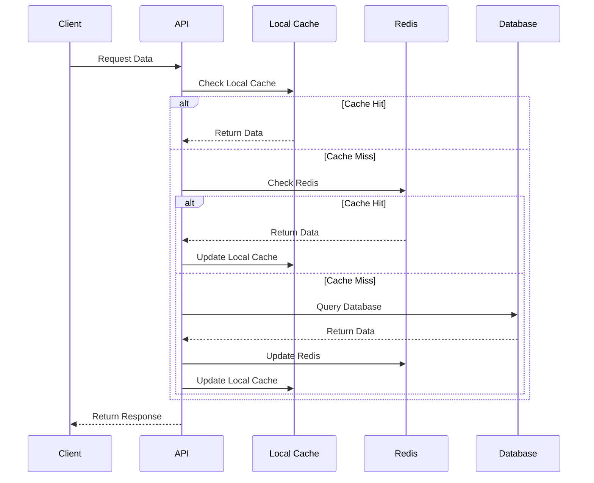

# Planungsdokument: Implementierung von Caching-Strategien

## 1. Ziel & Nutzenbeschreibung

### User Story
Als Performance-Architekt möchte ich ein mehrschichtiges Caching-System implementieren, um die Antwortzeiten zu verbessern und die Datenbankbelastung zu reduzieren, insbesondere für häufig abgerufene Daten.

### Akzeptanzkriterien
- Implementierung von Cache-Layern auf verschiedenen Ebenen:
  - Browser/Client-Cache
  - API-Gateway Cache
  - Application Cache
  - Database Query Cache
- Intelligente Cache-Invalidierung
- Cache-Hit-Rate >90% für häufig abgerufene Daten
- Reduzierung der Datenbankzugriffe um 50%
- Monitoring der Cache-Effizienz
- Konfigurierbare Cache-Strategien pro Datentyp
- Automatische Cache-Warmup nach Deployment

## 2. Technische Anforderungen & Schnittstellen

### Cache-Infrastruktur
- Redis als primärer Cache-Store
- Distributed Caching mit Redis Cluster
- In-Memory Caching mit Caffeine
- Browser-Cache-Kontrolle via HTTP-Header
- ETags für Response-Caching

### Backend-Integration
- Cache Abstraction Layer
- Custom Cache Annotations
- Cache Warmup Service
- Cache Statistics Collector
- Integration mit existierenden Services

### Monitoring
- Cache-Hit/Miss-Metriken
- Memory Usage Tracking
- Invalidation Events
- Performance Impact Metrics

## 3. Grobentwurf

### Cache-Konfiguration
```python
class CacheConfig(BaseModel):
    name: str
    type: Literal['local', 'distributed', 'browser']
    ttl: int  # seconds
    max_size: int  # entries
    strategy: Literal['lru', 'lfu', 'fifo']
    
class CacheKey(BaseModel):
    prefix: str
    parameters: List[str]
    version: str
    
@cache_config(
    ttl=3600,
    strategy="lru",
    invalidate_on=["user_update", "role_change"]
)
async def get_user_permissions(user_id: str) -> Dict[str, Any]:
    """Beispiel für Cache-Annotation"""
```

### Redis Cluster Setup
```yaml
redis:
  cluster:
    nodes:
      - host: redis-1
        port: 6379
      - host: redis-2
        port: 6379
      - host: redis-3
        port: 6379
    max_redirects: 3
    read_from_replicas: true
    
  cache_configs:
    user_data:
      ttl: 3600
      max_memory: "1gb"
      eviction_policy: "allkeys-lru"
    
    session_data:
      ttl: 1800
      max_memory: "2gb"
      eviction_policy: "volatile-lfu"
```

### Cache-Metriken
```yaml
metrics:
  - name: cache_hit_ratio
    type: gauge
    labels: [cache_name, data_type]
    
  - name: cache_memory_usage
    type: gauge
    labels: [cache_name, node]
    
  - name: cache_evictions_total
    type: counter
    labels: [cache_name, reason]
    
  - name: cache_invalidations_total
    type: counter
    labels: [cache_name, trigger]
```

### Sequenzdiagramm


## 4. Aufwandsschätzung

### Entwicklungsaufwand
- Cache-Infrastruktur: 3 Personentage
- Backend-Integration: 4 Personentage
- Monitoring-Setup: 2 Personentage
- Performance-Tests: 2 Personentage
- Dokumentation: 1 Personentag
- Buffer: 1 Personentag
**Gesamt: 13 Personentage**

### Ressourcen
- 1 Senior Backend Developer
- 1 DevOps Engineer
- Redis Cluster (min. 3 Nodes)
- Monitoring-Infrastruktur
- Lasttest-Umgebung

### Performance-Ziele
- Cache-Hit-Rate: >90%
- Cache-Latenz: <1ms (lokal), <5ms (Redis)
- Memory Overhead: <20%
- Invalidierungslatenz: <100ms
- Warmup-Zeit: <5min

## 5. Empfehlungen für CREATE-Phase

### Vorgeschlagene Agentenrollen
1. **CacheArchitectAgent**: Cache-Strategie und Infrastruktur
2. **BackendAgent**: Service-Integration und Annotations
3. **DevOpsAgent**: Redis-Cluster und Monitoring
4. **PerformanceAgent**: Lasttests und Optimierung
5. **DocAgent**: Technische Dokumentation

### Implementierungsreihenfolge
1. Setup Redis Cluster
2. Implementierung Cache Abstraction Layer
3. Service-Integration mit Annotations
4. Monitoring und Metriken
5. Cache Warmup Service
6. Performance-Optimierung
7. Browser-Cache-Integration

### Risikominimierung
- Schrittweise Einführung pro Service
- A/B Testing für Cache-Strategien
- Fallback-Mechanismen
- Circuit Breaker für Redis
- Monitoring von Memory Usage
- Cache-Poisoning-Prevention 