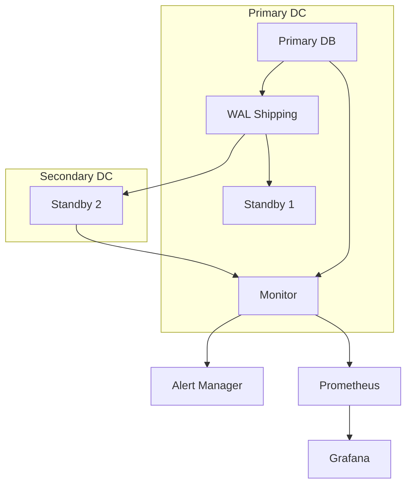

# Planungsdokument: Reduktion der Datenbank-Failover-Zeit

## 1. Ziel & Nutzenbeschreibung

### User Story
Als System-Administrator möchte ich die Datenbank-Failover-Zeit von aktuell 3,5 Sekunden auf unter 2 Sekunden reduzieren, um die Systemverfügbarkeit zu erhöhen und Unterbrechungen für Benutzer zu minimieren.

### Akzeptanzkriterien
- Failover-Zeit ist konsistent unter 2 Sekunden
- Keine Datenverluste während des Failovers
- Automatische Erkennung von Primary-Node-Ausfällen
- Transparente Umschaltung für Client-Anwendungen
- Monitoring und Alerting für Failover-Events
- Dokumentierte Recovery-Prozeduren
- Erfolgreiche Lasttests während Failover

## 2. Technische Anforderungen & Schnittstellen

### Datenbankinfrastruktur
- PostgreSQL Streaming Replication Optimierung
- Implementierung von pg_auto_failover
- Konfiguration von synchronous_commit = 'remote_apply'
- Optimierung der WAL-Segment-Größe
- Einrichtung von Connection Pooling mit PgBouncer

### Monitoring
- Integration mit Prometheus für Metriken
- Grafana-Dashboards für Replikation und Failover
- Alerting via AlertManager
- Logging in Elasticsearch

### Netzwerk
- Optimierung der Netzwerkkonfiguration
- Dedicated Network für Replikation
- Redundante Netzwerkpfade

## 3. Grobentwurf

### Systemarchitektur


### Konfigurationsanpassungen
```ini
# postgresql.conf Optimierungen
wal_level = replica
max_wal_senders = 10
wal_keep_segments = 64
synchronous_commit = remote_apply
wal_receiver_timeout = 2s
wal_sender_timeout = 2s

# pg_auto_failover settings
pgaf.node_reconnect_timeout = 2s
pgaf.health_check_timeout = 1s
pgaf.promotion_timeout = 1s
```

### Monitoring-Metriken
```yaml
metrics:
  - name: pg_replication_lag
    type: gauge
    help: "Replication lag in seconds"
  - name: pg_failover_time
    type: histogram
    help: "Time taken for failover in seconds"
  - name: pg_connection_pool_status
    type: gauge
    help: "Connection pool health status"
```

## 4. Aufwandsschätzung

### Entwicklungsaufwand
- Infrastruktur-Setup: 3 Personentage
- Konfigurationsoptimierung: 2 Personentage
- Monitoring-Setup: 2 Personentage
- Tests & Dokumentation: 2 Personentage
- Buffer: 1 Personentag
**Gesamt: 10 Personentage**

### Ressourcen
- 1 Senior DBA
- 1 DevOps Engineer
- Testumgebung mit identischer Hardware
- Load-Testing Tools (pgbench, sysbench)

### Performance-Metriken
- Aktuelle Failover-Zeit: 3,5s
- Ziel-Failover-Zeit: <2,0s
- Maximale Datenverlustzeit: 0s
- Recovery Point Objective (RPO): 0s
- Recovery Time Objective (RTO): 2s

## 5. Empfehlungen für CREATE-Phase

### Vorgeschlagene Agentenrollen
1. **InfrastructureAgent**: Setup und Konfiguration der DB-Cluster
2. **MonitoringAgent**: Implementation des Monitoring-Stacks
3. **TestAgent**: Durchführung von Failover- und Lasttests
4. **DocAgent**: Dokumentation der Konfiguration und Prozeduren
5. **SecurityAgent**: Überprüfung der Sicherheitsaspekte

### Implementierungsschritte
1. Setup der Testumgebung mit identischer Konfiguration
2. Baseline-Performance-Messung
3. Schrittweise Optimierung der Konfiguration
4. Implementierung des erweiterten Monitorings
5. Durchführung von Lasttests
6. Dokumentation und Schulung
7. Produktiv-Rollout

### Risikominimierung
- Ausführliche Tests in der Staging-Umgebung
- Backup der aktuellen Konfiguration
- Rollback-Plan für jede Änderung
- Schrittweise Implementierung
- 24/7 Bereitschaft während der Umstellung 