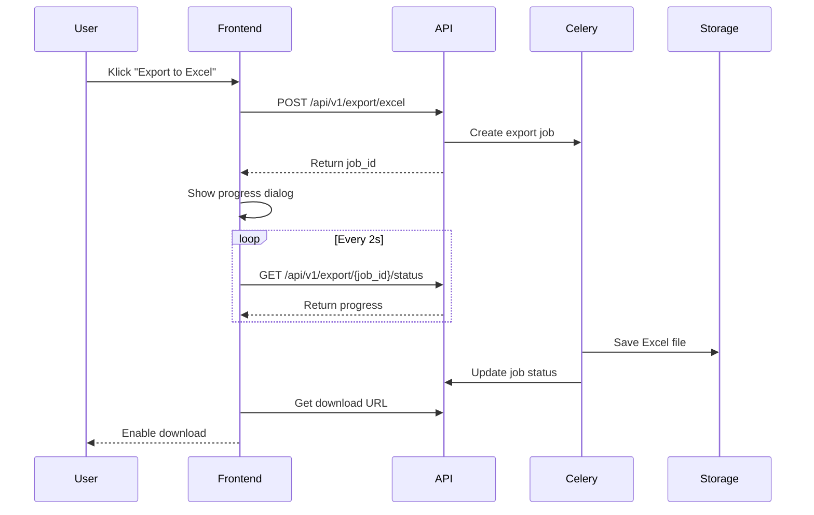

# Planungsdokument: Excel-Export für komplexe Tabellenstrukturen

## 1. Ziel & Nutzenbeschreibung

### User Story
Als Benutzer möchte ich komplexe Tabellenstrukturen mit allen Formatierungen und Hierarchien nach Excel exportieren können, um diese Daten offline weiterzuverarbeiten und mit externen Stakeholdern zu teilen.

### Akzeptanzkriterien
- Mehrstufige Tabellenhierarchien werden korrekt in Excel abgebildet
- Zahlen, Datumsangaben und Währungen behalten ihre Formatierung
- Styling-Elemente (Farben, Schriftarten, Rahmen) werden übernommen
- Pivot-Tabellen werden unterstützt
- Performance bei >10.000 Zeilen ist optimiert (<30 Sekunden Exportzeit)
- Fortschrittsanzeige während des Exports
- Fehlerbehandlung bei unvollständigem Export

## 2. Technische Anforderungen & Schnittstellen

### Backend
- Erweiterung des ExportService in `/backend/services/export_service.py`
- Implementierung von Streaming für große Datensätze
- Unterstützung für Apache POI (Java) oder openpyxl (Python)
- Asynchrone Verarbeitung mit Celery für große Exports

### Frontend
- Neue Komponente: ExportDialog mit Formatierungsoptionen
- Fortschrittsanzeige mit WebSocket-Updates
- Vorschau der Exportstruktur

### Schnittstellen
```typescript
interface ExportConfig {
  tableId: string;
  format: 'xlsx' | 'xls';
  includeStyles: boolean;
  includePivot: boolean;
  dateFormat: string;
  numberFormat: string;
  sheetName?: string;
}

interface ExportResponse {
  jobId: string;
  status: 'pending' | 'processing' | 'completed' | 'failed';
  progress: number;
  downloadUrl?: string;
  error?: string;
}
```

## 3. Grobentwurf

### API-Design
```python
@router.post("/api/v1/export/excel")
async def create_excel_export(config: ExportConfig) -> ExportResponse:
    """Startet einen neuen Excel-Export-Job"""
    
@router.get("/api/v1/export/{job_id}/status")
async def get_export_status(job_id: str) -> ExportResponse:
    """Prüft den Status eines Export-Jobs"""
```

### Datenmodell-Erweiterungen
```python
class ExportJob(BaseModel):
    id: str
    user_id: str
    config: ExportConfig
    status: str
    progress: float
    created_at: datetime
    completed_at: Optional[datetime]
    file_path: Optional[str]
    error: Optional[str]
```

### Sequenzdiagramm


## 4. Aufwandsschätzung

### Entwicklungsaufwand
- Backend-Implementierung: 4 Personentage
- Frontend-Komponenten: 3 Personentage
- Tests & Dokumentation: 2 Personentage
- Buffer für Unerwartetes: 1 Personentag
**Gesamt: 10 Personentage**

### Ressourcen
- 1 Backend-Entwickler (Python/FastAPI)
- 1 Frontend-Entwickler (React/TypeScript)
- Testumgebung mit großen Datensätzen

### Token-Schätzung
- Neue Code-Zeilen: ~1500
- Testcode: ~500
- Dokumentation: ~300
**Gesamt: ~2300 Tokens**

## 5. Empfehlungen für CREATE-Phase

### Vorgeschlagene Agentenrollen
1. **ArchitectAgent**: Initiale Systemarchitektur und Schnittstellendefinition
2. **BackendAgent**: Implementierung der Export-Logik und Celery-Tasks
3. **FrontendAgent**: Entwicklung der UI-Komponenten und WebSocket-Integration
4. **TestAgent**: Erstellung der Testfälle und Performance-Tests
5. **DocAgent**: Technische Dokumentation und API-Beschreibungen

### Entwicklungsreihenfolge
1. Basis-Export-Funktionalität ohne Formatierung
2. Integration der Formatierungsoptionen
3. Implementierung der Fortschrittsanzeige
4. Performance-Optimierung für große Datensätze
5. UI-Feinschliff und Fehlerbehandlung 