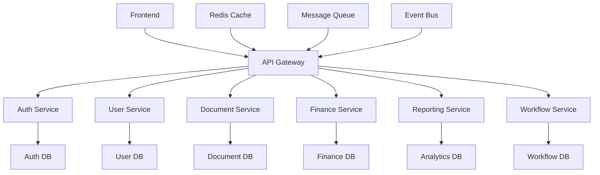

# Architekturplan VALEO-NeuroERP

## System-Architektur

### Microservices-Architektur


### Komponenten-Struktur

#### Frontend-Architektur
```typescript
interface FrontendArchitecture {
  core: {
    routing: 'react-router',
    stateManagement: 'redux-toolkit',
    api: 'axios',
    caching: 'redux-persist'
  },
  components: {
    ui: 'material-ui',
    forms: 'react-hook-form',
    validation: 'yup',
    charts: 'recharts'
  },
  performance: {
    codeSplitting: 'react-loadable',
    bundling: 'webpack',
    optimization: 'terser'
  }
}
```

#### Backend-Architektur
```python
class BackendArchitecture:
    def __init__(self):
        self.core = {
            'framework': 'fastapi',
            'orm': 'sqlalchemy',
            'cache': 'redis',
            'queue': 'rabbitmq'
        }
        self.services = {
            'auth': 'jwt',
            'database': 'postgresql',
            'search': 'elasticsearch',
            'storage': 'minio'
        }
        self.monitoring = {
            'metrics': 'prometheus',
            'logging': 'elk-stack',
            'tracing': 'jaeger'
        }
```

## Datenmodell

### Core-Entities
```typescript
interface CoreEntities {
  User: {
    id: string;
    email: string;
    role: UserRole;
    permissions: Permission[];
  };
  Document: {
    id: string;
    type: DocumentType;
    content: string;
    metadata: Metadata;
  };
  Transaction: {
    id: string;
    type: TransactionType;
    amount: number;
    status: TransactionStatus;
  };
  Workflow: {
    id: string;
    steps: WorkflowStep[];
    status: WorkflowStatus;
    assignee: string;
  }
}
```

### Datenbank-Schema
```sql
-- Users
CREATE TABLE users (
    id UUID PRIMARY KEY,
    email VARCHAR(255) UNIQUE,
    role_id UUID REFERENCES roles(id),
    created_at TIMESTAMP,
    updated_at TIMESTAMP
);

-- Documents
CREATE TABLE documents (
    id UUID PRIMARY KEY,
    type VARCHAR(50),
    content JSONB,
    metadata JSONB,
    created_by UUID REFERENCES users(id),
    created_at TIMESTAMP,
    updated_at TIMESTAMP
);

-- Transactions
CREATE TABLE transactions (
    id UUID PRIMARY KEY,
    type VARCHAR(50),
    amount DECIMAL(15,2),
    status VARCHAR(50),
    created_at TIMESTAMP,
    updated_at TIMESTAMP
);

-- Workflows
CREATE TABLE workflows (
    id UUID PRIMARY KEY,
    definition JSONB,
    status VARCHAR(50),
    assignee_id UUID REFERENCES users(id),
    created_at TIMESTAMP,
    updated_at TIMESTAMP
);
```

## Service-Architektur

### API-Gateway
```yaml
apiGateway:
  routes:
    - path: /api/auth/*
      service: auth-service
      methods: [POST, GET]
      rateLimit: 100/minute
      
    - path: /api/users/*
      service: user-service
      methods: [GET, POST, PUT, DELETE]
      rateLimit: 1000/minute
      
    - path: /api/documents/*
      service: document-service
      methods: [GET, POST, PUT, DELETE]
      rateLimit: 500/minute
      
    - path: /api/finance/*
      service: finance-service
      methods: [GET, POST]
      rateLimit: 200/minute
```

### Service-Definitionen

#### Auth-Service
```typescript
interface AuthService {
  endpoints: {
    login: '/auth/login',
    register: '/auth/register',
    verify: '/auth/verify',
    refresh: '/auth/refresh'
  };
  methods: {
    authenticate: (credentials: Credentials) => Promise<Token>;
    validate: (token: Token) => Promise<boolean>;
    authorize: (permission: Permission) => Promise<boolean>;
  };
  events: {
    publish: ['user.login', 'user.logout', 'token.expired'];
    subscribe: ['user.created', 'user.deleted'];
  }
}
```

#### Document-Service
```typescript
interface DocumentService {
  endpoints: {
    create: '/documents',
    update: '/documents/:id',
    delete: '/documents/:id',
    search: '/documents/search'
  };
  methods: {
    createDocument: (doc: Document) => Promise<Document>;
    updateDocument: (id: string, doc: Document) => Promise<Document>;
    searchDocuments: (query: SearchQuery) => Promise<Document[]>;
  };
  events: {
    publish: ['document.created', 'document.updated', 'document.deleted'];
    subscribe: ['workflow.completed'];
  }
}
```

## Infrastruktur

### Kubernetes-Konfiguration
```yaml
# Deployment
apiVersion: apps/v1
kind: Deployment
metadata:
  name: valeo-neuroerp
spec:
  replicas: 3
  selector:
    matchLabels:
      app: valeo-neuroerp
  template:
    metadata:
      labels:
        app: valeo-neuroerp
    spec:
      containers:
      - name: api
        image: valeo-neuroerp/api:latest
        resources:
          limits:
            cpu: "1"
            memory: "1Gi"
          requests:
            cpu: "500m"
            memory: "512Mi"
        ports:
        - containerPort: 8080
        env:
        - name: DATABASE_URL
          valueFrom:
            secretKeyRef:
              name: db-secrets
              key: url

# Service
apiVersion: v1
kind: Service
metadata:
  name: valeo-neuroerp-service
spec:
  selector:
    app: valeo-neuroerp
  ports:
  - port: 80
    targetPort: 8080
  type: LoadBalancer
```

### Monitoring-Stack
```yaml
# Prometheus Config
global:
  scrape_interval: 15s
  evaluation_interval: 15s

scrape_configs:
  - job_name: 'valeo-neuroerp'
    static_configs:
      - targets: ['localhost:8080']

# Grafana Dashboards
dashboards:
  - name: "System Overview"
    panels:
      - title: "CPU Usage"
        type: "graph"
        datasource: "Prometheus"
        
      - title: "Memory Usage"
        type: "graph"
        datasource: "Prometheus"
        
      - title: "API Response Times"
        type: "heatmap"
        datasource: "Prometheus"
```

## Security-Architektur

### Authentication
```typescript
interface SecurityConfig {
  auth: {
    type: 'JWT',
    expiry: '1h',
    refresh: '7d',
    algorithms: ['RS256']
  };
  encryption: {
    type: 'AES-256-GCM',
    keyRotation: '30d'
  };
  headers: {
    security: [
      'X-Frame-Options: DENY',
      'X-Content-Type-Options: nosniff',
      'X-XSS-Protection: 1; mode=block'
    ]
  }
}
```

### Authorization
```typescript
interface RoleConfig {
  roles: {
    admin: {
      permissions: ['*'],
      rate_limit: 1000
    },
    user: {
      permissions: ['read', 'write'],
      rate_limit: 100
    },
    guest: {
      permissions: ['read'],
      rate_limit: 10
    }
  }
}
```

## Performance-Optimierung

### Caching-Strategie
```typescript
interface CacheConfig {
  layers: {
    browser: {
      type: 'service-worker',
      maxAge: '1h'
    },
    application: {
      type: 'memory',
      maxSize: '100MB'
    },
    server: {
      type: 'redis',
      maxSize: '1GB'
    }
  },
  invalidation: {
    strategy: 'time-based',
    triggers: ['update', 'delete']
  }
}
```

### Skalierung
```yaml
autoscaling:
  metrics:
    - type: Resource
      resource:
        name: cpu
        target:
          type: Utilization
          averageUtilization: 70
    - type: Resource
      resource:
        name: memory
        target:
          type: Utilization
          averageUtilization: 80
          
  behavior:
    scaleUp:
      stabilizationWindowSeconds: 300
      policies:
      - type: Pods
        value: 4
        periodSeconds: 60
        
    scaleDown:
      stabilizationWindowSeconds: 300
      policies:
      - type: Pods
        value: 2
        periodSeconds: 60
```

## Disaster Recovery

### Backup-Strategie
```yaml
backup:
  schedule:
    full: '0 0 * * 0'  # Weekly
    incremental: '0 0 * * 1-6'  # Daily
    
  retention:
    full: '30d'
    incremental: '7d'
    
  storage:
    type: 's3'
    bucket: 'valeo-backups'
    encryption: 'AES-256'
```

### Failover
```yaml
failover:
  strategy: 'active-passive'
  checkInterval: '10s'
  timeout: '30s'
  
  healthCheck:
    path: '/health'
    interval: '5s'
    timeout: '3s'
    successThreshold: 1
    failureThreshold: 3
``` 