# Optimierte Microservices-Architektur für VALERO-NeuroERP v1.7

## Übersicht

Dieses Dokument beschreibt die optimierte Microservices-Architektur für VALERO-NeuroERP v1.7, die im Rahmen der PLAN-Phase des GENXAIS-Zyklus v1.7 entwickelt wurde. Die Architektur wurde auf Basis der Ergebnisse der VAN-Phase optimiert, um die identifizierten Performance-Bottlenecks zu beheben und die Skalierbarkeit für 10k+ Nutzer zu gewährleisten.

## Architekturdiagramm

```mermaid
graph TB
    %% Externe Systeme
    Client["🖥️ Client Browser/App"]
    ExternalSystems["🌐 Externe Systeme"]
    
    %% API Gateway und Sicherheit
    APIGateway["🔐 API Gateway"]
    AuthService["🔑 Auth Service"]
    
    %% Core Services
    CoreServices["Core Services"]
    subgraph CoreServices
        ComplianceEngine["⚖️ Compliance Engine"]
        TransactionProcessor["💸 Transaction Processor"]
        DocumentManager["📄 Document Manager"]
        UserService["👤 User Service"]
    end
    
    %% Unterstützende Services
    SupportServices["Supporting Services"]
    subgraph SupportServices
        NotificationService["🔔 Notification Service"]
        ReportingService["📊 Reporting Service"]
        DashboardService["📈 Dashboard Service"]
        AuditService["🔍 Audit Service"]
    end
    
    %% Datenbanken
    Databases["Databases"]
    subgraph Databases
        MainDB[("🗄️ Main DB")]
        ComplianceDB[("⚖️ Compliance DB")]
        DocumentDB[("📑 Document DB")]
        AnalyticsDB[("📊 Analytics DB")]
        AuditDB[("🔍 Audit DB")]
    end
    
    %% Caching und Messaging
    Infrastructure["Infrastructure"]
    subgraph Infrastructure
        Redis["📦 Redis Cache"]
        MessageQueue["📨 Message Queue"]
        ServiceMesh["🕸️ Service Mesh"]
        LoadBalancer["⚖️ Load Balancer"]
    end
    
    %% Monitoring und Observability
    Observability["Observability"]
    subgraph Observability
        Prometheus["📊 Prometheus"]
        Grafana["📈 Grafana"]
        ElasticStack["🔍 Elastic Stack"]
        ErrorHandler["❌ Global Error Handler"]
    end
    
    %% Verbindungen
    Client --> LoadBalancer
    LoadBalancer --> APIGateway
    ExternalSystems --> APIGateway
    
    APIGateway --> AuthService
    APIGateway --> CoreServices
    APIGateway --> SupportServices
    
    %% Core Service Verbindungen
    ComplianceEngine --> ComplianceDB
    ComplianceEngine --> Redis
    TransactionProcessor --> MainDB
    TransactionProcessor --> MessageQueue
    DocumentManager --> DocumentDB
    UserService --> MainDB
    UserService --> Redis
    
    %% Supporting Service Verbindungen
    NotificationService --> MessageQueue
    NotificationService --> Redis
    ReportingService --> AnalyticsDB
    DashboardService --> Redis
    AuditService --> AuditDB
    
    %% Infrastructure Verbindungen
    ServiceMesh --> CoreServices
    ServiceMesh --> SupportServices
    ServiceMesh --> Observability
    
    %% Observability Verbindungen
    ErrorHandler --> ElasticStack
    CoreServices --> Prometheus
    SupportServices --> Prometheus
    Prometheus --> Grafana
    
    %% Datenflüsse
    MainDB -.-> AnalyticsDB
    MessageQueue -.-> NotificationService
    CoreServices -.-> AuditService
    SupportServices -.-> AuditService
```

## Schlüsselkomponenten

### 1. API Gateway

Das optimierte API Gateway dient als zentraler Einstiegspunkt für alle Client-Anfragen und implementiert:

- **Verbesserte Authentifizierung**: JWT-basierte Authentifizierung mit kurzer Token-Lebensdauer und Refresh-Mechanismus
- **Ratenbegrenzung**: Schutz vor Überlastung durch konfigurierbare Rate-Limits pro Endpunkt und Benutzer
- **Routing und Load-Balancing**: Intelligentes Routing zu Backend-Services mit automatischem Load-Balancing
- **Caching**: Response-Caching für häufig abgerufene, nicht-personalisierte Daten
- **Protokolltransformation**: Einheitliche REST-API nach außen, flexible Service-Kommunikation intern
- **Sicherheitsheader**: Automatisches Hinzufügen von Security-Headern (HSTS, CSP, etc.)

### 2. Service Mesh

Ein neues Service Mesh verbessert die Kommunikation zwischen Microservices:

- **Circuit Breaker**: Verhindert Kaskadenfehler durch automatische Isolation fehlerhafter Services
- **Retry-Mechanismen**: Automatische Wiederholungsversuche mit Exponential Backoff für transiente Fehler
- **Observability**: Detaillierte Metriken für Service-zu-Service-Kommunikation
- **mTLS**: Gegenseitige TLS-Authentifizierung für sichere Service-Kommunikation
- **Traffic Splitting**: Ermöglicht Canary Deployments und A/B-Testing

### 3. Caching-Strategie

Die mehrstufige Caching-Strategie optimiert die Performance:

- **Redis als zentraler Cache**: In-Memory-Caching für häufig abgerufene Daten
- **Lokale Service-Caches**: Für service-spezifische, häufig verwendete Daten
- **Cache-Invalidierung**: Event-basierte Invalidierung über Message Queue
- **Hierarchisches Caching**: Browser → API Gateway → Service → Datenbank

### 4. Global Error Handler

Der neue Global Error Handler verbessert die Fehlerbehandlung:

- **Standardisiertes Fehlerformat**: Einheitliches JSON-Format für alle API-Fehlerantworten
- **Korrelations-IDs**: Durchgängiges Tracking von Anfragen über Service-Grenzen hinweg
- **Strukturiertes Logging**: JSON-formatierte Logs für einfache Analyse
- **Automatische Klassifizierung**: Kategorisierung von Fehlern nach Typ und Schweregrad

### 5. Verbesserte Datenbankarchitektur

Die optimierte Datenbankarchitektur unterstützt höhere Last:

- **Sharding**: Horizontale Partitionierung für bessere Skalierbarkeit
- **Read Replicas**: Separate Lesereplikas für analytische Abfragen
- **Indexoptimierung**: Optimierte Indizes für häufige Abfragen
- **Connection Pooling**: Effiziente Verwaltung von Datenbankverbindungen

## Skalierungsstrategie

Die Architektur unterstützt horizontale und vertikale Skalierung:

1. **Horizontale Skalierung**:
   - Stateless Services für einfache Replikation
   - Kubernetes-basierte Autoscaling-Regeln
   - Datenbank-Sharding für verteilte Datenhaltung

2. **Vertikale Skalierung**:
   - Ressourcen-Optimierung für kritische Services
   - Performance-Tuning für Datenbanken
   - Spezialisierte Instance-Typen für unterschiedliche Workloads

3. **Geografische Skalierung**:
   - Multi-Region-Deployment-Vorbereitung
   - Content Delivery Network für statische Assets
   - Geo-Routing für niedrige Latenz

## Implementierungsplan

Der Implementierungsplan für die optimierte Architektur umfasst:

1. **Phase 1: Grundlegende Infrastruktur** (2 Wochen)
   - API Gateway Implementierung
   - Service Mesh Einrichtung
   - Redis Cache Integration

2. **Phase 2: Service-Optimierung** (3 Wochen)
   - Refactoring der Core Services
   - Implementierung des Global Error Handlers
   - Optimierung der Datenbankzugriffe

3. **Phase 3: Skalierung und Monitoring** (2 Wochen)
   - Autoscaling-Konfiguration
   - Monitoring und Alerting
   - Load-Tests und Performance-Optimierung

## Erwartete Verbesserungen

| Metrik | Aktueller Wert | Zielwert | Verbesserung |
|--------|----------------|----------|-------------|
| Durchschnittliche API-Latenz | 450ms | <100ms | 78% |
| Maximale Nutzer pro Instance | 2.500 | 10.000+ | 300% |
| Durchsatz (Transaktionen/s) | 250 | 1.000+ | 300% |
| Recovery-Zeit nach Ausfällen | 5-10 min | <30 sek | 90% |
| Cache-Hit-Rate | <5% | >80% | 1.500% |

---

Erstellt: 2025-07-02  
Autor: ArchitectureAgent  
Version: 1.0 