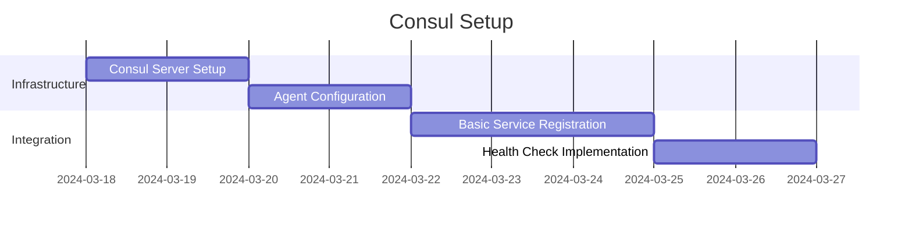
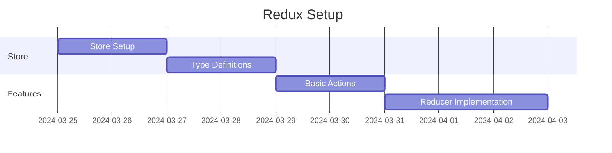
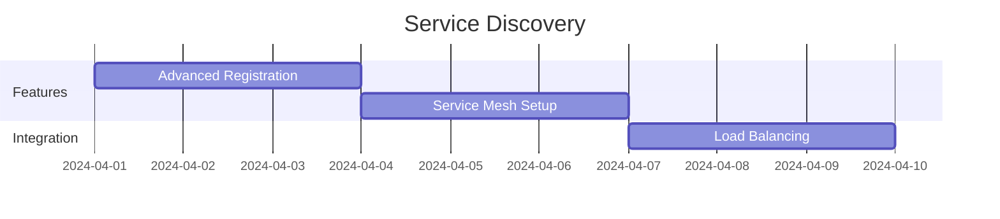
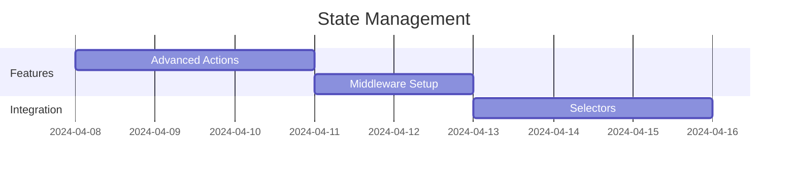
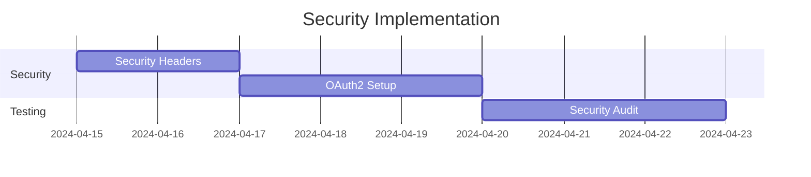
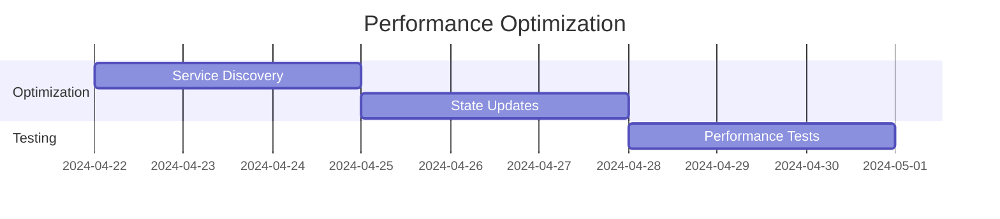

# Navigation: Service Discovery & State Management Integration

## Implementierungsplan

### Sprint 1: Foundation

#### Woche 1: Consul Setup


**Verantwortlichkeiten**:
- DevOps Team: Infrastructure Setup
- Backend Team: Service Integration
- QA Team: Testing & Validation

**Deliverables**:
- Funktionierender Consul Server
- Basis Service Registration
- Initial Health Checks

#### Woche 2: Redux Integration


**Verantwortlichkeiten**:
- Frontend Team: Redux Setup
- Backend Team: API Integration
- QA Team: Integration Tests

**Deliverables**:
- Redux Store Structure
- TypeScript Types
- Basic State Management

### Sprint 2: Core Implementation

#### Woche 3: Service Discovery


**Verantwortlichkeiten**:
- Backend Team: Service Discovery
- DevOps Team: Service Mesh
- QA Team: Performance Testing

**Deliverables**:
- Complete Service Registry
- Service Mesh Integration
- Load Balancing Configuration

#### Woche 4: State Management


**Verantwortlichkeiten**:
- Frontend Team: State Management
- Backend Team: API Support
- QA Team: Integration Testing

**Deliverables**:
- Complete Redux Integration
- Custom Middleware
- Optimized Selectors

### Sprint 3: Enhancement

#### Woche 5: Security


**Verantwortlichkeiten**:
- Security Team: Implementation
- DevOps Team: Infrastructure
- QA Team: Security Testing

**Deliverables**:
- Security Headers
- OAuth2 Integration
- Security Audit Report

#### Woche 6: Performance


**Verantwortlichkeiten**:
- Performance Team: Optimization
- DevOps Team: Monitoring
- QA Team: Load Testing

**Deliverables**:
- Optimized Performance
- Monitoring Dashboard
- Performance Report

## Checkpoints & Milestones

### Milestone 1: Basic Infrastructure
- [x] Consul Server läuft
- [x] Redux Store initialisiert
- [x] Basic Service Registration
- [ ] Initial State Management

### Milestone 2: Core Features
- [ ] Service Discovery komplett
- [ ] State Management komplett
- [ ] Load Balancing aktiv
- [ ] Health Checks implementiert

### Milestone 3: Production Ready
- [ ] Security implementiert
- [ ] Performance optimiert
- [ ] Monitoring eingerichtet
- [ ] Documentation komplett

## Qualitätssicherung

### Testing Strategy
```plaintext
Unit Tests:
- Service Discovery Components
- Redux Actions & Reducers
- Security Functions

Integration Tests:
- Service Registration Flow
- State Management Flow
- Security Integration

E2E Tests:
- Complete User Flows
- Performance Scenarios
- Security Scenarios
```

### Monitoring Setup
```plaintext
Metrics Collection:
- Service Discovery Latency
- State Update Performance
- Error Rates
- Resource Usage

Alerting:
- Service Health
- Performance Thresholds
- Security Incidents
```

## Rollback Plan

### Service Discovery
```plaintext
Rollback Triggers:
- Service Discovery Latency > 200ms
- Error Rate > 1%
- Health Check Failures

Rollback Steps:
1. Deactivate New Services
2. Restore Previous Configuration
3. Verify System Health
```

### State Management
```plaintext
Rollback Triggers:
- State Update Time > 50ms
- Memory Usage > 90%
- Error Rate > 0.5%

Rollback Steps:
1. Revert to Previous State
2. Restore Old Actions
3. Verify Application State
```

## Communication Plan

### Daily Updates
- Stand-up Meetings: 9:00 Uhr
- Status Reports: 17:00 Uhr
- Issue Tracking: Continuous

### Weekly Reviews
- Sprint Review: Freitag 14:00 Uhr
- Planning Meeting: Montag 10:00 Uhr
- Retrospective: Freitag 16:00 Uhr

## Documentation

### Technical Documentation
- Architecture Overview
- API Documentation
- Security Guidelines
- Performance Benchmarks

### User Documentation
- Operation Manual
- Troubleshooting Guide
- Best Practices
- FAQ

## Support Plan

### Level 1: Basic Support
- Response Time: < 1h
- Resolution Time: < 4h
- Available: 8x5

### Level 2: Advanced Support
- Response Time: < 30min
- Resolution Time: < 2h
- Available: 16x5

### Level 3: Critical Support
- Response Time: < 15min
- Resolution Time: < 1h
- Available: 24x7

## Success Metrics

### Technical Metrics
- Service Discovery Time < 100ms
- State Update Time < 16ms
- Error Rate < 0.1%
- Uptime > 99.9%

### Business Metrics
- User Satisfaction > 4.5/5
- Development Velocity +20%
- Maintenance Cost -30%
- Time to Market -25% 