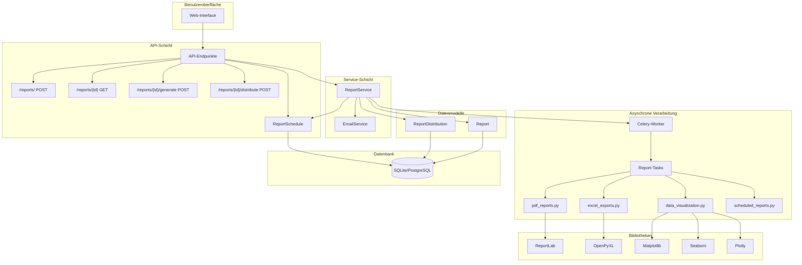
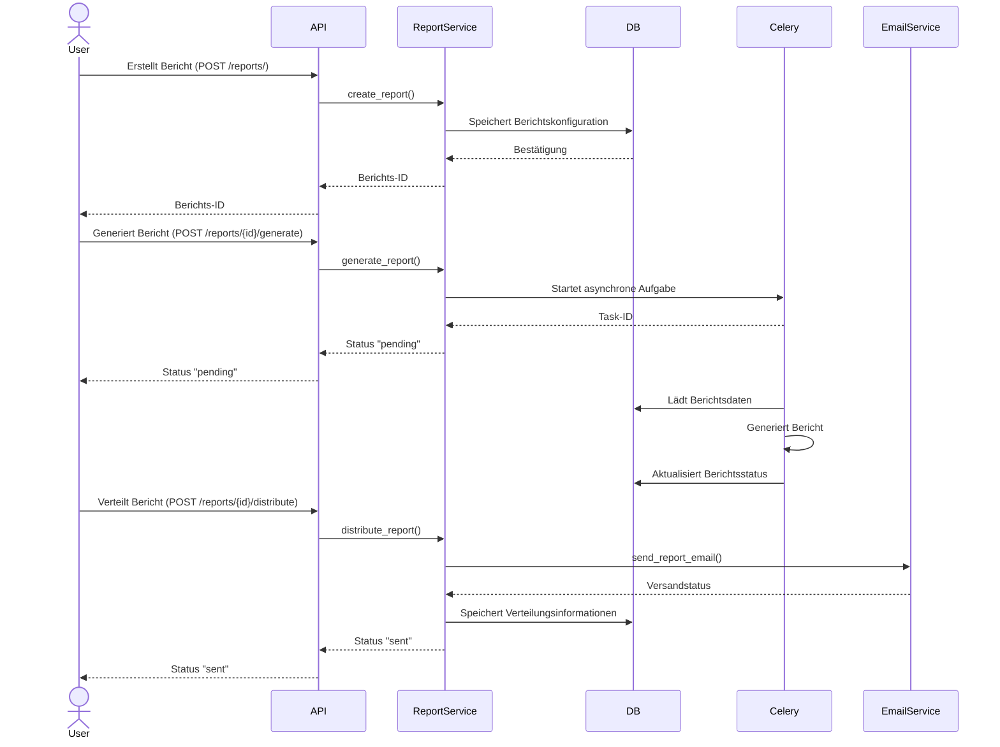
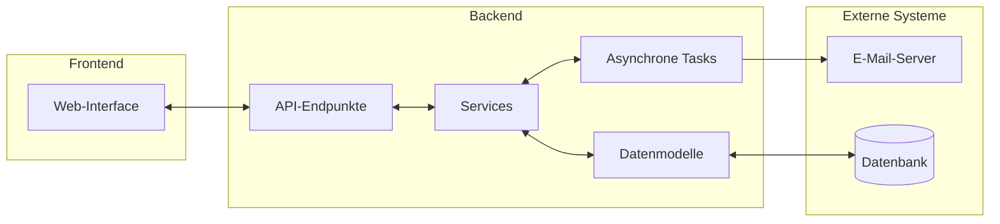

# Architekturdiagramm: Berichtsmodul

## Übersicht

```mermaid
graph TD
    subgraph "Benutzeroberfläche"
        UI[Web-Interface]
    end
    
    subgraph "API-Schicht"
        API[API-Endpunkte]
        API --> ReportCreate["/reports/ POST"]
        API --> ReportGet["/reports/{id} GET"]
        API --> ReportGenerate["/reports/{id}/generate POST"]
        API --> ReportDistribute["/reports/{id}/distribute POST"]
        API --> ReportSchedule["/reports/{id}/schedule POST"]
    end
    
    subgraph "Service-Schicht"
        RS[ReportService]
        ES[EmailService]
    end
    
    subgraph "Datenmodelle"
        Report[Report]
        ReportDistribution[ReportDistribution]
        ReportSchedule[ReportSchedule]
    end
    
    subgraph "Asynchrone Verarbeitung"
        Celery[Celery-Worker]
        Tasks[Report-Tasks]
        Tasks --> PDFReports[pdf_reports.py]
        Tasks --> ExcelExports[excel_exports.py]
        Tasks --> DataViz[data_visualization.py]
        Tasks --> ScheduledReports[scheduled_reports.py]
    end
    
    subgraph "Bibliotheken"
        ReportLib[ReportLab]
        OpenPyXL[OpenPyXL]
        MatplotLib[Matplotlib]
        Seaborn[Seaborn]
        Plotly[Plotly]
    end
    
    subgraph "Datenbank"
        DB[(SQLite/PostgreSQL)]
    end
    
    UI --> API
    API --> RS
    RS --> Report
    RS --> ReportDistribution
    RS --> ReportSchedule
    RS --> ES
    RS --> Celery
    Celery --> Tasks
    PDFReports --> ReportLib
    ExcelExports --> OpenPyXL
    DataViz --> MatplotLib
    DataViz --> Seaborn
    DataViz --> Plotly
    Report --> DB
    ReportDistribution --> DB
    ReportSchedule --> DB
```

## Datenfluss

```mermaid
sequenceDiagram
    actor User
    participant API
    participant ReportService
    participant DB
    participant Celery
    participant EmailService
    
    User->>API: Erstellt Bericht (POST /reports/)
    API->>ReportService: create_report()
    ReportService->>DB: Speichert Berichtskonfiguration
    DB-->>ReportService: Bestätigung
    ReportService-->>API: Berichts-ID
    API-->>User: Berichts-ID
    
    User->>API: Generiert Bericht (POST /reports/{id}/generate)
    API->>ReportService: generate_report()
    ReportService->>Celery: Startet asynchrone Aufgabe
    Celery-->>ReportService: Task-ID
    ReportService-->>API: Status "pending"
    API-->>User: Status "pending"
    
    Celery->>DB: Lädt Berichtsdaten
    Celery->>Celery: Generiert Bericht
    Celery->>DB: Aktualisiert Berichtsstatus
    
    User->>API: Verteilt Bericht (POST /reports/{id}/distribute)
    API->>ReportService: distribute_report()
    ReportService->>EmailService: send_report_email()
    EmailService-->>ReportService: Versandstatus
    ReportService->>DB: Speichert Verteilungsinformationen
    ReportService-->>API: Status "sent"
    API-->>User: Status "sent"
```

## Komponentenbeziehungen

```mermaid
graph LR
    subgraph "Frontend"
        UI[Web-Interface]
    end
    
    subgraph "Backend"
        API[API-Endpunkte]
        Services[Services]
        Models[Datenmodelle]
        Tasks[Asynchrone Tasks]
    end
    
    subgraph "Externe Systeme"
        SMTP[E-Mail-Server]
        DB[(Datenbank)]
    end
    
    UI <--> API
    API <--> Services
    Services <--> Models
    Services <--> Tasks
    Models <--> DB
    Tasks --> SMTP
```
