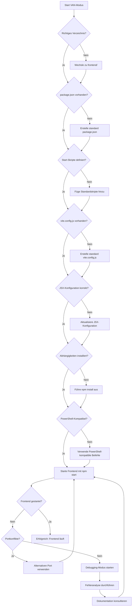

# Visual Process Map: Frontend-Validierung im VAN-Modus



## VAN-Modus Checkliste für Frontend-Entwicklung

Diese Checkliste wird verwendet, um die Frontend-Entwicklungsumgebung im VAN-Modus zu validieren:

### 1. Verzeichnisstruktur

- [ ] Arbeite ich im korrekten Verzeichnis?
  ```powershell
  # Wechsle ins frontend-Verzeichnis
  cd frontend
  # Prüfe aktuelles Verzeichnis
  Get-Location
  ```

### 2. Konfigurationsdateien

- [ ] Sind die notwendigen Konfigurationsdateien vorhanden?
  ```powershell
  # Prüfe, ob package.json existiert
  Test-Path package.json
  # Prüfe, ob vite.config.js existiert
  Test-Path vite.config.js
  ```

### 3. Standardskripte

- [ ] Enthält package.json die benötigten Skripte?
  ```powershell
  # Skripte anzeigen
  (Get-Content package.json -Raw | ConvertFrom-Json).scripts
  ```

### 4. JSX-Konfiguration

- [ ] Ist die JSX-Konfiguration in vite.config.js korrekt?
  ```javascript
  // Benötigte Konfiguration in vite.config.js
  esbuild: {
    loader: { '.js': 'jsx', '.ts': 'tsx' },
    jsxFactory: 'React.createElement',
    jsxFragment: 'React.Fragment'
  }
  ```

### 5. Abhängigkeiten

- [ ] Sind alle notwendigen Abhängigkeiten installiert?
  ```powershell
  # Abhängigkeiten installieren
  npm install
  ```

### 6. Starten des Frontends

- [ ] Frontend mit dem korrekten Befehl starten:
  ```powershell
  # Option 1: Standard-Skript
  npm start
  
  # Option 2: Vite direkt
  npx vite
  
  # Option 3: Alternativen Port verwenden
  npm start -- --port 5000
  # oder
  npx vite --port 5000
  ```

## Entscheidungsbaum für Frontend-Probleme

1. **Problem**: "Missing script: start"
   - **Lösung**: Befinden Sie sich im richtigen Verzeichnis? Wechseln Sie zu `frontend/`
   - **Alternative**: Verwenden Sie das Frontend-Starter-Skript: `./scripts/start_frontend.ps1`

2. **Problem**: "&&" Syntax-Fehler
   - **Lösung**: Verwenden Sie in PowerShell keine `&&`-Verkettung, sondern führen Sie Befehle nacheinander aus:
     ```powershell
     cd frontend
     npm start
     ```

3. **Problem**: "The JSX syntax extension is not currently enabled"
   - **Lösung**: Aktualisieren Sie vite.config.js mit der JSX-Loader-Konfiguration
   - **Alternative**: Nutzen Sie das Skript `./scripts/start_frontend.ps1`, das dies automatisch korrigiert

4. **Problem**: "Cannot find module 'typescript'"
   - **Lösung**: Installieren Sie TypeScript als Abhängigkeit: `npm install typescript --save-dev`

5. **Problem**: "Port XXXX is in use"
   - **Lösung**: Verwenden Sie einen alternativen Port: `npm start -- --port 5000` oder `npx vite --port 5000`