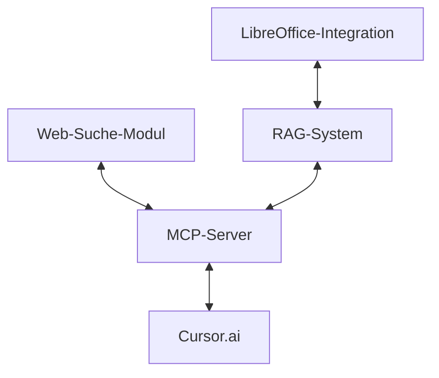

# Technische Zusammenfassung: Web-Suche und RAG-Integration

Diese Zusammenfassung bietet einen technischen Überblick über die Integration von Web-Suche und RAG-Funktionalitäten in VALEO-NeuroERP.

## Architekturübersicht

Die Implementierung basiert auf einer modularen Architektur mit drei Hauptkomponenten:



### 1. Web-Suche-Modul

Das Web-Suche-Modul nutzt die Linkup API für präzise Websuchen mit verschiedenen Filtern:

```python
import os
from dotenv import load_dotenv
from linkup import Linkup

# API-Schlüssel aus Umgebungsvariablen laden
load_dotenv()
linkup_api_key = os.getenv("LINKUP_API_KEY")

# Linkup-Client initialisieren
linkup = Linkup(api_key=linkup_api_key)

# Web-Suche durchführen
def web_search(query, search_type="sourcedAnswer", region=None, language=None, time_period=None):
    """
    Führt eine Web-Suche mit der Linkup API durch.
    
    Args:
        query (str): Die Suchanfrage
        search_type (str): Art der Suche ('sourcedAnswer' oder 'searchResults')
        region (str, optional): Region für die Suche
        language (str, optional): Sprache für die Suche
        time_period (str, optional): Zeitraum für die Suche
        
    Returns:
        dict: Suchergebnisse
    """
    params = {
        "query": query,
        "type": search_type
    }
    
    # Optionale Parameter hinzufügen
    if region:
        params["region"] = region
    if language:
        params["language"] = language
    if time_period:
        params["timePeriod"] = time_period
    
    # Anfrage senden
    response = linkup.search(**params)
    return response
```

### 2. RAG-System

Das RAG-System kombiniert Dokumentenverarbeitung, Vektorindexierung und LLM-Anfragen:

```python
import os
from dotenv import load_dotenv
from langchain_text_splitters import RecursiveCharacterTextSplitter
from langchain_openai import OpenAIEmbeddings
from langchain_community.vectorstores import FAISS
from langchain_openai import ChatOpenAI
from langchain.chains import RetrievalQA

# API-Schlüssel aus Umgebungsvariablen laden
load_dotenv()
openai_api_key = os.getenv("OPENAI_API_KEY")

# Text-Splitter initialisieren
text_splitter = RecursiveCharacterTextSplitter(chunk_size=1000, chunk_overlap=100)

# Embeddings-Modell initialisieren
embeddings = OpenAIEmbeddings()

# Dokument verarbeiten und indexieren
def process_document(file_path):
    """
    Verarbeitet ein Dokument und fügt es zum Vektorindex hinzu.
    
    Args:
        file_path (str): Pfad zum Dokument
        
    Returns:
        FAISS: Vektorindex
    """
    # Dokument lesen
    with open(file_path, 'r', encoding='utf-8') as file:
        text = file.read()
    
    # Text in Chunks aufteilen
    chunks = text_splitter.split_text(text)
    
    # Vektorindex erstellen
    vector_store = FAISS.from_texts(chunks, embeddings, metadatas=[{"source": file_path}] * len(chunks))
    return vector_store

# RAG-Abfrage durchführen
def rag_query(vector_store, query):
    """
    Führt eine RAG-Abfrage durch.
    
    Args:
        vector_store (FAISS): Vektorindex
        query (str): Abfrage
        
    Returns:
        str: Antwort
    """
    # LLM initialisieren
    llm = ChatOpenAI(model_name="gpt-4")
    
    # Retrieval-QA-Chain erstellen
    qa_chain = RetrievalQA.from_chain_type(
        llm=llm,
        chain_type="stuff",
        retriever=vector_store.as_retriever()
    )
    
    # Abfrage durchführen
    response = qa_chain.invoke({"query": query})
    return response["result"]
```

### 3. LibreOffice-Integration

Die LibreOffice-Integration ermöglicht die Verarbeitung von LibreOffice-Dokumenten im RAG-System:

```python
import os
import uno
from com.sun.star.beans import PropertyValue
from tempfile import NamedTemporaryFile
import subprocess

class LibreOfficeProcessor:
    def __init__(self, port=8100):
        """Initialisiert den LibreOffice-Prozessor."""
        self.port = port
        self.connect_to_libreoffice()
    
    def connect_to_libreoffice(self):
        """Stellt eine Verbindung zum LibreOffice-Dienst her."""
        try:
            # Verbindung zum LibreOffice-Dienst herstellen
            local_context = uno.getComponentContext()
            resolver = local_context.ServiceManager.createInstanceWithContext(
                "com.sun.star.bridge.UnoUrlResolver", local_context
            )
            self.context = resolver.resolve(
                f"uno:socket,host=localhost,port={self.port};urp;StarOffice.ComponentContext"
            )
            self.desktop = self.context.ServiceManager.createInstanceWithContext(
                "com.sun.star.frame.Desktop", self.context
            )
        except Exception:
            # LibreOffice starten, wenn es nicht läuft
            subprocess.Popen([
                "soffice",
                "--headless",
                "--accept=socket,host=localhost,port=8100;urp;"
            ])
            # Kurz warten und erneut versuchen
            import time
            time.sleep(5)
            self.connect_to_libreoffice()
    
    def extract_text(self, file_path):
        """Extrahiert Text aus einem LibreOffice-Dokument."""
        # Dokument öffnen
        props = (PropertyValue("Hidden", 0, True, 0),)
        url = uno.systemPathToFileUrl(os.path.abspath(file_path))
        document = self.desktop.loadComponentFromURL(url, "_blank", 0, props)
        
        try:
            # Text basierend auf Dokumenttyp extrahieren
            if document.supportsService("com.sun.star.text.TextDocument"):
                # Writer-Dokument
                text = document.getText().getString()
            elif document.supportsService("com.sun.star.sheet.SpreadsheetDocument"):
                # Calc-Dokument
                text = self._extract_from_calc(document)
            elif document.supportsService("com.sun.star.presentation.PresentationDocument"):
                # Impress-Dokument
                text = self._extract_from_impress(document)
            else:
                text = "Nicht unterstütztes Dokumentformat"
            
            return text
        finally:
            document.close(True)
    
    def _extract_from_calc(self, document):
        """Extrahiert Text aus einem Calc-Dokument."""
        sheets = document.getSheets()
        text_parts = []
        
        for i in range(sheets.getCount()):
            sheet = sheets.getByIndex(i)
            text_parts.append(f"Sheet: {sheet.getName()}")
            
            # Zellenbereich durchlaufen
            cursor = sheet.createCursor()
            cursor.gotoEndOfUsedArea(True)
            
            for row_idx in range(cursor.getRows().getCount()):
                row_texts = []
                for cell in sheet.getCellRangeByPosition(0, row_idx, cursor.getColumns().getCount() - 1, row_idx):
                    row_texts.append(str(cell.getString()))
                text_parts.append(" | ".join(row_texts))
        
        return "\n".join(text_parts)
    
    def _extract_from_impress(self, document):
        """Extrahiert Text aus einem Impress-Dokument."""
        slides = document.getDrawPages()
        text_parts = []
        
        for i in range(slides.getCount()):
            slide = slides.getByIndex(i)
            text_parts.append(f"Slide {i+1}:")
            
            for j in range(slide.getCount()):
                shape = slide.getByIndex(j)
                if hasattr(shape, "getString"):
                    text_parts.append(shape.getString())
        
        return "\n".join(text_parts)
    
    def convert_to_text(self, file_path):
        """Konvertiert ein LibreOffice-Dokument in Plaintext (Fallback-Methode)."""
        with NamedTemporaryFile(suffix=".txt", delete=False) as temp_file:
            temp_path = temp_file.name
        
        try:
            # LibreOffice-Kommandozeile für Konvertierung nutzen
            subprocess.run([
                "soffice",
                "--headless",
                "--convert-to", "txt:Text",
                "--outdir", os.path.dirname(temp_path),
                file_path
            ], check=True)
            
            # Konvertierte Datei lesen
            txt_file = os.path.join(
                os.path.dirname(temp_path),
                os.path.basename(os.path.splitext(file_path)[0] + ".txt")
            )
            
            with open(txt_file, 'r', encoding='utf-8') as f:
                content = f.read()
            
            # Temporäre Datei löschen
            os.unlink(txt_file)
            return content
            
        except Exception as e:
            print(f"Fehler bei der Konvertierung: {e}")
            return ""
        finally:
            if os.path.exists(temp_path):
                os.unlink(temp_path)

# Integration in das RAG-System
def process_libreoffice_document(file_path, text_splitter, embeddings):
    """
    Verarbeitet ein LibreOffice-Dokument für das RAG-System.
    
    Args:
        file_path (str): Pfad zum LibreOffice-Dokument
        text_splitter: Text-Splitter für die Chunk-Erstellung
        embeddings: Embeddings-Modell
        
    Returns:
        FAISS: Vektorindex
    """
    # LibreOffice-Prozessor initialisieren
    processor = LibreOfficeProcessor()
    
    try:
        # Text direkt extrahieren
        text = processor.extract_text(file_path)
    except Exception:
        # Fallback zur Konvertierung
        text = processor.convert_to_text(file_path)
    
    # Text in Chunks aufteilen
    chunks = text_splitter.split_text(text)
    
    # Vektorindex erstellen
    vector_store = FAISS.from_texts(
        chunks, 
        embeddings, 
        metadatas=[{
            "source": file_path,
            "type": os.path.splitext(file_path)[1],
            "filename": os.path.basename(file_path)
        }] * len(chunks)
    )
    
    return vector_store
```

### 4. MCP-Server

Der MCP-Server dient als Brücke zwischen Cursor.ai und den anderen Komponenten:

```python
import os
from fastapi import FastAPI, HTTPException
from fastmcp import MCPRouter
from pydantic import BaseModel

# FastAPI-App und MCP-Router initialisieren
app = FastAPI()
mcp_router = MCPRouter()

# Web-Suche-Tool definieren
@mcp_router.tool("web_search")
async def web_search_tool(query: str, search_type: str = "sourcedAnswer", 
                          region: str = None, language: str = None, 
                          time_period: str = None):
    """
    Führt eine Web-Suche durch.
    
    Args:
        query: Die Suchanfrage
        search_type: Art der Suche ('sourcedAnswer' oder 'searchResults')
        region: Region für die Suche
        language: Sprache für die Suche
        time_period: Zeitraum für die Suche
    """
    try:
        result = web_search(query, search_type, region, language, time_period)
        return result
    except Exception as e:
        raise HTTPException(status_code=500, detail=str(e))

# RAG-Abfrage-Tool definieren
@mcp_router.tool("rag_query")
async def rag_query_tool(query: str, document_paths: list[str] = None):
    """
    Führt eine RAG-Abfrage durch.
    
    Args:
        query: Die Abfrage
        document_paths: Liste von Dokumentpfaden (optional)
    """
    try:
        # Wenn keine Dokumente angegeben sind, verwende den Standard-Index
        if not document_paths:
            # Standardindex laden
            vector_store = FAISS.load_local("index", embeddings)
        else:
            # Index aus den angegebenen Dokumenten erstellen
            vector_store = FAISS.from_texts([], embeddings)
            
            for path in document_paths:
                # Dokumenttyp erkennen und entsprechende Verarbeitung wählen
                ext = os.path.splitext(path)[1].lower()
                
                if ext in ['.odt', '.ods', '.odp', '.odg', '.ott', '.ots', '.otp', '.otg']:
                    # LibreOffice-Dokument
                    doc_index = process_libreoffice_document(path, text_splitter, embeddings)
                    vector_store.merge_from(doc_index)
                else:
                    # Standardverarbeitung für andere Dokumente
                    with open(path, 'r', encoding='utf-8') as file:
                        text = file.read()
                    chunks = text_splitter.split_text(text)
                    metadatas = [{"source": path}] * len(chunks)
                    vector_store.add_texts(chunks, metadatas=metadatas)
        
        # Abfrage durchführen
        result = rag_query(vector_store, query)
        return result
    except Exception as e:
        raise HTTPException(status_code=500, detail=str(e))

# MCP-Router in FastAPI-App einbinden
app.include_router(mcp_router.router)

# Server starten
if __name__ == "__main__":
    import uvicorn
    uvicorn.run(app, host="0.0.0.0", port=8000)
```

## Dokumentenverarbeitung

Die Dokumentenverarbeitung unterstützt folgende Formate:

1. **PDF-Dokumente**: Extraktion von Text und Metadaten mit PyPDF2
2. **Word-Dokumente**: Extraktion mit python-docx
3. **Excel-Tabellen**: Verarbeitung mit pandas oder openpyxl
4. **PowerPoint-Präsentationen**: Extraktion mit python-pptx
5. **LibreOffice-Dokumente**: Verarbeitung über UNO-Bridge oder Konvertierung
6. **Gescannte Dokumente**: OCR mit Tesseract

### LibreOffice-Dokumentenverarbeitung

Die LibreOffice-Integration unterstützt folgende Formate:

- **Writer-Dokumente** (.odt, .ott): Textverarbeitung
- **Calc-Tabellen** (.ods, .ots): Tabellenkalkulationen
- **Impress-Präsentationen** (.odp, .otp): Präsentationen
- **Draw-Dokumente** (.odg, .otg): Zeichnungen

Die Verarbeitung erfolgt über zwei Hauptwege:

1. **Direkte UNO-Bridge**: Kommunikation mit LibreOffice über die Universal Network Objects (UNO) API
2. **Konvertierungspipeline**: Fallback-Methode für robuste Textextraktion

## Sicherheitsmaßnahmen

Die Implementierung umfasst folgende Sicherheitsmaßnahmen:

1. **API-Schlüssel-Verwaltung**: Sichere Speicherung in Umgebungsvariablen
2. **Authentifizierung**: API-Schlüssel-basierte Authentifizierung für den MCP-Server
3. **Rate-Limiting**: Begrenzung der Anfragen pro Benutzer und Zeiteinheit
4. **Eingabevalidierung**: Validierung aller Benutzereingaben
5. **Fehlerbehandlung**: Robuste Fehlerbehandlung ohne Preisgabe sensibler Informationen

## Deployment

Die Anwendung ist für Deployment in verschiedenen Umgebungen vorbereitet:

### Docker-Deployment

```dockerfile
FROM python:3.10-slim

# LibreOffice installieren
RUN apt-get update && apt-get install -y \
    libreoffice \
    libreoffice-script-provider-python \
    && rm -rf /var/lib/apt/lists/*

WORKDIR /app

# Abhängigkeiten installieren
COPY requirements.txt .
RUN pip install --no-cache-dir -r requirements.txt

# Anwendungscode kopieren
COPY . .

# Port freigeben
EXPOSE 8000

# Server starten
CMD ["python", "server.py"]
```

### Kubernetes-Deployment

```yaml
apiVersion: apps/v1
kind: Deployment
metadata:
  name: rag-websuche
spec:
  replicas: 2
  selector:
    matchLabels:
      app: rag-websuche
  template:
    metadata:
      labels:
        app: rag-websuche
    spec:
      containers:
      - name: rag-websuche
        image: rag-websuche:latest
        ports:
        - containerPort: 8000
        env:
        - name: LINKUP_API_KEY
          valueFrom:
            secretKeyRef:
              name: api-keys
              key: linkup-api-key
        - name: OPENAI_API_KEY
          valueFrom:
            secretKeyRef:
              name: api-keys
              key: openai-api-key
        resources:
          limits:
            cpu: "1"
            memory: "2Gi"
          requests:
            cpu: "0.5"
            memory: "1Gi"
```

## Nächste Schritte

Die nächsten Entwicklungsschritte umfassen:

1. **Multimodale Suche**: Integration von Bild- und Audiosuche
2. **Erweiterte Analysen**: Trend- und Sentimentanalysen
3. **Personalisierung**: Anpassung der Suchergebnisse an Benutzerprofile
4. **Automatisierung**: Automatische Informationsbeschaffung für wiederkehrende Aufgaben
5. **Integration weiterer Dokumentformate**: Unterstützung für zusätzliche Dateiformate

---

Diese technische Zusammenfassung bietet einen Überblick über die Implementierung der Web-Suche und RAG-Funktionalitäten in VALEO-NeuroERP. Die modulare Architektur ermöglicht eine einfache Erweiterung und Wartung der Funktionalitäten. 